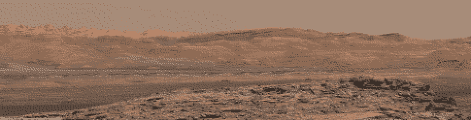
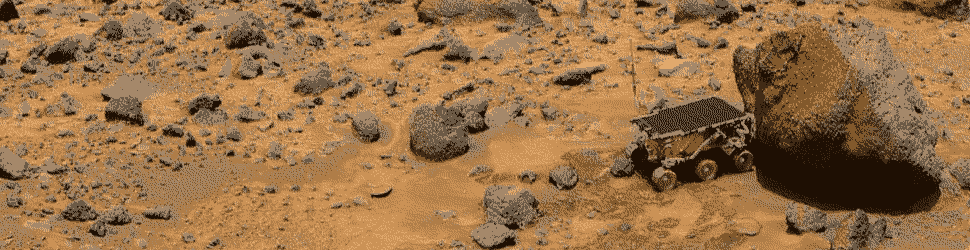
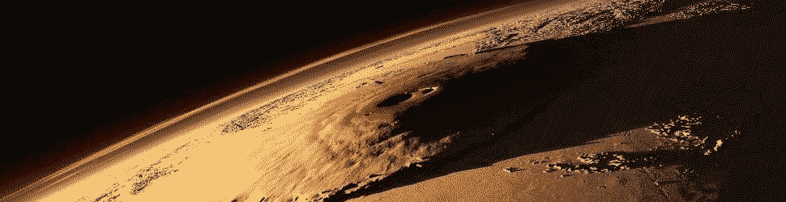

#   CS 498MC • Martian Computing
#### Neal Davis • Department of Computer Science • University of Illinois

The underlying infrastructure of modern networked computing—namely Unix and its derivatives—is approaching fifty years of age.  What will come to replace it?  A strong competitor is the clean-slate “operating function” approach of Urbit.  Jocosely branded as “computing for Martians,” Urbit provides a fresh and updated vision of what Internet computing could come to look like in future years.  Featuring end-to-end encryption and true peer-to-peer routing built on a network-first operating system, Urbit fosters decentralized digital societies and stable user identities.

Our primary objectives in this course are for you to be able to explain and navigate the technical layout of Urbit, as well as construct novel applications for Arvo, the Urbit operating function, using the Hoon programming language.

- Understand the schematics and technical implementation of the Urbit OS kernel (Arvo and vanes).
- Navigate and utilize the Urbit ID public-key infrastructure (Azimuth).
- Program literately using the Hoon language, including source code conventions and interoperability.
- Construct userspace apps to run on the Urbit OS platform (Gall, Landscape).

##  Audience

My target audience for the course consists of graduate students in computer science and neighboring fields interested in sound computing and functional operating system design (functional-as-in-language).  (Seniors are welcome to email me and apply as well.)  The course assumes an interest in functional programming but no specific experience[.](https://en.wikipedia.org/wiki/Centzon_T%C5%8Dt%C5%8Dchtin)  <!-- egg -->

##  Resources

| What                 | When and Where |
| -------------------- | -------------- |
| **Discussions**      | Wed/Fri 14h00–15h15 • Online (active discussion) |
| **Labs**             | Mon 14h00–14h50 • Online (office hours) |
| **Instructor email** | [cs498mcadmin@illinois.edu](mailto:cs498mcadmin@illinois.edu?subject=CS498MC) |
| **Class URL**        | [go.illinois.edu/cs498mc](https://go.illinois.edu/cs498mc) |
| **Class forum**      | `~fotfur-rosbex/martian-computing` |

##  Access

The use of Urbit requires an [Urbit ID](https://urbit.org/using/install/).  While I intend to arrange for students participating in the course to obtain an Urbit ID as part of their enrollment, you can also purchase an ID on a third-party site like [urbit.live](https://urbit.live) or [OpenSea](https://opensea.io/).  You can also use a transient ID (called a "comet") as a permanent ID; these are free and can be generated on your own machine.

##  Agenda

Lessons focus on conceptual or architectural aspects of Urbit, including technical discussions of Urbit’s behavior and internals.  Labs are hands-on tutorials to familiarize students with operations and language features.

| Wk | Date | Number | Lecture | Lab | MP |
| -- | ---- | ------ | ------- | --- | -- |
| 0 | 08/24 |  |  | (no lab) |  |
|  | 08/25 |  |  |  |  |
|  | 08/26 | 00 | [Prospectus](./lessons/lesson00-prospectus.md) |  |  |
|  | 08/27 |  |  |  |  |
|  | 08/28 | 01 | [Dojo](./lessons/lesson01-dojo.md) |  |  |
|  | 08/29 |  |  |  |  |
|  | 08/30 |  |  |  |  |
| 1 | 08/31 | 02 |  | [Azimuth I](./lessons/lesson02-azimuth-1.md) |  |
|  | 09/01 |  |  |  |  |
|  | 09/02 | 03 | [Generators](./lessons/lesson03-generators.md) |  |  |
|  | 09/03 |  |  |  |  |
|  | 09/04 | 04 | [Auras](./lessons/lesson04-aura.md) |  |  |
|  | 09/05 |  |  |  |  |
|  | 09/06 |  |  |  |  |
| 2 | 09/07 |  |  | (no lab) |  |
|  | 09/08 |  |  |  |  |
|  | 09/09 | 05 | [Syntax](./lessons/lesson05-syntax.md) |  |  |
|  | 09/10 |  |  |  |  |
|  | 09/11 | 06 | [Cores](./lessons/lesson06-cores.md) |  | `mp0` |
|  | 09/12 |  |  |  |  |
|  | 09/13 |  |  |  |  |
| 3 | 09/14 | 07 |  | [`%say` Generators](./lessons/lesson07-say-generators.md) |  |
|  | 09/15 |  |  |  |  |
|  | 09/16 | 08 | [Subject-Oriented Programming](./lessons/lesson08-subject-oriented-programming.md) |  |  |
|  | 09/17 |  |  |  |  |
|  | 09/18 | 09 | [Clay I](./lessons/lesson09-clay-1.md) |  |  |
|  | 09/19 |  |  |  |  |
|  | 09/20 |  |  |  |  |
| 4 | 09/21 | 10 |  | [Libraries](./lessons/lesson10-libraries.md) |  |
|  | 09/22 |  |  |  |  |
|  | 09/23 | 11 | [Ford I](./lessons/lesson11-ford-1.md) |  |  |
|  | 09/24 |  |  |  |  |
|  | 09/25 | 12 | [Debugging Hoon](./lessons/lesson12-debugging.md) |  | `mp1` |
|  | 09/26 |  |  |  |  |
|  | 09/27 |  |  |  |  |
| 5 | 09/28 | 13 |  | [`%ask` Generators](./lessons/lesson13-ask.md) |  |
|  | 09/29 |  |  |  |  |
|  | 09/30 | 14 | [Types & Molds](./lessons/lesson14-typechecking.md) |  |  |
|  | 10/01 |  |  |  |  |
|  | 10/02 | 15 | [Standard Library](./lessons/lesson15-stdlib.md) |  |  |
|  | 10/03 |  |  |  |  |
|  | 10/04 |  |  |  |  |
| 6 | 10/05 | 16 |  | [Common Containers](./lessons/lesson16-containers.md) |  |
|  | 10/06 |  |  |  |  |
|  | 10/07 | 17 | [Gall I](./lessons/lesson17-gall-1.md) |  |  |
|  | 10/08 |  |  |  |  |
|  | 10/09 | 18 | [Kernel](./lessons/lesson18-kernel.md) |  | `mp2` |
|  | 10/10 |  |  |  |  |
|  | 10/11 |  |  |  |  |
| 7 | 10/12 | 19 |  | [Data & Text Parsing](./lessons/lesson19-text-parsing.md) |  |
|  | 10/13 |  |  |  |  |
|  | 10/14 | 20 | [Ames](./lessons/lesson20-ames.md) |  |  |
|  | 10/15 |  |  |  |  |
|  | 10/16 | 21 | [Behn](./lessons/lesson21-behn.md) |  |  |
|  | 10/17 |  |  |  |  |
|  | 10/18 |  |  |  |  |
| 8 | 10/19 | 22 |  | [Clay II](./lessons/lesson22-clay-2.md) |  |
|  | 10/20 |  |  |  |  |
|  | 10/21 | 23 | [Polymorphism](./lessons/lesson23-polymorphism.md) |  |  |
|  | 10/22 |  |  |  |  |
|  | 10/23 | 24 | [Urbit Foundation](./lessons/lesson24-foundation.md) |  | `mp3` |
|  | 10/24 |  |  |  |  |
|  | 10/25 |  |  |  |  |
| 9 | 10/26 | 25 |  | Gall II |  |
|  | 10/27 |  |  |  |  |
|  | 10/28 | 26 | Gall III |  |  |
|  | 10/29 |  |  |  |  |
|  | 10/30 | 27 | Ames |  |  |
|  | 10/31 |  |  |  |  |
|  | 11/01 |  |  |  |  |
| 10 | 11/02 | 28 |  | Eyre & Iris |  |
|  | 11/03 |  |  |  |  |
|  | 11/04 | 29 | Gall IV |  |  |
|  | 11/05 |  |  |  |  |
|  | 11/06 | 30 | Boot Process |  | `mp4` |
|  | 11/07 |  |  |  |  |
|  | 11/08 |  |  |  |  |
| 11 | 11/09 | 31 |  | Moons |  |
|  | 11/10 |  |  |  |  |
|  | 11/11 | 32 | Arvo I |  |  |
|  | 11/12 |  |  |  |  |
|  | 11/13 | 33 | Ford II |  |  |
|  | 11/14 |  |  |  |  |
|  | 11/15 |  |  |  |  |
| 12 | 11/16 | 34 |  | Hoon |  |
|  | 11/17 |  |  |  |  |
|  | 11/18 | 35 | (buffer lecture) |  |  |
|  | 11/19 |  |  |  |  |
|  | 11/20 | 36 | Vere |  | `mp5` |
|  | 11/21 |  |  |  |  |
|  | 11/22 |  |  |  |  |
|  | 11/23 |  |  | (no lab) |  |
|  | 11/24 |  |  |  |  |
|  | 11/25 |  | (no lecture) |  |  |
|  | 11/26 |  |  |  |  |
|  | 11/27 |  | (no lecture) |  |  |
|  | 11/28 |  |  |  |  |
|  | 11/29 |  |  |  |  |
| 13 | 11/30 | 37 |  | Arvo II |  |
|  | 12/01 |  |  |  |  |
|  | 12/02 | 38 | Nock I |  |  |
|  | 12/03 |  |  |  |  |
|  | 12/04 | 39 | Nock II |  |  |
|  | 12/05 |  |  |  |  |
|  | 12/06 |  |  |  |  |
| 14 | 12/07 | 40 |  | Azimuth II |  |
|  | 12/08 |  |  |  |  |
|  | 12/09 | 41 | Final Thoughts |  |  |
|  | 12/10 |  |  |  |  |
|  | 12/11 |  |  |  | `mp6` |
|  | 12/12 |  |  |  |  |
|  | 12/13 |  |  |  |  |
| 15 | 12/14 |  |  |  |  |
|  | 12/15 |  |  |  |  |
|  | 12/16 |  |  |  |  |
|  | 12/17 |  |  |  |  |
|  | 12/18 |  |  |  | `bonus` |

### MPs

| **MP** | **Description**         |
| ----- | ------------------------ |
| `mp0` | Write naked generators. |
| `mp1` | Write `%say` generators. |
| `mp2` | Write `%ask` generators. |
| `mp3` | Write a basic Gall app. |
| `mp4` | Write a Landscape tile and a Clay mark |
| `mp5` | Write a full library with testing suite |
| `mp6` | Decompile Nock code |
| `bonus` | A proposed scoped project, such as writing a jet.  (See below.) |
