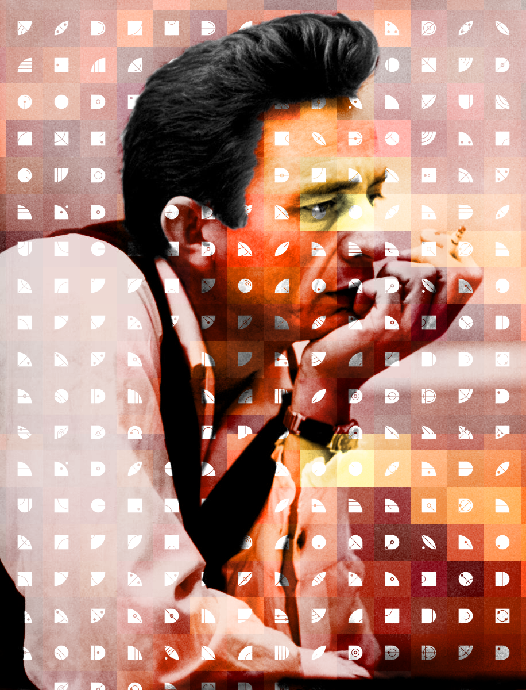

#   Azimuth 1 (Urbit ID)

##  Learning Objectives

-   Understand the role of public-key infrastructure in Urbit.
-   Describe the high-level architecture of the Urbit ID address space and distinguish types of points.
-   Interpret and apply the Azimuth point naming scheme.
-   Identify point features such as activity.
-   List at least two services provided by a star for its planets.

##  The Urbit Address Space

Urbit provides persistent and stable futureproof identity to its users through a hierarchical address space.

[Zooko's triangle](https://en.wikipedia.org/wiki/Zooko%27s_triangle) is a trilemma posing that any naming system on a network must attend to three concerns:  decentralization, security, and human-meaningfulness.

- _Decentralization_ means that names should resolve without a central authority.
- _Security_ means that bad actors on a network should be as limited in their damage-making capacities as possible.
- _Human-meaningfulness_ means that meaningful and memorable names are assigned to users.

There have been a number of attempts to balance the demands of Zooko's trilemma, such as Aaron Swartz's [proposal inpsiring Namecoin and Twister](http://www.aaronsw.com/weblog/squarezooko) and Nick Szabo's [secure property titles](https://nakamotoinstitute.org/secure-property-titles/).

Urbit ID resolves Zooko's triangle by using peer-to-peer routing after discovery, by strictly limiting identity as a scarce and reputation-bearing good, and by assigning each addressable point of the 128-bit address space a unique and memor(iz)able name.

In fact, today on Urbit you frequently see the mnemonic address used as the primary pseudonymous identity and username.  Felicitously, the identity problem is thereby solved without horrible username requirements.  For instance, I am `~lagrev-nocfep` on Urbit, point 4,235,396,352 (or 4.235.396.352 in European-style notation as used within Urbit).

Now, that said, there are different kinds of points available in the address space.  All of these are brokered by Azimuth, an Ethereum-bootstrapped public-key infrastructure (address space and protocol) which governs ownership and transactions.

Each Azimuth point is a 128-bit address.  I have already refered to ships as having 32-bit addresses, so what gives?  Urbit is structured with a hierarchy of addressable points, and bands of smaller values (preceded by many zeroes) have more "weight" in the system and broker access to higher-addressed points.

- **8-bit galaxies** (preceded with 120 bits of zeroes) represent the "governing council" of Urbit, primarily concerned with peer discovery and packet routing as well as network protocol governance.  Galaxies allocate star address space.
- **16-bit stars** provide peer discovery services, handle distribution of software updates, and allocate planet address space.
- **32-bit planets** are primary single-user identities.
- **64-bit moons** are intended to represent devices and associated accounts for the owning planet, but are currently only rarely used.  Each planet has $2^{32}$ moons available to it.
- **128-bit comets** are zero-reputation instances, in principle spammers or bots.  (Comets require a star sponsor to access the network, but once online they are persistent.  They are also free to spin up.)

In total there are $2^{128}$ addressable points, of which the vast majority are available as unclaimed "comet space."

The initial allocation of galaxies served the expedient of funding Tlon to develop Urbit, but the 256 galaxies are in the hands of many different kinds of people besides investors.

{: width=100%}

Like Lana sings (["Before we go out, what's your address?"](https://www.youtube.com/watch?v=sxDdEPED0h8)), we in principle care about address when dealing with a strange star or planet for the first time.  A reputation system is under development, but hasn't yet seemed to be necessary.  This is called [`Censures`](https://urbit.org/docs/glossary/censure/).  Plus, at this point, identity _is_ fairly cheap, abundant if not infinite.  (Notably, not so cheap that spammers can thrive.)

Peer discovery, the primary role of stars besides planet allocation, is an important step in responsibly controlling network traffic.  "The basic idea is, you need someone to sponsor your membership on the network. An address that can't find a sponsor is probably a bot or a spammer" ([docs](https://urbit.org/understanding-urbit/)).

##  The `patp` Mnemonic Naming Scheme

Urbit uses a system of mnemonic syllables to uniquely identify each address point.  These mnemonic names, called "`patp`s" after their Hoon representation `@p`, occur in a set of 256 suffixes (such as "zod") and 256 prefixes (such as "lit").  They were selected to be pronounceable but not meaningful.

| Number | Prefix | Suffix |
| ------ | ------ | ------ |
|      0 |    doz |    zod |
|      1 |    mar |    nec |
|      2 |    bin |    bud |
|      3 |    wan |    wes |
|      4 |    sam |    sev |
|    ... |    ... |    ... |
|    254 |    mip |    nev |
|    255 |    fip |    fes |

The first 256 points (the galaxies) simply take their name from the suffix of their address point.  Subsequent points combine values:  for instance, point 256 is ~marzod, point 480 is ~marrem, and point 67,985 is ~fogfel-folden.  (Conventionally, a sigma `~` is used in front of an address.)

The 256 galaxies have suffix-only names, and all higher addresses have prefix–suffix names.  Two-syllable names always mean the point is a star; four-syllable names are planets.  Comets have rather cumbersome names:  67,985,463,345,234,345 corresponds to ~doztes-nodbel-palleg-ligbep with eight syllables.

The stars which correspond to a galaxy are suffixed with the galaxy's name; planet names are mangled so that one cannot tell which star or galaxy a planet corresponds to at a glance.

If a planet needs to change its sponsor, there is support for a process called _emancipation_, in which another star can assume the role of peer discovery in case a star goes offline (a "dark star").

- Reading: [Urbit Live, "An Intro to Urbit Names"](https://blog.urbit.live/an-intro-to-urbit-names/)

### Reputation

A reputation system is available called [`Censures`](https://urbit.org/docs/glossary/censure/).  As spammers and bots are not yet present on the Urbit network in any significant quantity, Censures is not heavily used today.  Galaxies and stars can censure (or lower the reputation of) lower-ranked points as a deterrent to bad behavior (defined as spamming, scamming, and spreading malware).  Since good behavior is the default, only lowering reputation is supported.

- Optional Reading: [Nicholas Simmons (`~simfur-ritwed`), "Platform Decay, Decentralized Marketplaces, and Urbit"](https://urbit.org/blog/platform-decay/)
- Resource: [`Censures.sol` contract](https://github.com/urbit/azimuth/blob/master/contracts/Censures.sol)

##  Azimuth On-Chain

Azimuth is located on the Ethereum blockchain at address [`0x223c067f8cf28ae173ee5cafea60ca44c335fecb`](https://etherscan.io/address/0x223c067f8cf28ae173ee5cafea60ca44c335fecb) or [`azimuth.eth`](https://etherscan.io/address/azimuth.eth).  Azimuth points are not interchangeable tokens like ETH or many other cryptocurrencies:  each point has a unique ID, a type, and associated privileges.  “Azimuth is basically two parts, a database of who owns which points, and a set of rules about what points and their owners can do” (Wolfe-Pauly).  The technical blockchain term for this kind of points is "non-fungible tokens".

There is nothing intrinsic about Azimuth which requires Ethereum to work correctly, and in the future Azimuth will probably be moved entirely onto Urbit itself.

- Reading: [Galen Wolfe-Pauly, "Azimuth is On-Chain", through section "Azimuth"](https://urbit.org/blog/azimuth-is-on-chain/)
- Optional Reading: [Ameer Rosic, "What is An Ethereum Token?"](https://blockgeeks.com/guides/ethereum-token/)
- Code: [`azimuth-js`](https://github.com/urbit/azimuth-js)

### Urbit Ownership and the Crypto Community

Because Urbit address space is finite, it in principle bears value similar to cryptocurrencies such as Bitcoin.  You should hold your Urbit keys like a dragon's hoard:  once lost, they are irrecoverable.  I do not have a copy of your master ticket, which is the cryptographic information necessary to sell, start, or administer your planet.

To be clear, _I am not_ promoting Urbit or ownership of any part thereof as a speculative crypto asset.  Like blockchain and cryptocurrencies, Urbit may carry intrinsic value or it may be only [so much (digital) paper](https://en.wikipedia.org/wiki/Wildcat_banking).  Right now, you can purchase available Azimuth points on [OpenSea.io](https://opensea.io/assets/urbit-id?query=urbit) and [urbit.live](https://urbit.live/buy), or you can buy directly from someone who has some available.

- Reading: [Wolf Tivy, "Why do Urbit stars cost so much?" (Quora answer)](https://www.quora.com/Why-do-Urbit-stars-cost-so-much)
- Resource: [Urbit Live, "Urbit Network Stats"](https://urbit.live/stats) (set the dates to a much broader range and the currency type to ETH)

### Galaxy Ownership and Star Access

The sale of galaxies formed a role in initially funding Urbit, but to prevent too early sale and to modulate access to the network, most stars are locked by Ethereum smart contracts and unsellable until their unlock date.  Star contracts will unlock through January 2025, at which point the full address space will be available (but of course not activated).  Galaxy owners can sell or distribute stars as they see fit, and star owners can parcel out planets.  However, since a star provides peer discovery services, it is imperative that a star with daughter planets remain online and up-to-date.

Much of the Urbit address space is locked and unspawnable to provide an artificial brake on supply and prevent overrunning the available address space.  See "The Value of Urbit Address Space, Part 3" for extensive details on star and planet limitations and the associated Ethereum smart contracts.

{: width=100%}

If a star ceases to provide peer-to-peer lookup services and software updates, a planet may find itself in a pickle.  "Dark stars" are stars which have spawned daughter planets but are not running anymore.  To mitigate this situation, planets can switch from one sponsoring star and move to another.

- Optional Reading: [Erik Newton `~patnes-rigtyn`, Galen Wolfe-Pauly `~ravmel-ropdyl`, "The Value of Urbit Address Space, Part 1"](https://urbit.org/blog/value-of-address-space-pt1/)
- Optional Reading: [Erik Newton `~patnes-rigtyn`, Galen Wolfe-Pauly `~ravmel-ropdyl`, "The Value of Urbit Address Space, Part 2"](https://urbit.org/blog/value-of-address-space-pt2/)
- Optional Reading: [Erik Newton `~patnes-rigtyn`, Galen Wolfe-Pauly `~ravmel-ropdyl`, "The Value of Urbit Address Space, Part 3"](https://urbit.org/blog/value-of-address-space-pt3/)

##  Sigils

Sigils are a visual corollary to the mnemonic patp.  Each address has a unique sigil, based on the 512 component syllables[.](https://en.wikipedia.org/wiki/1492_light_sighting)  <!-- egg -->

A galaxy patp is monosyllabic since there are only 256 galaxies.  Thus a galaxy sigil is a single symbol only.  For ~fyr:

{: width=50%}

Stars have two syllables and thus two symbols.  The left-hand sigil is derived from the prefix set, and so is completely unique from the set of suffix sigils.  For ~fosfyr:

{: width=50%}

Planets have four syllables and hence four components in their sigils.  For ~winter-martyr, for instance, we have:

{: width=50%}

Although the pattern extends readily, sigils for moons (64-bit, 8-syllable, thus 8-component sigils) and comets (128-bit, 16-syllable, thus 16-component sigils) are not really seen in practice.

Sigils are not intrinsic to Urbit, but they form part of the metatextual environment that Urbit inhabits and they are frequently used as a means of ready differentiation and identity.

- Reading: [Philip Monk `~wicdev-wisryt`, "Designing a Permanent Personal Identity"](https://urbit.org/blog/pki-maze/)
- Optional Reading: [Gavin Atkinson `~ridlur-figbud`, "Creating Sigils"](https://urbit.org/blog/creating-sigils/)
- Code: [`sigil-js`](https://github.com/urbit/sigil-js)

{: width=100%}

##  Further On Up the Road

The Azimuth PKI is quite sophisticated, and the Urbit HD (Hierarchical Deterministic) wallet allows for nuance in point management.  Bridge is used to manage point operations.  We will revisit all three in technical detail in _Azimuth 2_.  We will furthermore examine the internal operations of `azimuth-js` and the Ecliptic contracts.

{: width=33%}
