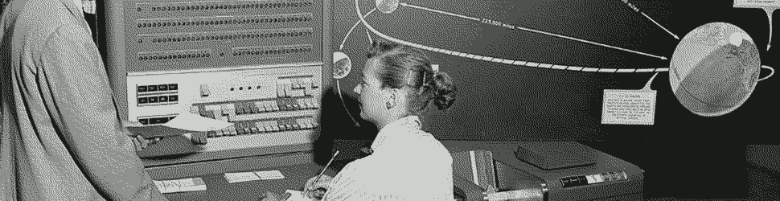
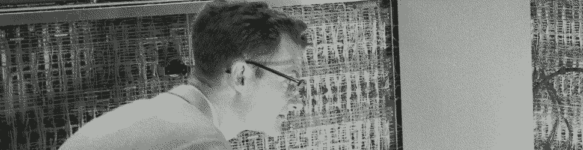
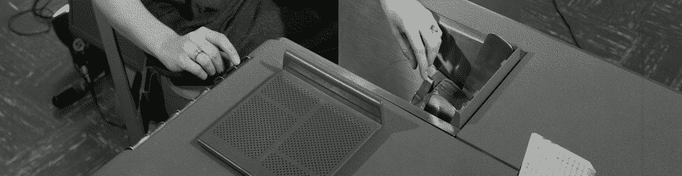
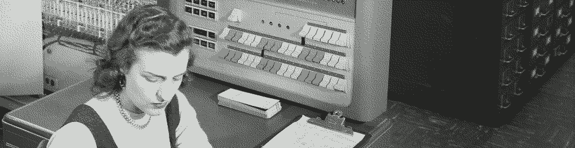

#   Generators (Functions Done Better)



> The promise of Urbit lies in its reimagination of the digital world using components that are as constrained and limited as possible.  (Ted Blackman `~rovnys-ricfer`)

##  Learning Objectives

- Compose a simple generator and load it from `gen/`.
- Understand how to pass arguments to and results from gates.
- Use the Hoon standard library Section 1a, "Basic Arithmetic".
* Produce a generator for a mathematical calculation.

_Complete everything in this lesson using a fakezod, not your real ship.  That holds true generally for development work._

##  Hoon

Most of our programming work with Urbit will involve Hoon.  Indeed, the entire operating system itself is written in Hoon.  Aside from Hoon there is a little bit written in C and a fair bit in Javascript; there is also a project to implement an Urbit daemon in Haskell (King Haskell).  But Hoon reins supreme.

Formally, Hoon can be described as a purely functional systems language.  It's statically typed, purely functional, and strictly evaluated.  Hoon is designed to compile and run arbitrary code in a typesafe way, allow hot code reloading, and permit metaprogramming.  Urbit is also completely homoiconic:  code and data are the same thing (and not just at the binary level), and even the environment is a Nock binary tree.

Wait, what?  How can a systems language (mega side effects) be purely functional (no side effects)?  The Urbit stack is a bit of a paradox in that regard.  Some of the side effects can be shunted aside because the system doesn't actually have to implement Nock, it has to implement identical behavior (on the Urbit side) to Nock.  Others can be ignored because Urbit doesn't purport to run a full OS the way Windows or macOS do.

Hoon bears a similar relationship to Nock as C bears to assembler.  Ultimately, Nock is a Turing-complete "pico-Lisp," and without needing to look at Nock itself (yet) we can infer some consequences.  For instance, of Lisp it hath been written that,

> A Lisp program is defined in terms of the interpretation of its core data structures, rather than by a syntax over characters. This makes it easy for programs to be a source of programs and for program transformations to be functions of data → data, and in both cases for the standard library to be of substantial utility. The conversion of character streams into data is handled by separate functions of the reader.  (Rich Hickey, "A History of Clojure")[https://download.clojure.org/papers/clojure-hopl-iv-final.pdf]

Hoon and Nock similarly define and manipulate core data structures, all of them reducible to binary trees and represented as such in theory and practice[.](https://www.youtube.com/watch?v=OnrICy3Bc2U)  <!-- egg -->

Hoon is essentially a set of macros which reduce directly to Nock.  Hoon is read into an abstract syntax tree with a direct and well-defined relationship to Nock, meaning that there are not undefined behaviors in the system.

Lisp dialects generally don't mandate a particular higher-order programming model, in contrast to C++ and OOP, for instance.  Hoon _does_ imply certain expectations, such as the use of cores and other conventional structures.  These are baked into the macros and into Arvo, and provide a certain easy facility to manipulating the flow of data.  However, since Hoon is "compiled" into Nock for execution, there are sometimes compile-time decisions made which can lead to subtle mismatches (almost always type errors at compile time, not at runtime, mercifully).

Lisp favors a functional style, and so does Nock.  Hoon is frequently described as a functional language by its developers and users, but in practice it supports other conceptual modes of interaction, including imperative programming.  (Ultimately, of course, Lawrence Flon's axiom obtains:  “There does not now, nor will there ever, exist a programming language in which it is the least bit hard to write bad programs.”)



Hoon is written using "runes," which define relationships of daughter branches in a binary tree.  (_Everything_ in Hoon is a binary tree—see Syntax.)  There's also a fair amount of syntactic sugar which makes things a bit easier to write and comprehend.  For example, a runic function call looks like this:

```
%-  add  [1 2]
```

while its irregular form (the syntactic sugar) reads with a bit of a Lisp:

```
(add 1 2)
```

Notice one important feature of the above:  where are the spaces and how many are there?  The Hoon parser recognizes the "ace" (single space) and the "gap" (two or more spaces or any number of newlines; hard tabs are verboten).  Aces separate certain terms, such as the elements of a cell, but gaps must separate branches of runes.  The following are equivalent to Hoon:

```
%-  add  [1 2]
```

```
%-  add
  [1 2]
```

```
%-
add
[1 2]
```

Since whitespace is _somewhat_ meaningful, there is a lot of flexibility in program arrangement.  We will generally track the intended main branch of a program vertically downwards in the same column, with minor branches being indented slightly.  This keeps programs from being rightward-branching towers of indentation.  Hoon programmers refer to this as "backstep indentation."

Hoon isn't APL and, while minimalist, isn't nearly as lapidary.  Also, being ASCII-based, Hoon is straightforward to type.

```apl
⍝ Pascal's triangle of degree ⍵
{A←0,⍳⍵ ⋄ ⍉A∘.!A}
```

At this point, learn Hoon by mimesis:  copy and modify snippets and programs as you build out your mental model of what's happening.  By the time we're done this semester, we'll look at the source of `hoon.hoon` itself, deep into the heart of the jungle.

- Reading: [Ted Blackman `~rovnys-ricfer`, "Why Hoon?"](https://urbit.org/blog/why-hoon/)
- Optional Reading: [Philip Monk `~wicdev-wisryt`, "Urbit Precepts"](https://urbit.org/blog/precepts/)

##  Functions in Urbit (Gates)



One of the most common operations in Hoon is to invoke a function, which you just saw using `%-` ("cenhep").  We don't call it that, for nuanced reasons that won't feel natural until later.  Instead, in Hoon one "slams a gate."  It's a "gate" because it's a single well-defined entrypoint to a bit of code.  One "slams" it because, well, haven't you ever slammed a gate?  (You can say "call" if you prefer but you'll see both in the docs.)

A gate is an instance of a particular kind of data structure called a core, but set that aside for now—we'll come back to cores later.  Gates need three pieces of information:  the arm `$` (which does the computation); the sample (or arguments); and the context (or any further necessary information).

Gates are referentially transparent, since they are only a function of their input and can be replaced precisely by their output without changing the larger system behavior.

You need to have three things for a gate to work:  an _arm_, a _sample_, and a _context_.  Arvo, the Urbit OS, knows when presented with a gate where to look for each of these.

- The _arm_ contains the actual instructions for the computation.  Commonly, structures with only one arm call it `$`.
- The _sample_ contains the input value or arguments.
- The _context_ contains ancillary information such as entropy.

Since everything in Hoon is a binary tree, these are stored in a certain standard relationship to each other—this is what _defines_ a generator.  Specifically, the gate is a cell `[$ [sample context]]`.

The arm ultimately reduces to a single value (a noun, so either an atom or a cell).

The following gate accepts an unsigned integer `a` and returns the

```hoon
|=  a=@ud
  (pow 2 a)
```

Only one rune is explicitly used, but the irregular form for slamming a gate (calling a function) is used for the Lisp-like exponentiation using `pow`.

- `|=` produces a gate.  It has two children, a type specification (the sample) and a hoon which reduces to a value.  (Specifically, `|=` produces a _dry gate_, but we'll worry about dry v. wet gates much later.)
- `@ud` specifies an unsigned decimal integer.  More broad input could be matched with `@` (any atom) or `*` (any input noun, cell or atom).
- `(pow 2 a)` is the irregular form of `%-  pow  [2 a]`.
- `%-` slams a gate (the first child) on its sample (the second child).

To run this in Dojo, we need to use a Dojo hack to define it.  (As Hoon is a purely functional language, adding persistent things to the operating context is a bit difficult.)  Copy and paste the following into Dojo:

```hoon
=pow-2 |=  a=@ud
  (pow 2 a)
```

Now you can invoke the gate:

```hoon
(pow-2 5)
(pow-2 10)
(pow-2 1.000)
```

In the immediately foregoing example, the `|=` "bartis" rune defines the arm `$` and the sample in such a way that Arvo knows how to run everything per the standard.  (Note that `|=` implicitly swaps the order of its arguments to the standard `[$ [sample context]]` structure.  It's ordered this way for convenience:  we human programmers prefer to define our inputs before our computations.)

Gates offer flexibility in building cores which can be composed into much larger programs as arms and wings in calculations (see Subject-Oriented Programming for more on these structures).

Since there are no formal side effects in purely functional Hoon, there is a hinting rune `~&` which can be used to output debugging information and messages.  Think of it as a `printf`.

```hoon
~&  (add 1 1.000)
```

- Reading: [Tlon Corporation, "Walkthrough:  List of Numbers"](https://urbit.org/docs/tutorials/hoon/list-of-numbers/)
- Reading: [Tlon Corporation, "Gates"](https://urbit.org/docs/tutorials/hoon/gates/) (you should complete the exercises there as well)


##  Generators



A generator is a nonpersistent computation:  it maps an input to an output.  A generator is invoked with `+` in front of its name in Dojo:

```hoon
+trouble
```

If we check the pier, we indeed find a file `trouble.hoon` in `home/gen/`, and `trouble` is indeed a gate, beginning with `|=`.

There are several different kinds of generators, but for now we will simply use what are called _naked generators_.  These are gates stored in single files in the `home/gen/` directory (on Urbit and/or in Clay).

What denudes a naked generator is that it has an arm `$` and a payload but no context.  Consequently, since there isn't a null payload, naked generators always accept at least one noun as input.

Here's a basic factorial gate, which you can save as `home/gen/fact.hoon` and use as `+fact 5` (once you `|commit %home`):

```hoon
!:
::  Factorial
::
|=  n=@ud
^-  @ud
?:  =(n 1)
  1
(mul n $(n (dec n)))
```

- `!:` does what?
- `::` does what?
- `|=` does what?
- `@ud` means what?
- `^-` does what?
- `?:` tests what?
- `=()` tests what?
- `mul` multiplies two numbers
- `dec` decrements a number
- `$()`, recall, is not a rune, but constructs a new subject `$` by re-executing the code of the current subject `$`.  Here it is used to force the entire gate to calculate again using the decremented value of `n`.

The basic generators we are interested in writing are all gates.  To write anything really interesting, you need to know how to do two more things:  modularize and recurse.

**Modularity** describes breaking code down into smaller encapsulated pieces that do one thing and do it well.  If we define a generator, we can't just use it in another generator.  Rather, we want to set up gates (possibly with imports) and call them from each other in the same file.  (There is a strong bias towards minimizing inter-code dependencies within Urbit userspace.  There also isn't a package manager yet.)  To do this, we need to introduce a new rune, `|%` (barcen).  `|%` takes any number of children terminated by `--`, and allows us to pin named arms together for use.  Frequently, our base code is written first, then the named arms are included.  Since this is "backwards", we need to prefix the `=<` tisgal rune to reverse the order of the next two children (in this case, `%-` as implied by the function call and `|%`).

**Recursion** in Hoon means the ability to recompute the current subject and replace it with the new subject.  Most often, the current subject is implicitly defined as `$` and contains information about the standard library (operating context) and the function arguments (altogether, the sample).  Other information may be pinned to the subject, most commonly using `=+` tislus.  `|-` barhep indicates a recursion point; without this indication, whatever is the current core is recomputed.

```hoon
!:
::  Fibonacci sequence and summation to n values.
::
|=  n=@ud
=<
(fibonacci n)
|%
::  Generate a sequence of Fibonacci numbers.
++  fibonacci
  |=  n=@ud
  %-  flop
  =+  [i=0 a=0 b=1 seq=*(list @ud)]
  |-  ^+  seq
  ?:  =(i n)  seq
  %=  $
    i  +(i)
    a  b
    b  (add a b)
    seq  [b seq]
  ==
--
```

- `=<` composes two expressions in inverted order
- `|%` produces a core, typically with named arms
- `++` names an arm
- `%-` calls a gate on what comes into it; in this case, it calls `flop` which reverses the order of the list coming into it from below.
- `=+` pins a name (or a collection of names) to the subject; think of this as "defining a variable"
- `|-` starts a "trap," thought of here as a loop recursion point
- `^+` typecasts anything passing through it (a fence)
- `%=` recalculates a wing with changes; think of `%=` as specifying what needs to change each time through the recursion point.
- `==` closes a running series of expressions (in this case, `%=`)
- `--` closes a core (in this case, `|%`)

(You should also revisit `mod3` in Dojo at this point as well.)

### Imports

If we need to import code for things to work properly, we can use Ford runes such as `/+` to bring in library code.

Given a file `trig.hoon` in `home/lib`,

```hoon
::  Transcendental functions library for Hoon, compatible with @rs
::
=/  tau  .6.28318530717
=/  pi   .3.14159265358
=/  e    .2.718281828
=/  rtol  .1e-5
|%
++  factorial
  |=  x=@rs  ^-  @rs
  =/  t=@rs  .1
  |-  ^-  @rs
  ?:  =(x .1)
    t
  $(x (sub:rs x .1), t (mul:rs t x))
++  absolute
  |=  x=@rs  ^-  @rs
  ?:  (gth:rs x .0)
    x
  (sub:rs .0 x)
--
```

it can be imported for use in another generator `home/gen/abs.hoon` as

```hoon
/+  trig
!:
|=  [n=@]
(absolute:trig n)
```

and used in Dojo as `+abs .-5`

- Reading: [Tlon Corporation, "Generators"](https://urbit.org/docs/tutorials/hoon/generators/), section "Naked Generators"
- Reading: [Tlon Corporation, "Walkthrough:  Recursion"](https://urbit.org/docs/tutorials/hoon/recursion/) (note in particular the better way to carry out recursion)

##  Pronouncing Hoon

Now that you've seen a bit more of Hoon, let's talk about pronunciation.  The Urbit community has adopted a consistent monosyllabic way of pronouncing ASCII punctuation.  For instance, since `^` is "ket" and `-` is "hep", the rune `^-` is "kethep", and may be easily found in the documentation by searching for "kethep".  Although I don't explicitly require it for this class, memorizing the Hoon names for ASCII runes is convenient and you'll find yourself using them frequently.  We'll cover pronounceable Hoon in more depth in Syntax.

##  The Hooncard

You will likely find [this Hoon reference card](https://github.com/natareo/hooncard/blob/master/hooncard.pdf) to be quite useful.
