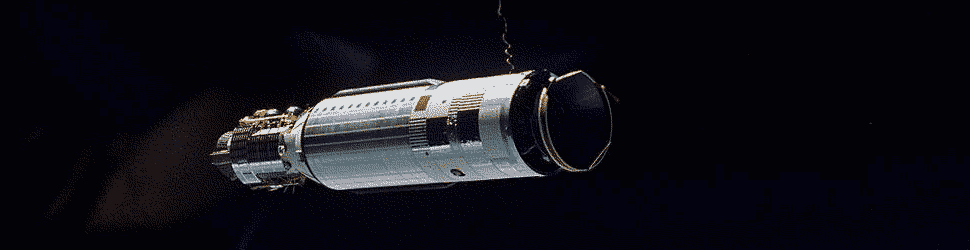

#   Auras (A Type System)


##  Learning Objectives

-   Apply auras to transform an atom.
-   Identify common Hoon molds, such as lists and tapes.
*   Produce a generator to convert a value between auras.

##  Reading Types in Urbit

For Nock, everything is either an [atom](https://urbit.org/docs/glossary/atom/) or a cell.  An atom is a single integer, whereas a cell is a pair of atoms and/or cells.  Since all values are ultimately integers, we need a way to tell different "kinds" (or applications) of integers apart.  Enter auras.

(For what it's worth, having all-integers isn't that different from any other digital machine, built on binary numbers.  These all derive ultimately from [Gödel numbers](https://en.wikipedia.org/wiki/G%C3%B6del_numbering).  Urbit makes this about as apparent as C does (via `union`), but it's first-order accessible via the Dojo REPL.)

An aura is a bit of metadata Hoon attaches to a value which tells Urbit how you intend to use a number.  (Of course, ultimately an aura is itself an integer as well!)  The default aura for a value is `@ud`, unsigned decimal, but of course there are many more.  Aura operations are extremely convenient for converting between representations.  They are also used to enforce type constraints on atoms in expressions and gates.

Because any value needs an aura, the way that a number is represented in text indicates to the Hoon parser what the aura should be.  For instance, a bare number like `1` or `1.000` is an `@ud` unsigned decimal.  `.3.9581792e-26` is a 32-bit floating-point number, `0x1543.ffe2` is a hexadecimal, and `~folfel-figput` is a verbal mnemonic.  (All of those are the same integer, by the way:  `356.777.954`.)

Try the following auras.  See if you can figure out how each one is behaving.

```hoon
`@ud`0x1001.1111
`@ub`0x1001.1111
`@ux`0x1001.1111
`@p`0x1001.1111

`@ud`.1
`@ux`.1
`@ub`.1
`@sb`.1

`@p`0b1111.0000.1111.0000

`@ta`'hello'
`@ud`'hello'
`@ux`'hello'
`@uc`'hello'
`@sb`'hello'
`@rs`'hello'
```

This is a table of the core auras and their expected formats:

| Aura | Description | Example |
| ---- | ----------- | ------- |
| `@` | Empty aura |  |
| `@c` | Unicode codepoint | `~-~45fed.` |
| `@da` | Date, absolute | `~2020.12.25..7.15.0..1ef5` |
| `@dr` | Date, relative | ~d71.h19.m26.s24..9d55 |
| `@p` | Phonemic base | `~laszod-dozser-fosrum-fanbyr` |
| `@rs` | Floating-point number, single-precision, 32-bit | `.3.141592653589793` |
| `@rd` | Floating-point number, double-precision, 64-bit |
 .~3.141592653589793 |
| `@sb` | Signed binary | `--0b10.0000` |
| `@sd` | Signed decimal | `--1.000` |
| `@sx` | Signed hexadecimal | `--0x2004.90fd` |
| `@t` | UTF-8 text (cord) | `'urbit'` |
| `@ta` | ASCII text (knot) | `~.urbit` |
| `@tas` | ASCII text symbol (term) | `%urbit` |
| `@ub` | Unsigned binary | `0b10.1011` |
| `@uc` | Bitcoin address | `0c1A1zP1eP5QGefi2DMPTfTL5SLmv7DivfNa` |
| `@ud` | Unsigned decimal | `8.675.309` |
| `@ux` | Unsigned hexadecimal | `0x84.5fed` |

Leading zeroes are always stripped; if you attempt to input an invalid representation, the Dojo will chomp your input.

Auras are used to specify input and output types for gates.

```hoon
++  add
  |=  [a=@rs b=@rs]  ^-  @rs
  (add:ma a b)
```

We call the data type specifications _molds_.  Molds are much more general than auras, but auras are a particular case.

If you don't care what your input is, the most general input is `*` which simply matches any noun.

```hoon
::  Determine whether two nouns are in alphabetical order.
++  aor
  |=  [a=* b=*]  ^-  ?
  ?:  =(a b)  &
  ?.  ?=(@ a)
    ?:  ?=(@ b)  |
    ?:  =(-.a -.b)
      $(a +.a, b +.b)
    $(a -.a, b -.b)
  ?.  ?=(@ b)  &
  |-
  =+  [c=(end 3 1 a) d=(end 3 1 b)]
  ?:  =(c d)
    $(a (rsh 3 1 a), b (rsh 3 1 b))
  (lth c d)
```

(As an aside, Hoon uses loobeans rather than booleans for logical operations.  A loobean `TRUE` is `0`, `%.y`, while `FALSE` is `1`, `%.n`.  The philosophy underlying this is that there is one way to be right but many ways to be wrong.  Also, for those of you screaming in C or Java, keep in mind that Bash also adopts this stance.  That's why your `int main` function ends with `return 0;`.)

Auras are non-coercive, but conversions may have to go via the empty aura sometimes.

```hoon
^-(@ud ^-(@ 'cyberpunk'))
`@ud``@`'cyberpunk'
```

(The `^-` kethep rune is the regular form of applying a rune:  `\`@ud\``, for instance.  Those two statements are equivalent.)

A user can designate any custom aura, but the pretty-printer only knows about the built-in auras.

```hoon
|=  a=@  ^-  @z
`@z`(add 1 a)
```

- Reading: [Tlon Corporation, "1.2 Nouns", sections "Atoms" through "Casting to Other Auras"](https://urbit.org/docs/hoon/hoon-school/nouns/)

##  Aura-Related Errors

Debugging Hoon is not for the faint of heart.  The errors are arcane and sometimes poorly documented.  Nevertheless, most errors occur frequently enough and in common patterns of programemer malfeasance that one learns to handle them fairly quickly.

Aura and type mismatches are a common error source.

- `nest-fail` typically means a sample mismatch; for instance, attempting to call a generator with the wrong arguments.

    ```hoon
    +trouble 5
    ```

    ```hoon
    +trouble
    ```

    You'll frequently see a `- want`/`- have` block in the traceback when this failure occurs.

- `mint-nice` means a type mismatch.  If you run into this with an aura cast, try casting via the empty aura:

    ```hoon
    ^-(tape ~[97 98 99])
    ```

    ```hoon
    ^-(tape ^-((list @) ~[97 98 99]))
    ```


##  Common Patterns


We are going to dive more deeply into syntax in the next lesson (Syntax), but for now there are some common patterns in Hoon which you should get used to seeing:

- List.  `[1 2 3 ~]`  A list is a null-terminated rightwards-branching cell of data.  This is the standard container type in Hoon.  Frequently, lists are written using the shorthand notation `~[1 2 3]` (which is equivalent to the example list).

- Tape.  `"Zythepsary"`  A tape is a list of ASCII cells.  In contrast to a `@t` or `cord`, which is an atom of text, a tape is broken out into single-letter tokens.  Tapes are sometimes more convenient for parsing and processing data than cords.  My mnemonic is that a cord, an atom, has single quotes `''`, whereas a tape, a list, has many quotes `""`.

- Wain.  A wain is a list of cords (thus, a list of text-typed atoms).

    ```hoon
    `wain`~['hello' 'world']
    ```

- Wall.  A wall is a list of tapes.  (Contrast a wain and a wall.)

    ```hoon
    `wall`~["hello" "world"]
    ```

    Wains and cords are useful in building messages.

- Date.  A `date` is a date as a tuple (rather than a date as an atom).

    ```hoon
    (yore now)
    ```

    (Yes, there are a number of dualities like this in the system; I find that it's normally apparent which one makes more sense, and the conversion routines are fine.)

- Tarp.  `[d=0 h=0 m=0 s=0 f=~]`  A `tarp` is a parsed time, much as a tape is an expanded cord.  The `tarp` is only the time component, however.

Most of these have specialized handling routines (much like how Python formally prefers you to use `os.path.join` rather than hard-coding slashes and backslashes).


##  A Deeper Look

To summarize, the most fundamental, unitary data type in Urbit is an atom.  Atoms are integers, but may have auras attached to them.  The auras are advisory, not coercive, so it remains easy to soft-enforce type expectations but still convert smoothly between auras[.](https://simone.computer/#/webdesktops)  <!-- egg -->

To be precise, Hoon actually wraps Nock atoms with two pieces of metadata:  the aura, which we've studied, and a constant, which determines whether or not the atom itself is constant.  (The runtime uses this information.)  A cold atom is fixed, a warm atom can change.

If you would like to see what kind of atom you have, use `ream`, which is the compiler parser function.  (`ream` accepts a cord, so you'll have to wrap the hoon in single quotes.)

```
> (ream '1.844')
[%sand p=%ud q=1.844]

> (ream '.~0.54')
[%sand p=%rd q=4.603.039.107.142.836.552]

> (ream '%urbit')
[%rock p=%tas q=499.984.265.845]

> (ream '~')
[%bust p=%null]
```

The `@tas` tags returned by `ream` represent the fixity of the atom, cold or warm.  A cold atom is `%rock` while a warm atom is `%sand`.  `%bust` represents the null value `~`.  All that is necessary to produce a cold atom is to prefix the warm atom form with `%`:

```
> (ream '0v3ich')
[%sand p=%uv q=117.137]

> (ream '%0v3ich')
[%rock p=%uv q=117.137]
```

Why do cold atoms and warm atoms matter?  A warm atom is loose, and its type is inferred to be general.  In practice, this means that you can cast a cold atom to a warm atom, but not vice versa:  a form of type protection.

A cold atom, in contrast, is fixed, and behaves rather like a constant.  It can also be used to enforce aura type rigorously:

```
> `%12`%12
%12
> `%12`12
/~zod/home/~2020.4.7..06.13.55..d061/sys/vane/ford:<[4.820 18].[4.820 59]>
mint-nice
nest-fail
ford: %slim failed:
ford: %ride failed to compute type:
```

- Reading: [Tlon Corporation, "Atoms and Strings", section "Cold Atoms"](https://urbit.org/docs/reference/hoon-expressions/rune/constants/#cold-atom)
- Reading: [Tlon Corporation, "Atoms and Strings", section "Warm Atoms"](https://urbit.org/docs/reference/hoon-expressions/rune/constants/#warm)

### Implied Bitwidth

Capital letters at the end of auras indicate the bitwidth in binary powers of two, starting from A ($2^0$).  As auras are non-coercive, these serve no absolute role, but are sometimes useful in labeling expected values and tracking program behavior.

| Aura   | Description |
| ------ | ----------- |
| `@ubD` | signed single-byte (8-bit) decimal |
| `@tD`  | 8-bit ASCII text |
| `@rhE` | half-precision (16-bit) floating-point number |
| `@uxG` | unsigned 64-bit hexadecimal |
| `@uvJ` | unsigned 512-bit integer with base-32 representation (frequently used for entropy) |


