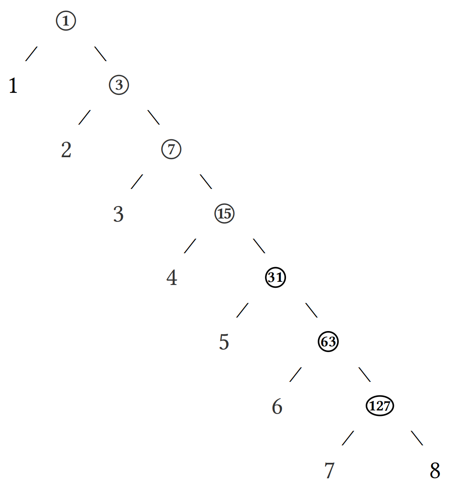

#   Hoon Syntax

{: width=100%}

##  Learning Objectives

-   Enumerate the type system used in Arvo.
-   Diagram Hoon generators into the corresponding abstract syntax tree.
-   Use the Hoon standard library Section 1b, "Tree Addressing".
-   Use lists to organize data.
-   Pronounce ASCII characters per standard Hoon developer practice.


##  The Zen of Hoon

Many functional languages, and high-level languages more generally, have a notion of elegance in code (Haskell and Scala, for instance).  Instead, Hoon invites you to portray a precise notion of the mechanics of your program.  A corollary of this is that there frequently isn't "one right way" to accomplish something (unlike, say, Python).  However, there are certain idioms—figures of code—in common currency which runes and Arvo expect to manipulate and which provide you a scaffolding for your thought.

Hoon, in a sense, focuses on ergonomics not elegance.

In a previous lesson, I made the point to you that everything in Hoon (and in Urbit) is a noun, either an atom or an ordered pair of nouns.  This ultimately means that _everything_ in Urbit is a binary tree.

The Arvo operating system uses several standard forms, and we will explore the more significant of these in depth later:

1. `%atom` (integer with aura)
2. `%cell` (pair of two other values)
3. `%core` (subject and abstract syntax tree (AST))
4. `%cube` (constant value and value)
5. `%face` (name wrapping a value)
6. `%fork` (option of two values)
7. `%hold` (subject and continuation AST)

There are also structures such as battery, payload, door, and trap which are used to describe patterns or elements of these standard forms.

##  Hoon as Binary Tree

All Nock structures are binary trees.  Since Hoon is essentially a macro language over Nock, all Hoon structures are binary trees as well.  This obviates a lot of pointer-based necessities but means that you have to understand a bit about tree addressing and structure instead.

{: width=75%}

What's missing from this tree?  Well, leaf nodes that _could_ exist but _don't_ can't be addressed.  (If you try, you'll see a `%ride failed` error.)

Address `1` is always the entire tree.  Address `2` is the _head_, while address `3` is the tail.  For instance, consider accessing the various subtrees and leaf nodes of a complex cell:

```hoon
[[[%a %b] %c] [%d [%e %f]]]
```

{: width=75%}

Indices 10, 11, 12, and 13 are not occupied and cannot be addressed, but anything else 1–15 can.

Hoon cell notation naturally nests containing cells.  That is, the cell `[1 2 3 4 5 6 7 8]` is actually `[1 [2 [3 [4 [5 [6 [7 8]]]]]]]`.  (Note that the short notation unambiguously branches rightwards:  most but not all features of Arvo branch rightwards.  Whether because of this convenience or motivating it, I cannot say.)

```hoon
> +1:[1 2 3 4 5 6 7 8]
[1 2 3 4 5 6 7 8]
> +2:[1 2 3 4 5 6 7 8]
1
> +3:[1 2 3 4 5 6 7 8]
[2 3 4 5 6 7 8]
> +4:[1 2 3 4 5 6 7 8]
ford: %ride failed to execute:
> +5:[1 2 3 4 5 6 7 8]
ford: %ride failed to execute:
> +6:[1 2 3 4 5 6 7 8]
2
> +7:[1 2 3 4 5 6 7 8]
[3 4 5 6 7 8]
> +8:[1 2 3 4 5 6 7 8]
ford: %ride failed to execute:
> +9:[1 2 3 4 5 6 7 8]
ford: %ride failed to execute:
> +10:[1 2 3 4 5 6 7 8]
ford: %ride failed to execute:
> +11:[1 2 3 4 5 6 7 8]
ford: %ride failed to execute:
> +12:[1 2 3 4 5 6 7 8]
ford: %ride failed to execute:
> +13:[1 2 3 4 5 6 7 8]
ford: %ride failed to execute:
> +14:[1 2 3 4 5 6 7 8]
3
> +15:[1 2 3 4 5 6 7 8]
[4 5 6 7 8]
```

{: width=75%}

Each leaf node ends up with an address of $2^n-2$ except for the last one.  What is the address of `8`, for instance?

For instance, structures in Hoon are simply cells:  `[head tail]` pairs.  The head and the tail may themselves be quite complicated.  For instance, a list is built up as `[1 [2 [3 [4 ~]]]]`, expanding rightwards along the tail.  Since everything in Hoon is either an atom or a cell, tree branches grow until reaching an atom (including the null atom `~`).

Indexing notation is a rather absolute way of thinking about tree addressing, and it's not always convenient.  Lark notation is frequently used instead to access internal elements.  Lark notation uses alternating symbols of `+`, `-`, `<`, and `>` to indicate the path through the tree to a particular element.  For instance, `+>` is the tail of the tail, while `-<` is the head of the head.  (You can think of lark expressions as a relative path notation rather than the "absolute" notation of numbered indexing.)  The first element of a lark expression is always `+` or `-`, alternating with `<` and `>`.

Read `-` and `<` as leftwards reaching, the head of the item.  Read `+` and `>` and rightwards reaching, the tail of the item.  Naturally, you can still hang yourself with these just as much as with bad numerical indexing.

Let's reconsider the binary tree from before:

{: width=75%}

```hoon
> +:[1 2 3 4 5 6 7 8]
[2 3 4 5 6 7 8]
> +>:[1 2 3 4 5 6 7 8]
[3 4 5 6 7 8]
> +>+:[1 2 3 4 5 6 7 8]
[4 5 6 7 8]
> +>+>:[1 2 3 4 5 6 7 8]
[5 6 7 8]
> +>+>+:[1 2 3 4 5 6 7 8]
[6 7 8]
> -:[[[%a %b] %c] [%d [%e %f]]]
[[%a %b] %c]
> +:[[[%a %b] %c] [%d [%e %f]]]
[%d %e %f]
> -<:[[[%a %b] %c] [%d [%e %f]]]
[%a %b]
> ->:[[[%a %b] %c] [%d [%e %f]]]
%c
> -<-:[[[%a %b] %c] [%d [%e %f]]]
%a
> -<+:[[[%a %b] %c] [%d [%e %f]]]
%b
```

Every structure being a binary tree, certain common structures arise which contain data at particular addresses.  Most generally, all structures in Hoon are _cores_, which are cells containing a _battery_ and a _payload_, `[battery payload]`.  The battery generally describes "what to do", like methods in an object, while the payload describes "what it is", the actual data.  In common structures, sometimes these take specific names other than battery and payload, but learn to always see these parts in any new structure you encounter in the kernel.

- Reading: [Tlon Corporation, "Nouns"](https://urbit.org/docs/tutorials/hoon/nouns/) (search for "tree" and read those sections)
- Optional Reading: [Tlon Corporation, "Tree Addressing"](https://urbit.org/docs/reference/library/1b/) (to get the flavor of accessing and manipulating trees)
- Optional Reading: [Tlon Corporation, "The Subject and Its Legs"](https://urbit.org/docs/tutorials/hoon/the-subject-and-its-legs/), section "Lark Expressions"

{: width=100%}


##  The Subject

For right now, the subject means the binary tree above a particular calculation (subtree).  We'll expand on this more in Subject-Oriented Programming[.](https://en.wikipedia.org/wiki/Principality_of_Sealand)  <!-- egg -->

The subject holds your code's context, such as pinned faces (defined variables).  It's a way of hierarchically storing all of a program's elements in a portable, legible way (since you can trivially wrap a subject).


##  Chapters in Dry Cores

When creating a nontrivial program, it is useful to define more arms in your subject to provide necessary functionality.  (Think of this as defining more functions.)  `|%` barcen is used to create a "dry core" (where "dry" = "normal", that is, expecting a certain type of sample).  It is followed by a series of arms indicated by `++` luslus, the "chapter label."

```hoon
|%
++  add2
  |=  n=@ud
  (add n 2)
++  sub2
  |=  n=@ud
  (sub n 2)
++  demo
  |=  n=@ud
  ^-  [@ud @ud]
  [(add2 n) (sub2 n)]
--
```

Here, the `--` hephep digraph is used to terminate the series under `|%` since it can take a variable number of arms.


##  Pronouncing Hoon

The developers of Urbit have adopted concise and consistently-patterned ways of pronouncing ASCII characters.  This is convenient when naming and reading runes.  (It also explains, for instance, why your ship name is a "patp", `@p`.)  Memorizing these is optional but highly recommended[.](https://sealandgov.org/)  <!-- egg -->

When you are looking up a rune in the docs, you should search "kethep" instead of "^-".

{: width=100%}

(There is [a chart in the docs](https://urbit.org/docs/tutorials/hoon/hoon-syntax/) which has an alphabetically-ordered equivalent if you prefer.)

{: width=100%}


##  Elements of Hoon Style

Hoon does not distinguish newlines from double spaces.  This leaves a lot of flexibility in structuring one's code.  Tlon has a recommended style guide, which we will discuss in detail later on.

Good Hoon style recommends weighting the heaviest parts of the tree lower.  (This explains why some runes have inverted forms, like `?.` wutdot instead of `?:` wutcol.)  Here's a sample from the kernel showing this form with the `?.` wutdot rune (a reversed `if`/`else`):

```hoon
|=  =turf
=/  m  (strand ,?)
^-  form:m
;<  good=?  bind:m  (self-check-http &+turf 5)
?.  good
  (pure:m |)
;<  ~       bind:m  (install-domain:strandio turf)
(pure:m &)
```

To diagram this as a binary tree, you'd have runes with various numbers of arms all feeding back into `++` as the label.

Good Hoon style also mandates backstep indentation, which counters the tendency of procedural languages to jag diagonally to the right as nested blocks are introduced.  Backstep indentation dictates that the largest child of a rune should have the same indentation as the rune itself.  Since Hoon doesn't have braces, we want the backbone of the program to run straight and true down the left-hand margin.

```hoon
::  Procedural standard indentation.
?:  (gth:rs a .1)
  ~&  'a > 1'
  (floor a)
  ~&  'a ≤ 1'
  (ceil a)

::  Backstep indentation.
?:  (gth:rs a .1)
  ~&  'a > 1'
  (floor a)
~&  'a ≤ 1'
(ceil a)
```

- Optional Reading: [Tlon Corporation, "Hoon Style Guide"](https://urbit.org/docs/tutorials/hoon/style/)


##  Efficiency

Hoon code—or rather the Nock code produced by Hoon—can be rather inefficient.  One signal example of this is that Nock has an increment but no decrement operation.  Instead, Nock must have an accumulator count up from zero until the incremented accumulator equals the current value; thus, the accumulator's value is the decremented value.  You'd never want to run things this way in practice, even if theoretically elegant, and so _jets_ have been introduced.  A jet is an efficient systems-language implementation (typically in C or C++) of a necessary Nock algorithm.  The jet has been rigorously tested to verify that it produces the same result as the Nock code (although not necessarily by the same algorithm, as with decrement).  The Vere runtime system matches some Nock calls to jet implementations, yielding real-time system responsiveness.  You can think of a jet as a virtual machine callout

- Reading: [Ted Blackman `~rovnys-ricfer`, "Why Hoon?"](https://urbit.org/blog/why-hoon/), grep for "jetted"
- Reading: [`xkpastel`, "Are Jets a Good Idea?" (Lambda the Ultimate)](http://lambda-the-ultimate.org/node/5482)

{: width=100%}
