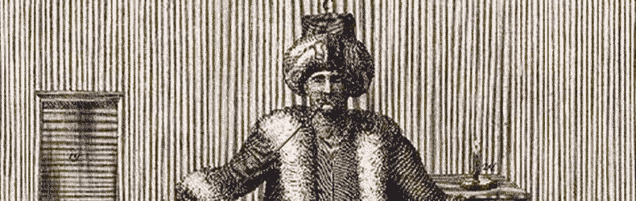
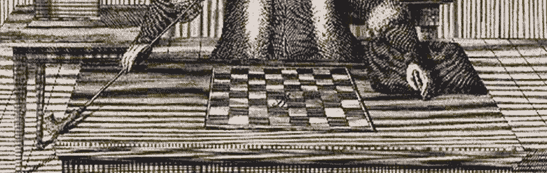
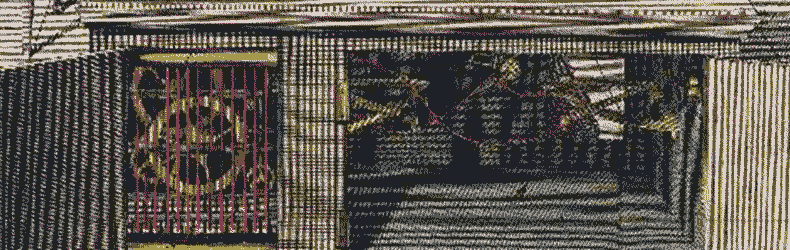

#   Cores



##  Learning Objectives

-   Identify common Hoon patterns:  atoms, cells, cores, faces, and traps.
-   Use and diagram the type spear `-:!>` and identify vases.
-   Review known runes in context of highest-frequency, highest-impact runes.


##  Standard Structures

Everything in Urbit is a binary tree.  There are a number of standard binary trees which are expected by the Arvo operating system and by other developers:  lists, cores, and traps are chief among these.

Now, for a moment let's draw some boundaries between domains.  We have Nock, Hoon, and Arvo, all of which come together to define Urbit OS.  Properly speaking, Nock and Hoon can stand apart from Arvo:  the Vere interpreter expects an "Arvo-shaped thing" and doesn't actually mandate Arvo itself.  We have been mixing these concepts somewhat, as for instance in Syntax, and for the most part this mixing doesn't matter (no one off Mars is liable to adopt Hoon).  My point is that Hoon and Arvo are even more tightly entwined than C and Unix, since C is portable across platforms.  (We can also perhaps look forward to a world with Pythoon and Rhooby language implementations.)

The structures that Arvo utilizes and that Hoon by convention expects are somewhat arbitrary, if frequently convenient.  For instance, one could imagine cores with `[payload battery]` or lists terminated by something other than null.  Arvo frequently takes advantage of consistent structure to fetch related data (such as the sample and context).

### Atoms

Everything in Urbit is a binary tree, or so you've been told, but what are the leaves of that tree?  Ultimately, everything reduces to a noun, which means either an atom or a cell.

An atom is an unsigned integer, whether or not it has the aura `@ud`.  All data in Hoon is ultimately representable by an unsigned integer.  Review Aura for more details.

Now, if you think about computing, this shouldn't be too surprising.  After all, everything is ultimately binary, all the way down to commands and addresses.  Hoon just lets this be discoverable and introspective.

### Cells

Cell:  the other noun.  Cells are the pair composition of two other nouns, so ultimately they are the branches in the binary tree, with the terminal leaves being atoms.

### Cores

Cores, as you've seen mentioned before, are a cell of `[battery payload]`.

Cores are absolutely ubiquitous in Urbit:  they are the primary idiom, and many special cases exist.

### Traps

A trap is a certain kind of core pattern.  It has one arm `$` and no sample.  Traps serve a similar role to loops in other languages.  Basically, since every program is a binary tree, there's not a reentrant connection.  Instead, we _recompute_ the arm and replace it with the updated values, thereby preserving the binary tree structure of a Hoon program but getting the same effect as a loop.  (This is an example of something formally elegant but slower in practice than, say, a C `for` loop would be.)

Let's look at a generator with a trap and annotate what's happening.  Pay particular attention to `|-` and `$()`:

```hoon
|=  n=@ud
=/  index=0
|-  ^-  @ud
  ?:  =(index n)  index
~&  index
$(index +(index))
```

This simple counting generator accepts a number `n` and counts up to that number, emitting each value up to (but not including) `n`.  Ignore the `|=` bartis for a moment and look at the rest of the program:

- `=/` is used to pin a face to the current subject.  That is, it defines a variable which downstream elements know about.
- `|-` defines a trap, which means that it's essentially a recalculation point.  It knows about what goes before it, but doesn't define anything new (other than `$`) nor does it accept a sample.
- `^-` constrains anything passing through it to be of a certain aura.  Basically, it's a type annotation.  These are not often formally necessary, but they are extremely helpful to thinking about and debugging code.
- `?:` checks whether the condition of equality between `index` and `n` has been met.  If so, then `index` is returned.
- `~&` emits `index` but has no other effects.
- `$()` is the irregular form for `%=` centis "resolve a wing with changes."  Thus the arm `$` is replaced with a new arm having the specificed changes.  In this case, one change is mandated, to replace `index` with its increment.  `+()` is shorthand for `.+`, a direct Nock command, rather like using inline assembler in C.

Each time the arm `$` is recomputed, the value of `index` updates, so the program proceeds towards its logical outcome of producing a value when `index` and `n` are equal.  Until that point, no value is emitted by the binary tree and so nothing resolves outside of it.

At each point in the tree, a prior subject is referred to and a new subject is created.  This is what is meant by subject-oriented programming, which fuses context, stack, and variable scope into one concept (see Subject-Oriented Programming).

Think for a moment about how you would go about implementing a _nested_ loop under these conditions.  Let's discuss this in office hours sometime because it's very instructive to think through and walk through.

Hint:  If a gate is a core with one arm `$`, then a trap is related to a gate by the omission of a sample.  A trap is essentially a gate with an unchanged subject with a default arm.  You can use `^` (e.g., `^$`) to retrieve an arm from the parent of the core the trap is in.  This is one way (but not the only way) of setting up nested loops.

### Gates

Let's revisit the first Hoon program you ever saw:

```hoon
|=  n=@ud
(add n 3)
```

First we have to back out from the irregular structure implied by `()` to this form:

```hoon
|=  n=@ud
$-  add  [n 3]
```

If a gate is a kind of core, then `|=` bartis with its two children must map to a core.  Indeed, we call `n=@ud` the payload while the rest of the program is the battery.

Reviewing the docs, we find that:

>A gate is a core with two distinctive properties: (1) the battery of a gate contains exactly one arm, which has the special name $. The $ arm contains the instructions for the function in question. And (2), the payload of a gate consists of a cell of [sample context]. The sample is the part of the payload that stores the "argument" (i.e., input value) of the function call. The context contains all other data that is needed for computing the $ arm of the gate correctly.

A gate is therefore `[$ [sample context]]`.

The gate `|=` bartis is a referentially transparent function:  its output depends _only_ on its input.


##  The Subject



Equipped with these structures, we are prepared to talk about Hoon as a _subject-oriented language_.  The _subject_ of any Hoon expression is the parent tree which led to this point.  You can think of it like a path, because it can be traversed backwards, and like a namespace, because it carries the context for evaluation.

For instance, for a gate, the parent core is the subject.  That is, with `[$ [sample context]]` as a gate, the payload `$` is computed using `[sample context]` as the data[.](https://en.wikipedia.org/wiki/Calf_of_Man)  <!-- egg -->

See the Subject-Oriented Language lesson for a deeper dive.

-   Reading: [Tlon Corporation, "The Subject and Its Legs", section "A Start"](https://urbit.org/docs/tutorials/hoon/hoon-school/the-subject-and-its-legs/), section "A Start"
-   Reading: [Tlon Corporation, "Gates"](https://urbit.org/docs/tutorials/hoon/hoon-school/gates/), section "What is a Gate?"

### Faces

A face is a way of referring to a particular limb.  You can think of it as a variable name to use legacy programming terms, although it's not _quite_ the same thing.

Faces can be accessed in more than one way:  `:` and `.`.

```hoon
> =a ~[a=3 b=4 c=5]
> a.a
3
> a:a
3
> b.a
4
> b:a
4
> =<  b  a
4
> =>  a  b
4
```

We read `:` as shorthand for `=<` tisgal "composition of two expressions, inverted."  This means that `:` runs a name as if it were an arm.

We read `.` as a wing lookup.  If it's an arm, the core it is in serves as the subject.

In practice, these are almost completely interchangeable and you'll see both used liberally.  A face is just metadata about the value.

Common faces include `i` and `t` for the head and tail of a list, respectively:

```hoon
> -:`(list @)`[1 2 3 4 ~]
i=1
> i.-:`(list @)`[1 2 3 4 ~]
1
> i:-:`(list @)`[1 2 3 4 ~]
1
```

`,` can be used to strip the face off if referring to the data via the face is inconvenient:

```hoon
> =/  value  1  [..- ,.-]
[value=1 1]
```

In the foregoing case, the first value carried the face of the subject.  `,` is commonly used to get rid of added metadata, as with `list`s.

`,` is shorthand for `^:` ketcol "produce a factory gate for parsing."  As hinted, `^:` gets used for more than just stripping faces and we'll see it again.

```hoon
> -:`(list @ta)`~['hello' 'world']
i=~.hello
> ,:-:`(list @ta)`~['hello' 'world']
~.hello
```

- Reading: [Tlon Corporation, "The Subject and Its Legs"](https://urbit.org/docs/tutorials/hoon/hoon-school/the-subject-and-its-legs/), sections "Faces" and "Duplicate Faces"

### Vases

A vase is a cell of a Hoon expression and its type (but in the other order).  The `!>` zapgar rune produces such typed data.  Vases are frequently used with dynamic data (when the type must be produced at runtime).

```hoon
> !>(.4)
[#t/@rs q=1.082.130.432]
> q:!>(.4)
1.082.130.432
```

The first element `p` is the type annotation (`@rs`, single-precision floating point) while the second element `q` is the value itself in `@ud` representation.

The type spear is a common idiom used to query or check a noun's type.

`-:!>`

```hoon
> !>(`@ud`3)
[#t/@ud q=3]
> +:!>(`@ud`3)
q=3
> -:!>(`@ud`3)
#t/@ud
```

```hoon
> -:!>(~[.~~5 .6 .~7])
#t/{@rh @rs @rd $~}
```

Although less important to us right now, it's worth noting that `!<` zapgal works backwards, comparing a mold to a vase and producing `nest-fail` if they don't match.  (And now you know the mechanism how mismatched auras produce a `nest-fail`.)

### Face to Face

As an aside on faces, sometimes it's hard to figure out how to get the right aura for a conversion.  I ran into the following situation with trying to cast `q` as an `@ux` aura:

```hoon
> q:!>(.4)
1.082.130.432
> `@ux`q:!>(.4)
/~zod/home/~2020.4.7..06.13.55..d061/sys/vane/ford:<[4.820 18].[4.820 59]>
nest-fail
ford: %slim failed:
ford: %ride failed to compute type:
```

In other words, I could get the value of `q`, but I couldn't convert it to another aura!

What was happening?  I used the type spear again:

```hoon
> -:!>(q:!>(.4))
#t/*
```

It turns out that `q` is actually of the _most_ general type `*` noun.  The Hoon compiler wouldn't let me downcast from a higher type `*` to a lower one `@`, which explains why my attempt to pass via the empty aura also failed:

```hoon
> ^-(@ q:+:!>(.4))
/~zod/home/~2020.4.7..06.13.55..d061/sys/vane/ford:<[4.820 18].[4.820 59]>
nest-fail
ford: %slim failed:
ford: %ride failed to compute type:
```

The right way, in this case, is to convert the generic noun type `*` to an atom `@` (a process formerly called a `clam` but now mostly referred to as merely a conversion):

```hoon
> `@ux`(@ q:+:!>(.4))
0x4080.0000
```


##  Errors

You've seen `nest-fail` and `mint-nice` in Aura already.  Other errors you should familiarize yourself with:

- `ford: %ride failed` means that an expected limb wasn't found in the subject.  You either got lost or you referred to something that didn't exist at all.
- `mint-vain` means that one path of a forking rune (like `?=` wuttis) was determined by the compiler to never be taken.
- `fish-loop` occurs when trying to identify a nested type like a `list`.


##  Arvo

Urbit runs as a binary but also has over-the-air updates.  What is going on there?

You can think of the binary as being like a VMWare or Virtual Box server, which holds all of the Urbit data in a single memory block called the loom.  OTAs live in the Urbit system software inside of that memory block.

The worker or "serf" carries out Nock and jet computations for an Arvo-shaped noun.  The daemon or "king" maintains the event log and interacts with the outside world (via Ames, Eyre, etc.).

Thus, OTAs affect the Urbit Arvo software or userspace elements like Landscape, but binary updates affect the serf and/or king.  The serf is written mostly in C, and the king has two implementations, a reference C implementation called Vere and a Haskell implementation King Haskell.


