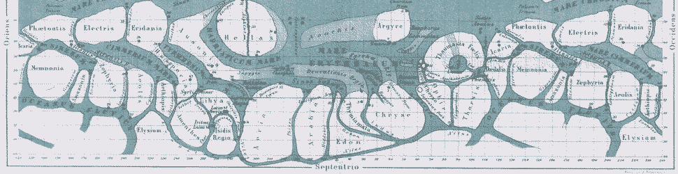
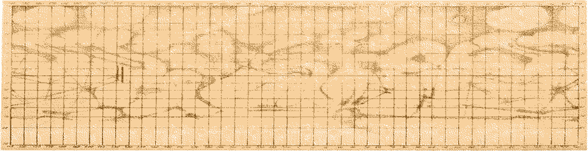

#   Subject-Oriented Programming

{: width=100%}

##  Learning Objectives

-   Explain what a "subject-oriented language" means.
-   Identify common Hoon patterns:  batteries, and doors, arms, wings, and legs.
-   Convert between different regular and irregular forms of Hoon runes.
-   Manage a ship:  events and OTAs.
*   Test irregular syntax


##  The Subject

You have perhaps heard Hoon described as a "subject-oriented language."  What does this mean?  And what is a subject?

The subject of any Hoon expression is the binary tree which spawned it.  In essence, subject-oriented programming is a way of fusing context, stack, and variable scope into one.

Subject-oriented programming means that this scope, the subject itself, is all you really have to take into account.

The downside is that much of the actual system-level code, what runs on the loom and in the Vere layer, is opaque to you.  You manipulate only Nock and above (as Urbit promises), but you don't have insight into what's happening with jets and the actual C or Haskell implementation.  (The system is abstracted away.)

It's worth addressing the relationship of Hoon+Nock to other compiler systems as well at this point:

> Urbit does not use the lambda calculus, an environment or symbol table, or linking. Because it pushes name resolution out of the fundamental interpreter and up into the language, it can play many more namespace juggling tricks.


##  Limbs

Limbs refer to pieces of data resolved in the subject.  Just as humans have two kinds of limbs (arms and legs), so do hoons.

Arms compute something, so they have a core.  Legs are simply subtrees.

Meditate upon Serge Nubret as a reminder:


This is why we say that `-/` tisfas, which we have used to define a variable, actually pins a face to the subject.  That is, it provides a metadata tag for the search path so you can locate the value again.

There are a lot of irregular syntax forms for efficiently accessing limbs.  You should check the documents in ["Limbs"](https://urbit.org/docs/reference/hoon-expressions/limb/limb/) to make sure that these are familiar to you.

A wing is a list of limbs; specifically, a wing is a search path into the subject.  Notably, these are written leftmost-innermost, which feels backwards from C-style languages.

`^` is labeled in the docs as skipping the first $n$ matches in the subject.  What this means to you is that the $n$ "nearest" names are skipped first, so what `^` does is pull a name from an outer core.  (Naturally, you only use this when you know what you're looking for in the subject.)  `^$` is one way of setting up a nested loop with two `|-` barket traps.

Wings are lists of limbs.  It's basically the search path of breadcrumbs to locate a particular arm or leg—computation or data.

(You may wish to review Subject-Oriented Programming, section "Faces", at this point as well.)

The current subject (Arvo) is `.`.  (Most of these values are actually hashes standing in for entire arms.)

```hoon
> .
[ [ [   a
      < 1.hmo
        { n/@ud
          {our/@p now/@da eny/@uvJ}
          <17.cif 31.snt 9.zdf 36.oqd 93.gjk 247.vdb 51.qyl 129.pdd 41.mac 1.ane $141>
        }
      >
        f
      < 1.uqe
        { {* {a/@ud b/@ud c/@ud $~} $~}
          {   a
            < 1.hmo
              { n/@ud
                {our/@p now/@da eny/@uvJ}
                <17.cif 31.snt 9.zdf 36.oqd 93.gjk 247.vdb 51.qyl 129.pdd 41.mac 1.ane $141>
              }
            >
            our/@p
            now/@da
            eny/@uvJ
          }
          <17.cif 31.snt 9.zdf 36.oqd 93.gjk 247.vdb 51.qyl 129.pdd 41.mac 1.ane $141>
        }
      >
    ]
    our=~zod
    now=~2020.9.7..21.48.43..48fe
      eny
    \/0v33n.r22bg.qqbub.q09sg.9gnnh.k1e9d.r8hlm.mt7hq.u6qto.mjjhr.pdhrv.a4r9p.g7tpc.3s703.vqo31.ina1n.\/
      5irmp.qja3l.kga9r.5h7gv.6lj44
    \/                                                                                                \/
  ]
  <17.cif 31.snt 9.zdf 36.oqd 93.gjk 247.vdb 51.qyl 129.pdd 41.mac 1.ane $141>
]
```

- Reading: [Tlon Corporation, "The Subject and Its Legs", section "A Start"](https://urbit.org/docs/tutorials/hoon/the-subject-and-its-legs/)
- Reading: [Tlon Corporation, "Limbs"](https://urbit.org/docs/reference/hoon-expressions/limb/limb/)
- Reading: [Tlon Corporation, "Wings"](https://urbit.org/docs/reference/hoon-expressions/limb/wing/)
- Reading: [Ted Blackman `~rovnys-ricfer`, "Why Hoon?"](https://urbit.org/blog/why-hoon/)


##  More Common Patterns

{: width=100%}

A battery is part of a core, of course:  it contains the code to be executed.  (Analogously with object-oriented programming, it would be the methods.)  Batteries are frequently set up with `|%` barcen although other `|` bar runes may be used.  Typically, each arm of a battery is "dry," meaning that it is type-specific, although there are also "wet" cores which possess type genericity.

A door is the most general case of a function in Hoon.  It packages a core's payload with a cell of `[sample context]`; thus, they are a cell of `[battery [sample context]]`.  Doors are created with `|_` barcab.  That is, the payload has a standard structure.  The context serves as the subject of the door.

Since every door has a standard structure, you can introspect inside of the door to see how parts of it work:

<!--  -->
```hoon
> +1:add
<1.vwd {{a/@ b/@} <41.mac 1.ane $141>}>
> +2:add
[6 [5 [1 0] 0 12] [0 13] 9 2 10 [6 [8 [9 2.398 0 7] 9 2 10 [6 0 28] 0 2] 4 0 13] 0 1]
> +3:add
[[a=0 b=0] <41.mac 1.ane $141>]
> +6:add
[a=0 b=0]
> +7:add
<41.mac 1.ane $141>
```
<!--  -->

`+1:add` returns the entire door:  in this case, it actually shows a hash of the elements and the type signature of expected inputs `{a/@ b/@}`.

`+2:add` yields the Nock formula for the door.  (Think `[battery payload]`; this is the battery.)

`+6:add` yields the sample, here with specific default values.  Since this is addition, we want to add from zero.  (Compare `+6:mul` in which we wish to multiply against one instead.)

`+7:add` is the context of the payload.  Note that this will match part of the `.` current subject.

These can stack:  `+6:+7:add` yields the sample of the door's context, here the Arvo version (root noun).

The core containing an arm is `..arm`.  Notice that `..add` and `+7:add` are the same, since the parent core and the context of standard library function `++add` are the same.  (This won't generally hold true, of course.)

This transparent introspection is extremely powerful, and you'll often see it employed in kernel code (if not so much in userspace code).  Head is code, tail is data, that's all you have to keep track of.

(Gates, therefore, are special cases of doors.  See [`%~` censig](https://urbit.org/docs/reference/hoon-expressions/rune/cen/#censig) for more information.)

- Reading: [Tlon Corporation, "Doors"](https://urbit.org/docs/tutorials/hoon/hoon-school/doors/)


##  Irregular Runic Forms

Runes frequently have irregular forms.  You should look up the following irregular forms on [the current Hooncard](https://github.com/natareo/hooncard/blob/master/hooncard.pdf).

- What is `~[1 2 3]` an irregular form for?
- What is `%a^%b` an irregular form for?
- What is `$()` an irregular form for?

The `|-` barhep rune in particular bears commenting upon.  Notice that, try as you might, you can't locate an irregular form `$()` on the Hooncard.  What's actually happening is that `%=` centis is recomputing the default subject `$` as a wing with specified changes.  Closely related to `|-` is `|.` bardot, which also produces a trap but defers evaluation.

Another less-than-regular form is the use of `&n` in addressing lists.  Rather than track the index of the binary tree node (as with `+n`), you can enumerate by natural list indices:

```hoon
> &3:~[1 2 3 4 5]
3
```

This doesn't work with faces (like `&a`), though, so tools like the zero-indexed [`++snag`](https://urbit.org/docs/reference/library/2b/#snag) are more helpful.  `++snag` tends to be cantankerous about types, though:

```hoon
> (snag 4 `(list)`~[1 2 3 4 5])
5
```


##  Ship Management

Your planet needs a bit of regular maintenance to keep things running smoothly.

### Over-the-Air Updates

First off, you should keep up with over-the-air updates.  You can control these using `|ota`.  By itself, `|ota` turns updates off.  Commonly, you turn updates on from a particular sponsor with `|ota (sein:title our now our) %kids`.  (The `%kids` desk is the Clay desk on a sponsor which provides information to daughter points.)

Any update has two parts:  download ("fetch") and apply ("merge").

You can check the "base hash" (deprecated but not yet replaced terminology) at [`whatsthelatestbasehash.com`](https://whatsthelatestbasehash.com).  Compare to your `%home` desk with `+trouble`.  If the base hashes match, then you have successfully fetched.

If the base hashes match but seem not to have been applied yet, [here is a recent discussion of means to solve the issue](https://github.com/urbit/urbit/issues/3191).

### Memory Management

Besides OTAs, you also need to trim excess memory usage.  Urbit allocates a 2-GB block called the loom.  Nouns can be checked for uniqueness and old chat logs etc. can be purged.

To maintain your ship's memory layout, you should run the following every few weeks:

```hoon
|pack
```

The event log yields the ship's current state.  If you have troubles with your ship, it is sometimes helpful to delete the current state and force the ship to play back all or some of the log.  To that end, you should _back up_ the ship's current state from time to time to prevent needing to play back millions of events.  (Keystroke-level occurrences are events.)

I highly recommend setting up a `cron` job on your cloud instance to regularly back up the `.urb/chk` directory inside of your ship's pier.

For instance, on my ship's cronfile (accessed with `crontab -e`), I have the following entry:

```bash
0 0 * * 1,3,5,7 /home/username/urbit/backup.sh >/dev/null 2>&1
```

where `backup.sh` contains

```bash
mkdir -p ~/urbit/backup/$(date +%Y-%m-%d)
cp -r ~/urbit/sampel-palnet/.urb/chk ~/urbit/backup/$(date +%Y-%m-%d)
cp -r ~/urbit/sampel-palnet/home ~/urbit/backup/$(date +%Y-%m-%d)
```

Finally, take note that `|knob` can turn on or off debugging messages from various tagged sources (like `%hole` or `%eyre-no-channel`):

```hoon
%hush  :: turn off all messages
%soft  :: simple error messages
%loud  :: full output
```

- Optional Reading: [Tlon Corporation, "Ship Troubleshooting"](https://urbit.org/docs/tutorials/ship-troubleshooting/)


##  A Word of Encouragement

From the [Precepts](https://urbit.org/blog/precepts-discussion/):

> Code courageously.
>
> If you avoid changing a section of code for fear of awakening the demons therein, you are living in fear. If you stay in the comfortable confines of the small section of the code you wrote or know well, you will never write legendary code. All code was written by humans and can be mastered by humans.
>
> It's natural to feel fear of code; however, you must act as though you are able to master and change any part of it. To code courageously is to walk into any abyss, bring light, and make it right.
>
> The unix/internet stack is a giant ball of mud. It's so big that when you're standing on it, it looks like a bog, and it's not clear that there is a bottom to it. You know there must be, but it doesn't matter because you learned long ago that the best solution is to not dig too deep. Build a strong structure by spreading out your weight and using strong construction materials. If there's something useful deep in the mud, it's probably not worth diving in to pull it out. That's dangerous and prone to failure, and you know many people who have gotten stuck down there.
>
> This is an appropriate reaction to the unix/internet stack. It's also self-perpetuating. The bog is filled — even composed of — countless predecessors who did that same thing. If you ever find yourself on solid ground, protect that with your life. Learn how it works and how to use it well. Then build a strong structure on top of that. Don't let it decompose into a layer of mud.
>
> Urbit is small enough that, while there's definitely some construction-related dirt and muck covering it, the solid metallic core is not very deep — not more than waist deep in most places. The feeling of always being in contact with the bottom is very different than flailing about in a bog.
>
> This property is worth fighting for. It's the whole reason Urbit was written. New Urbit programmers are instinctively distrustful of anything below them and code defensively and fearfully. They must learn that it's all drastically simpler and more legible than they're used to. It's still hard, but you can actually make progress. To do so, you have to stand up straight, so you can get a firm footing on the ground. Keep your chin up and your shoulders back, and adopt the posture of a conqueror. When something doesn't work right, don't retreat into your shell of safety and control — fix it. The forces of chaos are always lurking, but their victory isn't inevitable. It's all on the line, so code with abandon.

{: width=100%}
