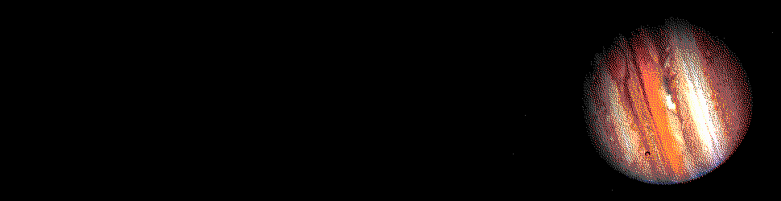
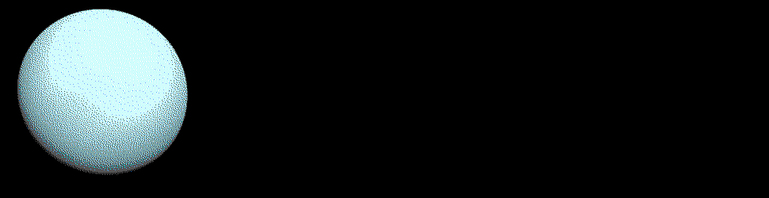

#   `%ask` Generators



##  Learning Objectives

-   Create an `%ask` generator.


##  `%ask` Generators


We use `%ask` generators to accept user input during the operation of the program, much like `input` or `scanf` in other languages.

As with a `%say` generator, an `%ask` generator is a cell which Arvo interprets in a particular way[.](https://youtu.be/UaUR6u8nHoM)  <!-- egg -->

That is, at this point we know about three kinds of generators.  Each is a core but has a characteristic shape that Arvo knows how to access[:](https://en.wikipedia.org/wiki/Italian_Unionist_Movement)  <!-- egg -->

1.  Naked generators are just gates.
2.  `%say` generators are cells of `%say` and a `cask`.
3.  `%ask` generators are cells of `%ask` and a `sole-result`.

A `sole-result` is a mold builder.  We haven't delved deeply into molds quite yet, but a mold is a coercive function which makes a noun match a specified type.  A mold builder, therefore, takes the molds from the body of the generator and reshapes them in a characteristic way for Arvo to interpret.

```hoon
/-  sole
/+  generators
=,  [sole generators]
:-  %ask
|=  *
^-  (sole-result (cask tang))
%+  print    leaf+"Who's on first?"
%+  prompt   [%& %prompt "name: "]
|=  t=tape
%+  produce  %tang
?:  =(t "Yes")
  :~  leaf+"I mean the fellow's name."
  ==
?:  =(t "That's the man's name.")
  :~  leaf+"That's who's name?"
  ==
:~  leaf+"Who's on first,"
    leaf+"What's on second,"
    leaf+"I Don't Know is on third."
==
```

New runes?  New runes:

- `=,` is probably the oddest one.  It "exposes a namespace."  In Hoon terms, this means that you can access what's inside of a core without suffixing the wing search path.  Here, we use it because it is shorter than typing `sole-result` again and again.
- `%+` calls a gate using a cell sample.  Here, it parses `%tang` and the lists of `tape`s.
- `%&` isn't a rune!  `%` prefixes `@tas` values, and so `%&` is a "positive" loobean flag indicating whether a prompt should echo output.  `%|` is the opposite, of course.
- `:~` is a list constructor; you've used it in irregular form many a time as `~[1 2 3]`.

You've seen `tang` and `leaf` before in Ford 1 when we talked about producing error messages.



### `sole-result`

The `sole` structure library lives in `%home/sur/sole/hoon` (note that it is imported with `/-`).  I recommend opening and reading this file.

There are a lot of standard structures in `sole`; we are primarily interested in `++sole-result`, which is a conditional result (thus, dependent on input).

### `generators`

The `generators` library lives in `%home/lib/generators/hoon`.  Unsurprisingly, it provides some convenience functions for constructing generators.  I recommend opening and reading this file.

You are primarily interested in employing `++print`, `++prompt`, and `++produce`, all of which are reasonably demonstrated in the example code above and in the documentation.  (Also not `++curl`.)

- Reading: [Tlon Corporation, "Generators"](https://urbit.org/docs/tutorials/hoon/hoon-school/generators/), section "`%ask` Generators"


