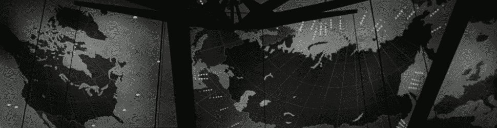
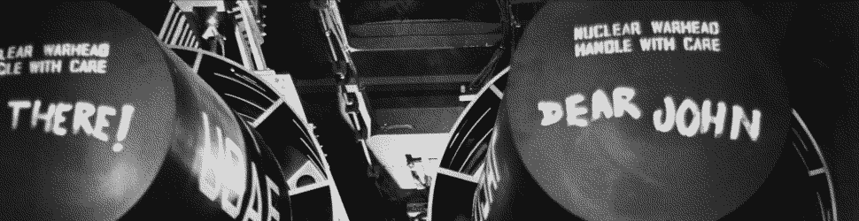
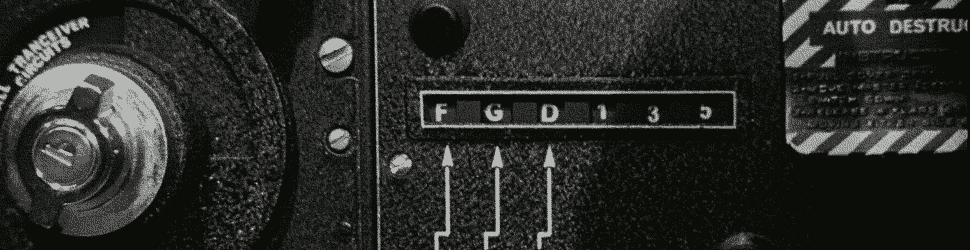
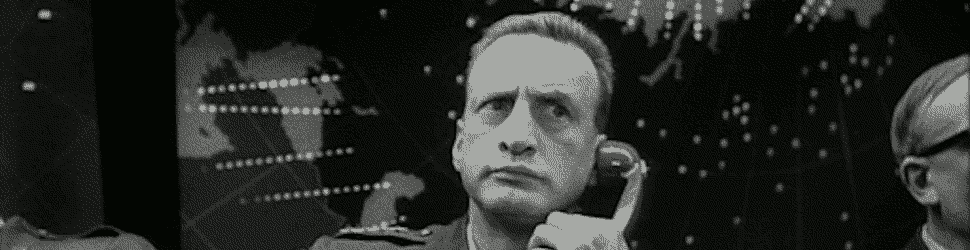

#   The Standard Library

{: width=100%}

##  Learning Objectives

- Explore the standard library's functionality:  text parsing & processing,     functional hacks, randomness, hashing, time, and so forth.


##  Standard Operations

{: width=100%}

Any useful programming language exposes a standard library:  a set of tools and manipulations which are exposed to or importable for any program to utilize immediately.  The Urbit OS standard library lives split between three aspects:  Hoon itself, Arvo, and Zuse.

Now, there's a bit of a challenge in sorting out which gates and molds come from Hoon and which from Zuse, and the docs generally aren't clear in defining those boundaries.  So `++add` is part of Hoon, whereas `++gift` is part of each vane's material in Zuse.

- Reading: [Tlon Corporation, "Standard Library (By Section)"](https://urbit.org/docs/reference/library/table-of-contents/#by-section)

##  Hoon

{: width=100%}

Broadly speaking, almost all of the functions and tools you've used up until today—with the exception of some of the Clay operations involved `++arch`—have been part of Hoon only.


##  Arvo


Arvo, at the top, is simply a gate which takes a timestamp and a structured input.  Since Arvo and Arvo's vanes must communicate with each other, it behooves us to establish a standard interface for that communication.

For instance, here are some of the top-level definitions which Arvo provides:

```hoon
::  $arch: fundamental node
::  $beak: global context
::  $beam: global name
::  $bone: opaque duct handle
::  $case: global version
::  $cage: marked vase
::  +cask: marked data builder
::  $desk: local workspace
::  $dock: message target
::  $mark: symbolic content type
::  $ship: network identity
::  $sink: subscription
```

The basic unit for these interactions is a `move`, which is a cell `[duct ball]`, or cause and action.  (Gall calls these `[bone card]` for who knows what reason.  Just think of causes and actions.)  Since we will start using moves extensively when we use Gall and Clay, let's dig into them a bit.  Each move can take one of several forms, but the most common and most important are these:

- `%pass` moves are essentially vane calls.
- `%give` moves are essentiall returns.
- `%unix` moves handle Unix-facing communications.

A `wire` (which is a kind of `path`) represents the list of symbols defining a particular cause.

These events are handled by `duct`s, which are call stacks maintained by each vanes.

You can get a notion of the kind of processing available for moves:

```hoon
::  $ball: dynamic kernel action
::  $card: tagged, untyped event (vane-specific)
::  $curd: tagged, untyped event
::  $duct: causal history
::  +hobo: %soft task builder
::  $goof: crash label and trace XX fail/ruin/crud/flaw/lack/miss
::  $mass: memory usage
::  $monk: general identity
::  $move: cause and action
::  $ovum: card with cause
::  $scry-sample: vane +scry argument
::  $vane-sample: vane wrapper-gate aargument
::  +wind: kernel action builder
::  $wire: event pretext
::  +wite: kernel action/error builder
```

- Reading: [Tlon Corporation, "Arvo"](https://urbit.org/docs/tutorials/arvo/arvo/), sections "What is Arvo?"–"Formal Interface" (we'll dive deeper into this in Arvo 1)


##  Zuse

{: width=100%}

Zuse is also a major component of the standard library for Urbit.  It sits midway on the subject stack, after the Hoon parser and Arvo itself, but before the vanes and the userspace apps.  The goal of Zuse is to provide a minimalist set of conventional operations on cores and the like.

"All vanes and userspace files depend on Zuse, which depends on the Arvo and Hoon sources."  The source for `%zuse` is in `zuse.hoon`.  The source code in Zuse is rather well-commented, though its accessibility is a function of familiarity with the Arvo bestiary.

Indeed, the standard library `%zuse` contains two nested cores, one for data structures and the other for functions (gates, doors, etc.).  Some pieces of `%zuse` define standard structures (like HTTP headers or ), while others describe standard tasks across vanes (like `%plea` "receive message via `%ames`" or `%vega`, "kernel upgraded)".

For instance, `%zuse` defines vane-specific structures like the `beam` and `beak`:

<!--  -->
```hoon
++  beam  {{p/ship q/desk r/case} s/path}             ::  global name
++  beak  {p/ship q/desk r/case}                      ::  path prefix
```
<!--  -->

Zuse also provides components to parse and process data structure like JSON, `++enjs` and `++dejs`, and MIME types, `++mimes`.

```hoon
> (en-base58:mimes:html `@ud`'Hello, world')
"2tv3tjoSwn5Qqgnuu"
> (de-base58:mimes:html "2tv3tjoSwn5Qqgnuu")
31.079.605.376.604.435.891.501.163.848
> `@t`(de-base58:mimes:html "2tv3tjoSwn5Qqgnuu")
'Hello, world'
```

There are some cryptography routines, time parsing, and other utilities as well.

```hoon
> (dust:chrono:userlib `date`(yore now))
"Mon, 28 Sep 2020 18:53:14 +0000"
> (stud:chrono:userlib 'Mon, 28 Sep 2020 18:53:14 +0000')
[~ [[a=%.y y=2.020] m=9 t=[d=28 h=18 m=53 s=14 f=~]]]
```

- Optional Reading: [Tlon Corporation, `zuse.hoon`](https://github.com/urbit/urbit/blob/master/pkg/arvo/sys/zuse.hoon)

{: width=100%}
