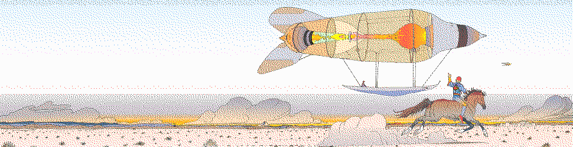
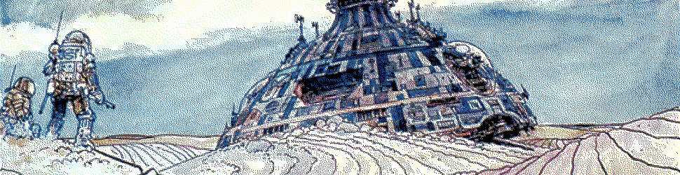
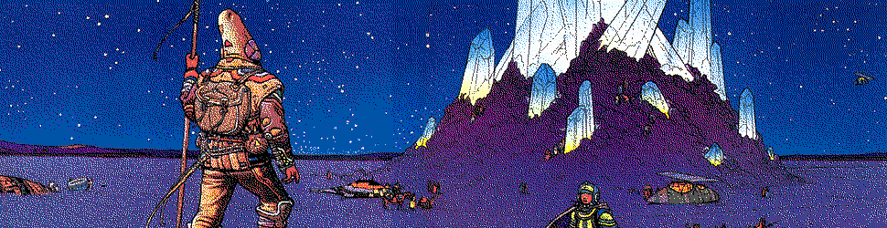
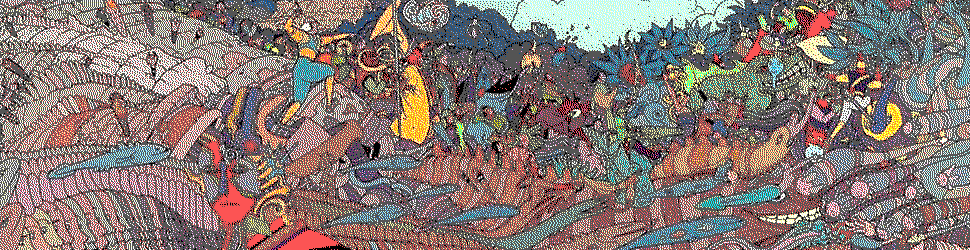

#   Common Containers



##  Learning Objectives

-   Identify common Hoon patterns, such as set, map, jar, and jug.
-   Use Sail runes to compose XML/HTML blocks.
-   Use the Hoon standard library Sections 2h–2k.


##  Containers

The most fundamental container in Hoon (and Nock) is a cell:  `[* *]`.  There are of course a number of specialty containers you've already seen:

- `core` `[battery payload]`:  thence doors, gates, etc.
- `list` `~[1 2 3]`
- [`vase`](https://urbit.org/docs/reference/library/4o/#vase) `!>(`@rs`.1.0)`, `!>(~)`
- [`dime`](https://urbit.org/docs/reference/library/3g/#dime):  atom-aura pair

Containers are supported to allow the ordered retrieval of information.  Fundamentally, we can separate containers by access mode (sequential and random-access).  An example of a sequential container would be a list; an example of a random-access container would be an associative array or dictionary—a `map`, to Hoon.


##  Lists



Lists are simply rightwards-branching null-terminated sequences.  They can be irregularly constructed using `~[1 2 3]` notation or using the `:~` colsig rune:

```hoon
=colormap :~  [135, 59, 97]
              [144, 69, 147]
              [131, 91, 193]
              [103, 123, 220]
              [73, 162, 218]
              [58, 198, 189]
              [71, 223, 145]
              [113, 231, 108]
              [173, 225, 95]
              [233, 213, 117]
            ==
```

Access to list elements is accomplished using [`++snag`](https://urbit.org/docs/reference/library/2b/#snag) by a zero-indexed convention:

```hoon
(snag 3 `(list)`colormap)
```

Sometimes the Hoon typechecker has difficulty identifying a null-terminated tuple as a list.  In that case, you may need to cast using the `++list` mold builder or the [`++limo`](https://urbit.org/docs/reference/library/2b/#limo) wrapper which adds `i`/`t` faces.  As always, frequently cast your expectations by mold using `^+` ketlus or `^-` kethep.

There are several tools to manipulate, combine, and separate lists and list elements:  `++snap`, `++weld`, etc.

- Reading: [Tlon Corporation, "List Logic"](https://urbit.org/docs/reference/library/2b/)


##  Maps, Sets, Jars, & Jugs


There is an ensemble of containers which are frequently used together:  maps (key-value treaps); sets (ordered treaps); jars (maps of lists); and jugs (maps of sets).

### Maps

If you want to look up data by key–value pairs, use the [`++my`](https://urbit.org/docs/reference/library/2m/#my) mold builder to construct a `map`.

```hoon
=alphabet `(map @ta cord)`(my ~[[%alpha 'α'] [%beta 'β'] [%gamma 'γ'] [%delta 'δ']])
```

To access a particular entry, use the `++get` arm in the following tendentious construction:

```hoon
(~(get by alphabet) %alpha)
```

Notice that this returns a `unit`, which also permits a bare `~` to be returned in case the entry is empty.

> What is going on with that `~(get by alphabet)` bit?
>
> Essentially, this lookup needs to resolve to a gate which can accept a sample (the key) and produce a value.  These arms in `++by`, `++in`, etc., are doors which resolve to gates for key lookup.

To change or insert an entry, use the `++put` arm:

```hoon
(~(put by alphabet) [%epsilon 'ε'])
```

(This _returns_ a changed copy; it doesn't alter the original dictionary.)

- Reading: [Tlon Corporation, "Trees, Sets, and Maps"](https://urbit.org/docs/hoon/hoon-school/trees-sets-and-maps/)
- Reading: [Tlon Corporation, "Map Logic"](https://urbit.org/docs/reference/library/2i/)

### Sets

A set is a collection of discrete objects.

If you want to track set membership using a `set`, use the [`++sy`](https://urbit.org/docs/reference/library/2m/#sy) mold builder.

```hoon
=fibs `(set @rs)`(sy ~[.1 .1 .2 .3 .5 .8 .13 .21])
```

To check set membership, use `++has`:

```hoon
(~(has in fibs) .34)
```

To add or remove an item from a set, use `++put` and `++del`, respectively:

```hoon
(~(put in fibs) .34)
(~(del in fibs) .1)
```

Slam a gate on each item in the set with `++run`:

```hoon
(~(run in fibs) |=(a=@rs (add:rs .1 a)))
```

Slam a gate across all items in the set with `++rep`:

```hoon
(~(rep in fibs) add:rs)
```

- Reading: [Tlon Corporation, "Set Logic"](https://urbit.org/docs/reference/library/2h/)

### Jars

A jar is a map of lists.  This is used internally for such operations as remembering ship names in order of preference and tracking `%unix` events.

- Reading: [Tlon Corporation, "Jar and Jug Logic"](https://urbit.org/docs/reference/library/2j/)

### Jugs

A jug is a map of sets.  This is frequently used in the metadata store in Gall apps like Chat and Publish.

- Reading: [Tlon Corporation, "Jar and Jug Logic"](https://urbit.org/docs/reference/library/2j/)

### Applications



Once you have a map or a set, what do you do with it?  One common technique is to `++turn` on `a-map` by `a-gate`:

```hoon
(turn ~(tap in ~(key by a-map)) a-gate)
(turn ~(tap in ~(key by a-map)) a-gate)
```

That produces a list.  If you want to preserve having a map, use `++urn`:

```hoon
(~(urn by a-map) |=(a=(pair * *) q.a))
```

(See also [`++stir`](https://urbit.org/docs/reference/library/4f/#stir), the parser-combinator for sequences, which acts as a Map/Reduce algorithm.)

- Reading: [Tlon Corporation, "Normalizing Containers"](https://urbit.org/docs/reference/library/2o/)
- Reading: [Tlon Corporation, "Container from Container"](https://urbit.org/docs/reference/library/2l/)
- Reading: [Tlon Corporation, "Container from Noun"](https://urbit.org/docs/reference/library/2m/)


##  Addendum


The bomb defusing exercise is a great refresher before we start on Gall next time.  It also uses some of the container logic we developed above.

- Reading: [Tlon Corporation, "Hoon Workbook:  Bomb Defusing"](https://web.archive.org/web/20210315072208/https://urbit.org/docs/tutorials/hoon/workbook/bomb/)

Dawid Ciezarkiewicz `~napter-matnep` has been working on a Hoon introduction, which may be worth your while to peruse as an alternative explanation of many elementary concepts in Hoon.

- Optional Reading: [Dawid Ciezarkiewicz `~napter-matnep`, "Hoon for Regular Programmers"](https://hackmd.io/IYd4RkpBQVqQTehmJeoxRw)



_All images in this lesson copyright Moebius._


#   Questions

##  Creating a Map

Create a map of ZIP codes, mapping the ZIP code to a city name.  (You may use any source.)

##  Creating a Map

Create a second map of human names paired with ZIP codes (as if extracted from a database).

Demonstrate looking up a human's city via their ZIP code.
