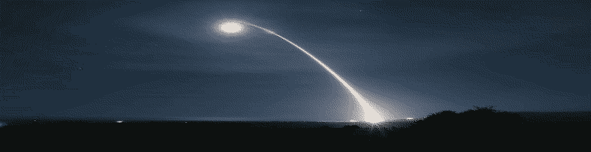
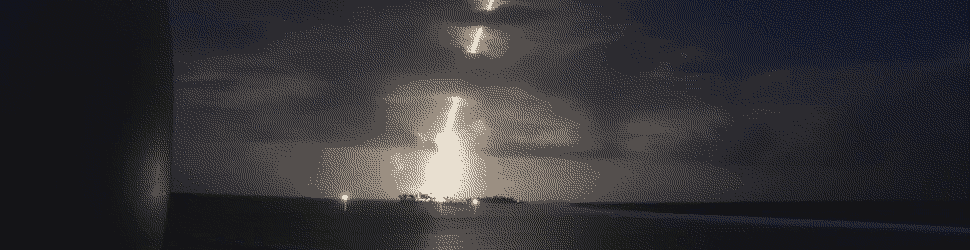
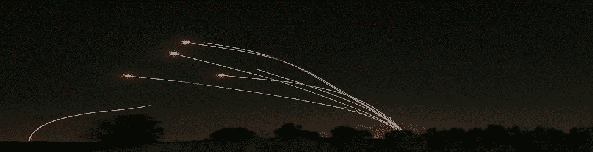

#   Gall I



##  Learning Objectives

- Understand how static Gall instruments an app.
* Produce a basic Gall app.


##  Userspace

We looked at Clay and Ford earlier; we'll see Ames and Behn and other vanes ahead.  Today we start on an epic journey through userspace:  Gall.

The Gall vane provides a standard set of operations to interface with userspace "apps":  really, state machines.  Almost everything in Urbit you interact with as a user is mediated through Gall:  Chat, Publish, Landscape, Dojo...


##  Event Handling


The fundamental unit of the Urbit kernel is an event called a `++move`.  Arvo is primarily an event dispatcher between moves created by vanes.  Each move therefore has an address and other structured information.

>A vanilla event loop scales poorly in complexity.  A system event is the trigger for a cascade of internal events; each event can schedule any number of future events.  This easily degenerates into “event spaghetti.”  Arvo has “structured events”; it imposes a stack discipline on event causality, much like imposing subroutine structure on gotos.
>
>An interrupted event never happened.  The computer is deterministic; an event is a transaction; the event log is a log of successful transactions. In a sense, replaying this log is not Turing complete. The log is an existence proof that every event within it terminates.  (Whitepaper)

Every Gall app is a door with two components in its subject:

1. `bowl:gall` for Gall-standard tools and data structures
2. App state information

The older Gall system (pre-12/19), now dubbed dynamic Gall, allowed for the free definition of arms as event handlers.  New Gall (static Gall) mandates a standard structure for event handlers[.](https://en.wikipedia.org/wiki/Roosevelt%E2%80%93Rondon_Scientific_Expedition)  <!-- egg -->

A minimalist do-nothing default Gall app could look like this:

```hoon
/+  default-agent
^-  agent:gall
=|  state=@
|_  =bowl:gall
+*  this      .
    default   ~(. (default-agent this %|) bowl)
::
++  on-init   on-init:default
++  on-save   on-save:default
++  on-load   on-load:default
++  on-poke
  |=  [=mark =vase]
  ~&  >  state=state
  ~&  got-poked-with-data=mark
  =.  state  +(state)
  `this
::
++  on-watch  on-watch:default
++  on-leave  on-leave:default
++  on-peek   on-peek:default
++  on-agent  on-agent:default
++  on-arvo   on-arvo:default
++  on-fail   on-fail:default
```

- Reading: [Tlon Corporation, "Gall"](https://urbit.org/docs/tutorials/hoon/hoon-school/gall/)
- Reading: [Tlon Corporation, "Gall Tutorial"](https://urbit.org/docs/tutorials/arvo/gall/)


##  Events


Every vane defines its own structured events.  Each unique kind of structured event has a unique, frequently whimsical, name.  This can make it challenging to get used to how a particular vane behaves.

For Gall, a standard move is a pair `[bone card]`.  A `bone` is a cause while a `card` is an action.  (`[cause action]`, it's always `[cause action]`.)  A `card`, in turn, is a pair `[tag noun]`.  The tag is a `@tas` token to indicate which event is being triggered while the `noun` contains any necessary information.

Gall apps run like services, so they can always talk to each other.  This leads to a very high potential for app interactivity rather than siloization.

(Compare this to other core structures:  a gate is `[battery [sample context]]`; a move is `[bone [tag noun]]`.)


##  Types of Apps



Userspace applications are conceptually but not architecturally divided into three classes.  It is recommended as a burgeoning best practice that new apps hew to this division for clarity and forward compatibility.

1. **Stores**.  Independent local collections of data exposed to other apps.  Think of Groups for Landscape.
2. **Hooks**.  Store manipulations.  Think of subscriptions.
3. **Views**.  User-interface applications.  Think of Landscape itself (the browser interface).

- Reading: [Logan Allen, Matt, Matilde Park `~haddef-sigwen`, "Userspace Architecture"](https://docs.google.com/document/d/1hS_UuResG1S4j49_H-aSshoTOROKBnGoJAaRgOipf54/edit)




#   Questions

##  Identifying Move Tokens

Examine the code in `app/chat-cli.hoon`.

Report the list of possible move tokens for that Gall app under the `+$command` structure arm.  Note (but don't bother reporting) the associated nouns.

##  A Minimalist Gall App

Complete the [`egg-timer` app tutorial](https://urbit.org/docs/tutorials/hoon/hoon-school/egg-timer/).

You may start the Gall app using `|start %egg-timer` and poke it using a relative time such as `:egg-timer ~s10`.

We will revisit this when we discuss Behn.
