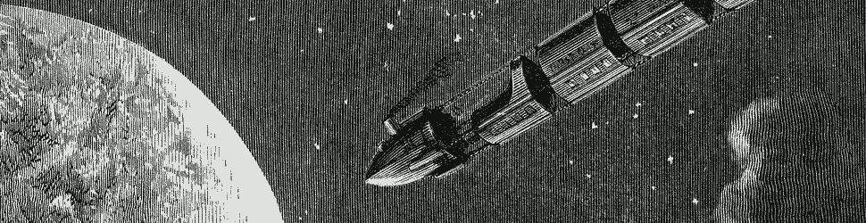
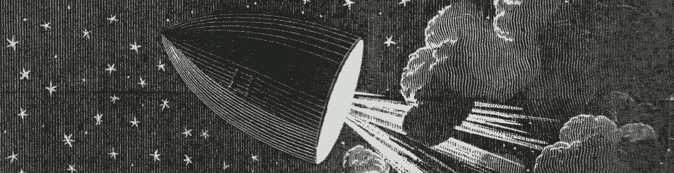
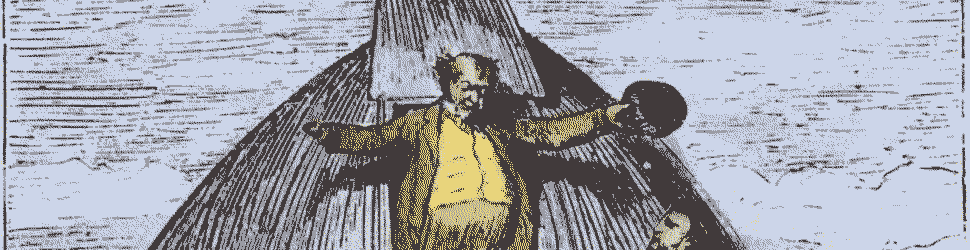

#   The Kernel

##  Learning Objectives

- Discuss foundational philosophy and directional vision for the project.

##  The Kernel

It's time for a philosophical fireside chat.  To tie together our loose ends up to this point, and to preface our further dive into the kernel post-Gall, we need to read the Urbit Whitepaper and thoroughly discuss its perspective.  We will also need to re-read and internalize the Urbit Precepts (an aesthetic of programming) and their associated discussion.

- Reading: [Curtis Yarvin `~sorreg-namtyv`, Philip Monk `~wicdev-wisryt`, Anton Dyudin, and Raymond Pasco, "Urbit: A Solid-State Interpreter" ("Whitepaper")](http://media.urbit.org/whitepaper.pdf), sections 1–8, 11–15
- Reading: [Philip Monk `~wicdev-wisryt`, "Urbit Precepts"](https://urbit.org/blog/precepts/)
- Reading: [Philip Monk `~wicdev-wisryt`, "Urbit Precepts (Discussion)"](https://urbit.org/blog/precepts-discussion/)
- Optional Reading: [Andrea O'Sullivan, "Can Urbit Reboot Computing?" (_Reason_ Magazine)](https://reason.com/2016/06/21/can-urbit-transform-the-internet/)
- Optional Reading: [François-René Rideau (Faré), "Houyhnhnms vs Martians"](https://ngnghm.github.io/blog/2016/06/11/chapter-10-houyhnhnms-vs-martians/)

#   Questions

##  Move Traces

Read the [docs on processing a move in Arvo](https://urbit.org/docs/tutorials/arvo/move-trace/).
