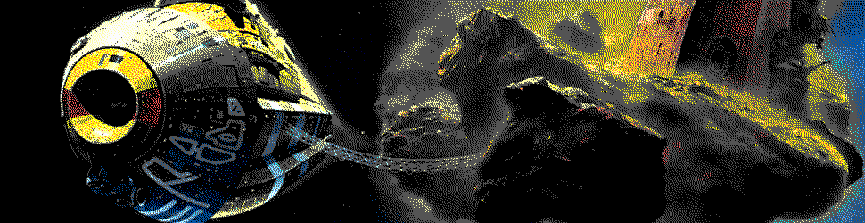

#   Text Parsing


##  Learning Objectives

{{ indented_include( "lessons/19-text-parsing/objectives.yml",0 ) }}


##  Text Molds and Values


The basic text quantities in Hoon are the atom `cord` `@t` and derivatives, and the list `tape`.

```hoon
> `@t`'Excalibur'
'Excalibur'
> `tape`"Excalibur"
"Excalibur"
```

There are many helpful text conversion arms:

- `++cass`:  convert upper-case text to lower-case (`tape`→`tape`)
- `++cuss`:  convert lower-case text to upper-case (`tape`→`tape`)
- `++crip`:  convert `tape` to `cord` (`tape`→`cord`)
- `++trip`:  convert `cord` to `tape` (`cord`→`tape`)

You can convert to and from atoms with particular auras as well:

- [`++scot`](https://urbit.org/docs/reference/library/4m/#scot):  render `dime` as `cord` (`dime`→`cord`)
- [`++scow`](https://urbit.org/docs/reference/library/4m/#scow):  render `dime` as `tape` (`dime`→`tape`)

But wait:  what's a `dime`?  A `dime` is a pair of aura as `@ta` and a value.  This helps the function know _what_ to render the value as.

[`++scan`](https://urbit.org/docs/reference/library/4g/#scan) is used with a parsing rule to parse `tape` into `atom`.

- [`dim:ag`](https://urbit.org/docs/reference/library/4j/#dim-ag) parses a decimal number out of a tape (`tape`→`@ud`)
- [`ddm:ag`](https://urbit.org/docs/reference/library/4j/#dim-ag) parses an Urbit-style decimal number (with `1.000` dot separators) out of a tape (`tape`→`@ud`)
- [`hex:ag`](https://urbit.org/docs/reference/library/4j/#hex-ag) parses a hexadecimal digit out of a tape (`tape`→`@ux`)
- [`d:ne`](https://urbit.org/docs/reference/library/4j/#x-ne) renders a adecimal digit from an atom (`@ud`→`cord`)
- [`x:ne`](https://urbit.org/docs/reference/library/4j/#x-ne) renders a hexadecimal digit from an atom (`@ux`→`cord`)

There are many more of these, but you get the flavor of it.

- Reading: [Tlon Corporation, "Text Processing"](https://urbit.org/docs/reference/library/4b/)
- Reading: [Tlon Corporation, "Parsing (Bases and Base Digits)"](https://urbit.org/docs/reference/library/4j/)


##  Text Structures



Many more advanced text structures are available.  These contain metadata tags such as `%leaf` to hint to the prettyprinter and other tools how to represent and process the text data.

Remember from way back when `wain` and `wall`:  `wain` being a list of `cord`s and `wall` being a list of `tape`s.

The primary data structure used by the prettyprinter is a [`tank`](https://urbit.org/docs/reference/library/2q/#tank), which is a nested tagged structure of `tape`s.  A `tank` element can be tagged in one of three ways:

- `%leaf` or `leaf+""`:  a simple printed line
- `%rose`:  a list of tank delimited by strings
- `%palm`:  a list of tank delimited by strings with backsteps (least common)

For instance, to make a single `%leaf` statement, you can type

```hoon
leaf+"Rhongomyniad"
```

You can also us the `>1.000<` format, which converts a value to a `$tank` directly (and can be used with faces/names).

A [`tang`](https://urbit.org/docs/reference/library/2q/#tang) is a list of `tank`s.  It is used with [`++slog`](https://urbit.org/docs/reference/library/2n/#slog) to produce conditional error messages.


##  Tokenizing and Parsing Text


One of the most straightforward tools to use with text is [`++trim`](https://urbit.org/docs/reference/library/4b/#trim), which splits a tape into two parts at a given index.  You can use this together with [`++find`](https://urbit.org/docs/reference/library/2b/#find) to produce a simple text tokenizer.

```hoon
++  parse
  |=  [in-words=tape]
  =/  out-words  *(list tape)
  |-  ^+  out-words
  =/  next-index  (find " " in-words)
  ?:  =(next-index ~)  (weld out-words ~[in-words])
  =/  values  (trim +(+:next-index) in-words)
  ~&  values
  $(in-words +:values, out-words (weld out-words ~[-:values]))
```

- Optional Reading: [Tlon Corporation, "Parsing Hoon"](https://urbit.org/docs/hoon/guides/parsing#parsing-arithmetic-expressions), section "Parsing Arithmetic Expressions"


### Sail & XML Parsing

Let's consider abstractly manipulating XML entities.  There are a number of `;` mic runes which support this.

> Sail is a part of Hoon used for creating and operating on nouns that represent XML nodes. With the appropriate rendering pipeline, a Sail document can be used to generate a static website[.](https://en.wikipedia.org/wiki/Io_%28moon%29#Interaction_with_Jupiter's_magnetosphere)  <!-- egg -->

The Sail runes are stored as `;` mic macros.  These operate on [`++manx`](https://urbit.org/docs/reference/library/5f/#manx) and [`++marl`](https://urbit.org/docs/reference/library/5f/#marl) (list of `manx`) values.  A `manx` is a single XML node; XML being a superspec of HTML, therefore, Sail can be used to map and produce HTML as a function of Hoon operations.

A `manx` is a single XML node, and thus

```hoon
[[%p ~] [[%$ [%$ "This is the first node."] ~] ~] ~]
```

Generally, one produces and manipulates `marl`s rather than directly working with `manx`s.

```hoon
;p: This will be rendered as an XML node.
```

```hoon
=;  ;p:
    ;p:
    ;p:
```

These are ultimately parsed by and from `%zuse`'s `++en-xml:html` and `++de-xml:html` arms.

```hoon
`manx`+:(de-xml:html (crip "<element attribute=\"1\">text<!-- comment --></element>"))
```

- Reading: [Tlon Corporation, "Molds and Mold Builders"](https://urbit.org/docs/reference/library/5f/), search for "XML"

### JSON Parsing

Similar to XML/HTML, there are a number of tools (but not runes) in the `++enjs` and `++dejs` arms of `%zuse`.

```hoon
> (tape:enjs:format "hello world")
[%s p='hello world']
```

```hoon
> (sa:dejs:format (tape:enjs:format "hello world"))
"hello world"
```

- Reading: [`zuse.hoon`](https://github.com/urbit/urbit/blob/master/pkg/arvo/sys/zuse.hoon#L5406), `++enjs` and `++dejs` arms


##  Aside on Functional Tools

It is convenient when parsing (and performing many other operations) to curry a function or cork it.

To _curry_ a function means to wrap one of its arguments inside of it so that it becomes a function not of $n$ variables but of $n-1$ variables.  Use [`++cury`](https://urbit.org/docs/reference/library/2n/#cury) to accomplish this.

```hoon
> =add-1 (add:rs .1)
> (add-1 .2)
.3
```

To _cork_ a function is to compose it forwards; that is, repeatedly apply it

```hoon
> (:(cork dec dec dec dec dec) 1.000)
995
```

Use [`++cork`](https://urbit.org/docs/reference/library/2n/#cork) to cork a function.

_Art by Chris Foss._


#   Questions

##  Parsing HTML

Parse the following HTML block into Sail elements such as `manx`s and `marl`s:

```html
<p>The <a href="/wiki/Alliterative_Morte_Arthure" title="Alliterative Morte Arthure">Alliterative <i>Morte Arthure</i></a>, a <a href="/wiki/Middle_English" title="Middle English">Middle English</a> poem, mentions Clarent, a sword of peace meant for knighting and ceremonies as opposed to battle, which <a href="/wiki/Mordred" title="Mordred">Mordred</a> stole and then used to kill Arthur at Camlann. The Prose <i>Lancelot</i> of the Vulgate Cycle mentions a sword called Seure (Sequence), or Secace in some manuscripts, which belonged to Arthur but was borrowed by Lancelot.</p>
```

(You'll need to right-click and `Inspect Element` to get the `<p>` tag and its contents.  Markdown and Jinja aren't playing nice with the code block.)

##  Morse Code

Produce an `%ask` generator which accepts a text value and produces the Morse code equivalent.  You may use the following core as a point of departure for composition.

You may decide how to handle spaces (omit or emit a space), but you should convert the message to lower-case first.

```hoon
|%
++  en-morse  !!
++  table
  %-  my
  :~  :-  'a'  '·-'     :-  'b'  '-···'   :-  'c'  '-·-·'   :-  'd'  '-··'
      :-  'e'  '·'      :-  'f'  '··-·'   :-  'g'  '--·'    :-  'h'  '····'
      :-  'i'  '··'     :-  'j'  '·---'   :-  'k'  '-·-'    :-  'l'  '·-··'
      :-  'm'  '--'     :-  'n'  '-·'     :-  'o'  '---'    :-  'p'  '·--·'
      :-  'q'  '--·-'   :-  'r'  '·-·'    :-  's'  '···'    :-  't'  '-'
      :-  'u'  '··-'    :-  'v'  '···-'   :-  'w'  '·--'    :-  'x'  '-··-'
      :-  'y'  '-·--'   :-  'z'  '--··'   :-  '0'  '-----'  :-  '1'  '·----'
      :-  '2'  '··---'  :-  '3'  '···--'  :-  '4'  '····-'  :-  '5'  '·····'
      :-  '6'  '-····'  :-  '7'  '--···'  :-  '8'  '---··'  :-  '9'  '----·'
  ==
--
```
