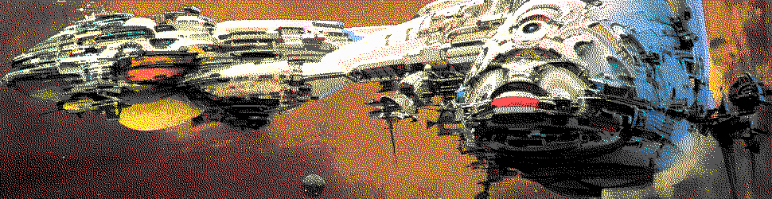
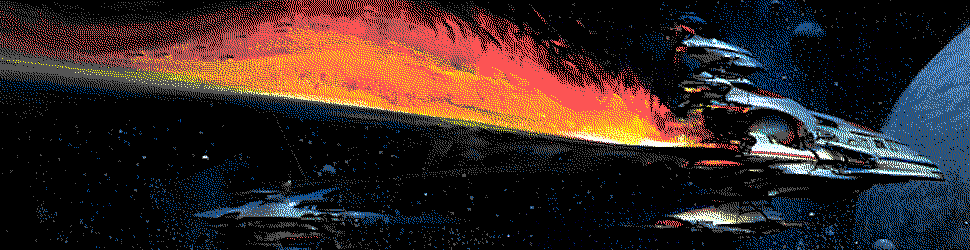
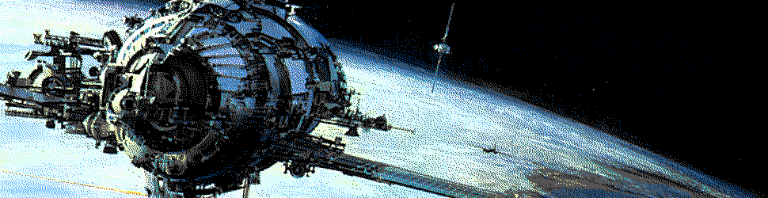
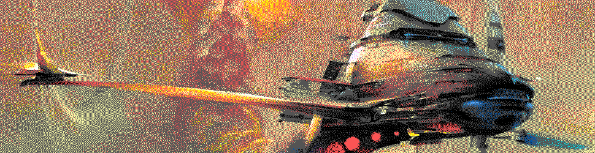

#   Ames



##  Learning Objectives

-   Understand architecture of the Ames network and communications.


Ames has probably evolved the least of any of the major vanes (except Clay) from its original whitepaper vision:

  >Ames is an encrypted peer-to-peer network running as an overlay over UDP. Ames does not have separate addressing and identity layers (like IP and DNS). An Ames address is an identity, mapped to a phonemic string to create a memorable pseudonym, and bound to a public key for encrypted communication.

Although Ames _has_ survived several rewrites, it defines the identity of a virtual formal computer and thus is only meaningful as it provides interactivity with other Urbit ships.  Thought of as a specification, it has been quite stable.

A particularly salient distinction to maintain in your mind is that between a bus and a network:

> There is a categorical difference between a bus, which transports commands, and a network, which transports packets. You can drop a packet but not a command; a packet is a fact and a command is an order.
>
> Facts are inherently idempotent; learning fact X twice is the same as learning it once. You can drop a packet, because you can ignore a fact. Orders are inherently sequential; if you get two commands to do thing X, you do thing X twice.  (Whitepaper)

Ames has to deal with both facts and orders, as it were:  facts from the other ships on the network and orders from other vanes in Arvo.

Ames refers to both the networking vane and the network itself.  (Somewhat confusingly, rewrites of Ames such as the late-2019 Alef also become Ames when released.)


##  Ames as Network



The Ames network structure passes messages generated by the Ames vane of each ship according to a certain structure.

### Messaging

The Ames vane is responsible for sending and receiving messages of arbitrary length.  These are broken into MTU-sized fragments—MTU (Maximum Transmission Unit) being the largest packet size which your system can send.

>Ames delivers messages of arbitrary length, broken into MTUshaped fragments. Because Urbit nodes are uniformly persistent, they maintain persistent sessions; message delivery is exactly-once. Every message is a transaction, and acknowledgments are end-to-end; the packet-level acknowledgment that completes a message also reports transaction success.
>
>Ames messages are typed; the type itself is not sent, just a label (like a MIME type) that the recipient must map to a local source path. Validation failure causes a silent packet drop, because its normal cause is a recipient that has not yet received a new protocol update; we want the sender to back off. Ames also silently drops packets for encryption failure; error reports are just an attack channel.

An Ames message must be processed at the destination using Clay/Ford.

- Reading: [Curtis Yarvin `~sorreg-namtyv`, Philip Monk `~wicdev-wisryt`, Anton Dyudin, and Raymond Pasco, "Urbit: A Solid-State Interpreter" ("Whitepaper")](http://media.urbit.org/whitepaper.pdf), sections 9–10

### UDP

Ames communicates using the [User Datagram Protocol](https://en.wikipedia.org/wiki/User_Datagram_Protocol) (UDP) specification.  UDP messages are "transaction oriented, and delivery and duplicate protection are not guaranteed."  To compensate for this, Ames employs a unique system of acks and nacks, covered below.

Each UDP message has a brief header including destination, source, length, and checksum.  It's rather a "minimum viable" packet system.

From [Cloudflare](https://www.cloudflare.com/learning/ddos/glossary/user-datagram-protocol-udp/):

> UDP is faster but less reliable than TCP, another common transport protocol. In a TCP communication, the two computers begin by establishing a connection via an automated process called a ‘handshake.’ Only once this handshake has been completed will one computer actually transfer data packets to the other.

Urbit compensates for this lower reliability by sending until receiving an appropriate ack or nack in reply.

> UDP is commonly used in time-sensitive communications where occasionally dropping packets is better than waiting. Voice and video traffic are sent using this protocol because they are both time-sensitive and designed to handle some level of loss. For example VOIP (voice over IP), which is used by many internet-based telephone services, operates over UDP. This is because a staticy phone conversation is preferable to one that is crystal clear but heavily delayed.

- Reading: [RFC 768](https://tools.ietf.org/html/rfc768) (UDP specification)

### Acks and Nacks

>Ames receives packets as Arvo events and emits packets as Arvo effects. The runtime is responsible for transferring the bytes in an Ames packet across a physical network to another ship.  (Ames Tutorial)

If every message is a transaction (or event), then what is Ames acknowledging (ack) or negative-acknowledging (nack)?  "A successful transaction has no result; a failed transaction is a negative ack and can contain an error dump."

> Ames has an unusual system of acks and nacks ("negative acknowledgments", but not like TCP's packets of the same name; Ames nacks mean the packet was received but the message resulted in an error).  In brief, each Ames packet of a message should get either an ack or a nack.  In the current system, the nack may include an error message (e.g., an error code or a stack trace).  ([Phillip Monk, `~wicdev-wisryt`](https://groups.google.com/a/urbit.org/g/dev/c/y_gaSpn9mxM/m/njlRhYZHBwAJ))

Ames will send messages and acks until a replying ack is received.  "Ames guarantees that a message will only be delivered once to the destination vane."

> When a new socket is opened, the client can resend (at-least-once delivery) or fail to resend (at-most-once). The programmer has to understand that the socket is not really a bus, and make sure the POST is actually an idempotent fact rather than an imperative command. (The idempotence problem is often punted to the human layer: “Please click only once to make your purchase.”)  (Whitepaper)

Because Ames and Urbit assume several nines of uptime, sessions between ships are treated as persistent.

> The basic argument for including end-to-end acks (and by extension, nacks) is that they're necessary for everything except those things which we don't care whether the message was received at all.  Thus, for Ames to give the guarantee that "if you give me a payload I will get it to the other side exactly once" isn't useful in itself, because no application cares about that.  They either (1) don't care whether it gets there or (2) care whether the request itself was "completed", in an application-defined sense.  ([Phillip Monk, `~wicdev-wisryt`](https://groups.google.com/a/urbit.org/g/dev/c/y_gaSpn9mxM/m/njlRhYZHBwAJ))

Keep in mind Postel’s law, also known as the robustness principle:  "Be conservative in what you send, and liberal in what you accept."

- Reading: [Tlon Corporation, "Ames"](https://urbit.org/docs/tutorials/arvo/ames/)

- Optional Reading: [Saltzer, Reed, Clark, "End-to-End Arguments in System Design"](http://web.mit.edu/Saltzer/www/publications/endtoend/endtoend.pdf)


##  Ames as Vane



Ames arms include:

```hoon
++  call  :: handle request stack
++  take  :: handle response $sign
++  stay  :: extract state before reload
++  load  :: load in old state after reload
++  scry  :: dereference namespace
```

which pretty well covers what Ames needs to do.  (There is a collection of `ames-helper` cores as well to handle many specific cases for unpacking and routing messages.)

Ames maintains a duct (queue) of ordered messages.  These are passed to and received from the runtime, and represent Arvo events.  Each message is encrypted at the source and decrypted at the destination using a symmetric public-key system.  A message may be a `%plea` (sent to another ship); in response, Ames can receive zero or more `%boon`s.  The ack–nack system is explained above; note that nacks are in response to event crashes.

How does an Ames message work in Hoon?  At the second-lowest level, you're poking a tool like `hood`.  For instance, this is the source code to `|hi` in `gen/hood/hi.hoon`:

```hoon
::  Helm: send message to an urbit
::
::::  /hoon/hi/hood/gen
  ::
/?    310
:-  %say
|=({^ {who/ship mez/$@(~ {a/tape ~})} ~} helm-send-hi+[who ?~(mez ~ `a.mez)])
```

This issues a poke to `hood`, the Gall–Dill interface app (`helm` is a component of `hood`), with a tag `%helm-send-hi`.

```hoon
++  poke
  |=  [=mark =vase]
  ?+  mark  ~|([%poke-helm-bad-mark mark] !!)
    ...
    %helm-reset            =;(f (f !<(_+<.f vase)) poke-reset)
    %helm-send-hi          =;(f (f !<(_+<.f vase)) poke-send-hi)
    %helm-serve            =;(f (f !<(_+<.f vase)) poke-serve)
    ...
  ==
```

The `++poke-send-hi:helm` arm:

```hoon
++  poke-send-hi
  |=  {her/ship mes/(unit tape)}  =<  abet
  %-  emit
  :*  %pass  /helm/hi/(scot %p her)
      %agent  [her %hood]  %poke
      %helm-hi  !>(?~(mes '' (crip u.mes)))
  ==
```

This issues a `%poke` to the target ship using the Gall API.

```hoon
++  emit  |=(card this(moz [+< moz]))
```

where a `card` is `card:agent:gall`.

Here at least we glimpse the lowest level of Ames operationality:  direct manipulation of `card`s.  We will rarely have need to compose these directly.  Here is the `++agent` definition in Zuse which applies to the vanes:

```hoon
++  agent
  |%
  +$  card  (wind note gift)
```

- Optional Reading: [`ames.hoon`](https://github.com/urbit/urbit/blob/master/pkg/arvo/sys/vane/ames.hoon)



_Art by John Berkey._  (We're halfway through today!  Have you learned anything new yet?)
