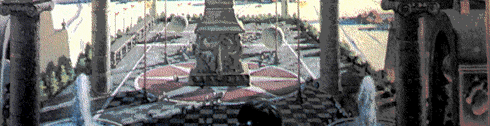

#   Clay II


##  Learning Objectives

-   Use the Clay API to read data.
-   Use the Clay API to write data.
-   Apply marks to convert data.


There be dragons here.  Clay, Eyre, and some of the other vanes we will look at soon have been heavily modified over the past several years, such that any existing documentation is very out-of-date.  We will endeavor to be as accurate as possible by making reference to the source code directly in many cases.


##  Structures


### Architecture

Clay is architected as global-namespace version-control filesystem.  You've seen the `beak` and other elementary concepts in Clay I; now we'll dive into `%clay`'s internals.

- A `desk` is a continuity branch, or a series of numbered commits.
- A `dome` is the actual data of a desk.
- An `arch` is a node.

### Operations

`%clay` recognizes two broad kinds of filesystem interactions:

1. Write operations
2. Read operations (`%clay` refers to filesystem read requests as "subscriptions")

#### Write Ops

Right now, there are three ways that you'll commonly create or modify file data in `%clay`:

1.  Filesystem synchronization with `|commit` or `|autocommit`, i.e. file creation or modification in Unix
2.  Dojo output redirection with `*`, e.g. `*%/web/planets/txt (turn p |=(a/@p (scot %p a)))`
3.  Desk synchronization across ships (as with an OTA update)

Let's trace each of these in some detail.

First, a commit from Unix.  `|commit` is a Dojo `hood` command which uses `kiln` to interact with `%clay`.  Ultimately, once you've traced all the `++poke`s and types, you end up looking at a `%pass` move:

```hoon
(emit %pass /commit %arvo %c [%dirk mon])
```

(`%dirk` is a call type into `%clay`.  `mon` is the mount point.)

Another write operation (from `lib/helm.hoon`) looks like this:

```hoon
(emit %pass /write %arvo %c %info -)
```

Next, what happens with Dojo's `*`?  Dojo divides commands into sinks and sources, where a sink is an effect (like a file write) and a source is a printed result.  `*` is shorthand to save a value to Clay.

```hoon
[%pass /file %arvo %c %info %pass  /file  %arvo  %c (foal:space:userlib /path cay)]
```

(where `cay` is a cage, from `dojo.hoon`).

Finally, desk synchronization adopts a merge strategy as discussed subsequently in this lesson.

#### Read Ops

"Urbit messaging always regards a single [read] response as a special case of a subscription."  Any attempt to use a local or remote resource is treated as a subscription to that resource and creates state _as soon as the resource exists_.

> When reading from Clay, there are three types of requests:
>
> - A `%sing` request asks for data at single revision.
> - A `%next` request asks to be notified the next time there's a change to given file.
> - A `%many` request asks to be notified on every change in a desk for a range of changes (including into the future).

You can find these under `++rove` in `clay.hoon`.

A subscription monitors a desk, sort of a long-term read.

### Internal Structures

A few internal structures are useful to know when you read `clay.hoon`:

- An `ankh`, or filesystem node, is used internally to store the current version of local data.
- An `aeon` is a version number.
- A `tako` is a commit hash.
- A `yaki` is a commit data structure.
- A `lobe` is a content hash.
- A `blob` is content.
- A `cage` is the result of a subscription.

Clay is byzantine in its complexity.  As one Tlon developer admits, "I have still not internalized the meaning of ``%clay`'s structure names, or established any kind of reliable binding.  I basically start over every time i work in that file."  So expect a bushwhack when wading into `clay.hoon`!

#### Permissions

Permissions are managed per-node.  You can see the (messy) code to set permissions in `++perm` and the permissions checks in `++read-p`, both in `clay.hoon`.  Permissions are set per-ship, not per-process.  To make a desk public, for instance, `|public` sets the blacklist to empty and the whitelist to any using `kiln`'s `++poke-permission` arm.  Note the `%clay` call in the last line:

<!--  -->
```hoon
++  poke-permission
  |=  {syd/desk pax/path pub/?}
  =<  abet
  %-  emit
  =/  =rite  [%r ~ ?:(pub %black %white) ~]
  [%pass /kiln/permission %arvo %c [%perm syd pax rite]]
```
<!--  -->

To figure out what's going on deeper inside, take a gander at `++read-p-in`:

<!--  -->
```hoon
++  read-p-in
  |=  {pax/path pes/regs}
  ^-  dict
  =/  rul/(unit rule)  (~(get by pes) pax)
  ?^  rul
    :+  pax  mod.u.rul
    %-  ~(rep in who.u.rul)
    |=  {w/whom out/(pair (set ship) (map @ta crew))}
    ?:  ?=({%& @p} w)
      [(~(put in p.out) +.w) q.out]
    =/  cru/(unit crew)  (~(get by cez.ruf) +.w)
    ?~  cru  out
    [p.out (~(put by q.out) +.w u.cru)]
  ?~  pax  [/ %white ~ ~]
  $(pax (scag (dec (lent pax)) `path`pax))
```
<!--  -->

Let's take pains to read this.  It accepts a path and a `regs` (perms structure) which is a `(map path rule)`.  It returns a `dict`, which is an effective permission for a ship and a `crew`, or permission group.

Other than opaque cores and other techniques, there don't seem to be any per-process permissions in place for apps at this point.


##  Moves


A very simple call into Clay can simply query the `arch` directly using the [`.^` dotket](https://urbit.org/docs/reference/hoon-expressions/rune/dot/#dotket) Nock namespace operator.

```hoon
.^(arch (cat 3 %c %y) %)
```

Most operations will be a bit more involved.  (Remember, as a user you are never staring into an unshielded kernel.  Your experience is always mediated by Gall.  In this case, Dojo intervenes.)

For instance, here is Dojo making a `%sing` single-read request:

```hoon
::  +dy-sing: make a clay read request
::
++  dy-sing
  |=  [way=wire =care:clay =path]
  ^+  +>+>
  ?>  ?=(~ pux)
  %-  he-card(poy `+>+<(pux `way))
  =/  [=ship =desk =case:clay]  he-beak
  [%pass way %arvo %c %warp ship desk ~ %sing care case path]
```

If you wanted to write a file from a generator into `%clay`, you have two options:

1.  Use the Dojo `*` syntax to capture and redirect output.  (This is useful for large output too, by the way:  it's much faster than printing.)
2.  Write to `%clay` using the internal interface.

    ```hoon
    [%pass (weld /write pax) %arvo %c %info (foal:space:userlib pax cay)]
    ```

    (as seen in `publish.hoon`'s `++write-file` arm).

- Optional Reading: [Tlon Corporation, "Clay Tutorial"](https://urbit.org/docs/tutorials/hoon/hoon-school/clay/) (outdated; okay on high-level concepts but no longer on technical details; e.g., kisses are now just moves)
- Optional Reading: [Curtis Yarvin `~sorreg-namtyv`, "Toward a New Clay"](https://urbit.org/blog/toward-a-new-clay/) (same caveats)
- Optional Reading: [`clay.hoon`](https://github.com/urbit/urbit/blob/master/pkg/arvo/sys/vane/clay.hoon)


##  Marks


> A mark is a core with three arms, `++grab`, `++grow`, and `++grad`. In ++grab is a series of functions to convert from other marks to the given mark. In ++grow is a series of functions to convert from the given mark to other marks. In ++grad is ++diff, ++pact, ++join, and ++mash.
>
> Not every mark has each of these functions defined -- all of them are optional in the general case.
>
> In general, for a particular mark, the ++grab and ++grow entries (if they exist) should be inverses of each other.

However, marks are not necessarily bijective and results from multiple conversions may be path-dependent.  There may not be a return path either.

Let's take a look at the JSON mark:

```hoon
::
::::  /hoon/json/mar
  ::
/?    310
  ::
::::  compute
  ::
=,  eyre
=,  format
=,  html
|_  jon/json
::
++  grow                                                ::  convert to
  |%
  ++  mime  [/application/json (as-octs:mimes -:txt)]   ::  convert to %mime
  ++  txt   [(crip (en-json jon))]~
  --
++  grab
  |%                                                    ::  convert from
  ++  mime  |=({p/mite q/octs} (fall (rush (@t q.q) apex:de-json) *json))
  ++  noun  json                                        ::  clam from %noun
  ++  numb  numb:enjs
  ++  time  time:enjs
  --
++  grad  %mime
--
```

The `++grad` arm is required for `%clay` marks (files) because it has revision-control information:

- `++diff` takes two instances of a mark and produces a diff of them.
- `++pact` takes an instance of a mark and patches it with the given diff.
- `++join` takes two diffs and attempts to merge them into a single diff.  If there are conflicts, it produces null.
- `++mash` takes two diffs and forces a merge, annotating any conflicts.

`%clay`'s `++ford` arm builds tubes, which are conversion gates between marks.  For instance,

```hoon
.^(tube:clay %cc /~zod/home/1/json/txt)
```

builds a conversion gate from JSON to text (which is close to trivial, yes, as you can see from the `++grow` arm above).  These are used internally by Clay and Ford (incidentally, a fusion of Clay and Ford and Gall, code-named Hume, has been proposed).

You can use the `/*` rune to build converted files as well.

```hoon
/*  hoon-as-txt  %txt  /gen/trouble/html
```

This won't work in Dojo; use this instead:

```hoon
=trouble -build-file %/gen/trouble/hoon
```

You say that `%cc` above?  The second letter of the `%c` query is a mode flag:

- `%a` for file builds
- `%b` for mark builds
- `%c` for cast builds (mark conversion gate)
- `%w` for version number
- `%x` for data
- `%y` for list of children
- `%z` for subtree

There are several more of these, used internally by other vanes.

- Reading: [`~timluc-miptev`, "Ford:  Imports, Files and Marks"](https://github.com/timlucmiptev/gall-guide/blob/master/ford.md)
- Reading: [Ted Blackman `~rovnys-ricfer`, "Ford Fusion"](https://urbit.org/blog/ford-fusion/)

### Paths

Relative paths match the current path by replacing a path component with `=`.  For instance, consider the following:

```hoon
> `path`/=
/~zod
> `path`/==
/~zod/home
> `path`/===
/~zod/home/~2020.10.14..20.13.38..e140
%posh-fail
> `path`/===capsaicin
/~zod/home/~2020.10.14..20.14.05..d374/capsaicin
```

While hierarchical access paths are useful, it's worth considering that `%clay` still concedes too much to the classical Unix model.  Really, you just have a hierarchical index into a binary tree of unsigned integers.


##  Merges



> Merging is a fundamental operation for a distributed revision control system. At their root, clay's merges are similar to git's, but with some additions to accomodate typed data. There are seven different merge strategies.

- `%init` is the first commit to a desk.
- `%this` merges two desks, keeping the target's files
- `%that` merges two desks, keeping the source's files
- `%fine` is a fast-forward merge
- `%meet` merges only if changes are in different files
- `%mate` attempts to merge cleanly even if changes are in the same files
- `%meld` merges and marks conflicts

A _merge_ produces a target desk.  A _sync_ coordinates changes from two desks back and forth.  An OTA update has two parts:  fetch the source desk (cached if you've fetched this version before), then apply the merge.  Sometimes if a merge or sync operation gets stuck, you can reset things by running `|cancel %home` until the queue is zeroed out.

A proof-of-concept tool for visualizing Clay commit histories is available [here](https://github.com/urbit/pottery).

_All art by Robert McCall._


#   Questions

##  CSV Conversion Mark

Compose a mark capable of conversion from a [CSV file](https://tools.ietf.org/html/rfc4180) to a plain-text file (and vice versa).

The `++grad` arm can be copied from the `hoon` mark, since we are not concerned with preserving CSV integrity.

##  Conversion Tube

Use `++ford` to produce a tube from `hoon` to `txt`.

Answer this question with the expression.
