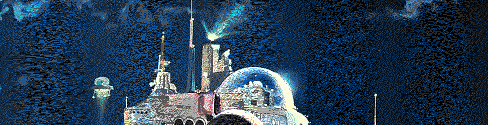

#   Polymorphism



##  Learning Objectives

-   Distinguish wet and dry cores.
-   Apply type constructor arms.


##  Wet Gates


> With a dry gate, when you pass in an argument and the code gets compiled, the type system will try to cast to the type specified by the gate; if you pass something that does not fit in the specified type, for example a `cord` instead of a `cell` you will get a nest failure. On the other hand, when you pass arguments to a wet gate, their types are preserved and type analysis is done at the definition site of the gate—in our case, fold in `hoon.hoon`—rather than the call site.

- Dry gate = type analysis at the call site
- Wet gate = type analysis at the gate definition

Wet gates are more general than dry gates:  you can use a wet gate anywhere a dry gate would work.  Wet gates are created with [`|*` bartar](https://urbit.org/docs/reference/hoon-expressions/rune/bar/#bartar).  Wet gates behave more like a C-style macro because the argument isn't converted into the sample type but directly present.

```hoon
> =dry |=([a=* b=*] [b a])
> =wet |*([a=* b=*] [b a])
> (dry .~1.0 .~~~1.0)
[85.065.399.433.376.081.038.215.121.361.612.832.768 4.607.182.418.800.017.408]
> (wet .~1.0 .~~~1.0)
[.~~~1 .~1]
```

> It is good practice to include a cast in all gates, even wet gates.  But in many cases the desired output type depends on the input type. How can we cast appropriately?  Often we can cast by example, using the input values themselves.  (`^+`)

Thus for gates.  More generally, what about cores?  First, a definition of the `core` type:

```hoon
[$core p=type q=coil]
+$  coil
  $:
    p=[p=(unit term) q=?(%wet %dry) r=?($gold $iron $lead $zinc)]
    q=type
    r=[p=seminoun q=(map term (pair what (map term hoon))]
```

(We'll discuss the `+$` lusbuc runes below.)

> The full core stores both payload types. The type that describes the payload currently in the core is `p`. The type that describes the payload the core was compiled with is `q.q`.

Many functional tools like [`++turn`](https://urbit.org/docs/reference/library/2b/#turn) and [`++rep:by`](https://urbit.org/docs/reference/library/2i/#rep-by) frequently require wet gates in order to yield the intended effect.

Now for dry cores:

> Dry polymorphism works by substituting cores. Typically, the the programmer uses one core as an interface definition, then replaces it with another core which does something useful.

In contrast, for wet cores[:](https://en.wikipedia.org/wiki/%C3%96rt%C3%B6%C3%B6)  <!-- egg -->

> For a wet arm, we ask: "suppose this core was actually compiled using `p` instead of `q.q`?" Would the Nock formula we generated for q.q actually work for a `p` payload?  … We don't actually recompile the arm at runtime. We actually run the formula generated for the original payload, `q.q`.

As a consequence, wet arms and wet cores behave a bit like C++ overloaded operators and templates or Haskell typeclasses.  There aren't fully different implementations though (as in C++ overloading), though, so there's not a way to (for instance) just make `++add` and `++add:rs` compatible.  (The "Lead Polymorphism" tutorial is very important in this regard.)

One thing to watch is that `|%` barcen produces dry cores, thus dry arms.  To produce a wet core, you need to use [`|@` barpat](https://urbit.org/docs/reference/hoon-expressions/rune/bar/#barpat) instead.

- Reading: [Tlon Corporation, "Advanced Types"](https://urbit.org/docs/reference/hoon-expressions/advanced/)
- Reading: [Tlon Corporation, "Iron Polymorphism"](https://urbit.org/docs/hoon/hoon-school/iron-polymorphism/)
- Reading: [Tlon Corporation, "Lead Polymorphism"](https://urbit.org/docs/hoon/hoon-school/lead-polymorphism/) <!-- TODO move -->


##  Type Constructors


Gall apps frequently require type definitions, customarily located in a `|%` barcen core before the `|_` barcab door.  Frequently these are defined and validated using type constructor arms.

[`+$` lusbuc](https://urbit.org/docs/reference/hoon-expressions/rune/lus/#lusbuc) is a type constructor arm.  It defines a custom type for use by the other arms in the core.  It is sometimes used with the [`$%` buccen](https://urbit.org/docs/reference/hoon-expressions/rune/buc/#buccen) union definition rune (irregular form `?(%foo %bar)`).

Let's imagine a Pokémon type.  We'll use a simple model of Pokémon with uniform capabilities by species (evolution, kind, whatever) but per-instance attributes for hit points, attack, etc.

```hoon
+$  pokemon
  $%  id=@uw                    :: unique hash
      name=tape                 :: name of pokemon
      kind=species              :: kind of pokemon
      hp=@ud                    :: current health
      max-hp=@ud                :: normal maximum health
      attack=@ud                :: attack
      defense=@ud               :: defense
      speed=@ud                 :: speed
  ==
+$  species
  $%  name=%tas                 :: pokemon species name as tag
      type=(set type)           :: pokemon types
      moves=(set move)          :: species-specific abilities
  ==
```

We need to know what a `species` is, what a `type` is, and what an `move` is.  Clearly these are limited to be chosen from a particular set of options.  For instance, here is a `type` definition (in the Pokémon type sense):

```hoon
+$  type  ?(%bug %dragon %ice %fighting %fire %flying %grass %ghost %ground %electric %normal %poison %psychic %rock %water)
```

Now, we have a bit of a problem, which is that these types really aren't disjoint.  That is, a Pokémon may have more than one of them.  So _really_ what we want isn't a _type_ in the Hoon sense, but a `set` of tags.  ("`$?` should only be used on types that are disjoint, i.e., which have no values in common.")  The same goes for `move`.

`+$` is a type constructor arm, so it doesn't make sense to define a particular `pokemon` until one has already defined a `species`, which needs `type` (as above) and `move`:

```hoon
+$  type  ?(%bug %dragon %ice %fighting %fire %flying %grass %ghost %ground %electric %normal %poison %psychic %rock %water)
+$  move  ?(%barrage %bite %bind %body-slam %comet-punch %constrict %conversion %cut %crunch %disable %dizzy-punch %double-team %growl)
=/  eevee  [%eevee `(set @tas)`(sy `(list @tas)`~[%normal]) `(set @tas)`(sy `(list @tas)`~[%growl %body-slam])]
```

(More realistically, we would load these from a configuration file like a JSON.  We leave that exercise to the reader for the time being.)

Now we're ready to build a unique Pokémon instance:

```hoon
=/  unique-hash  `@uw`(~(raw og eny) 60)
=/  eevee-1  [unique-hash "Eevee" eevee 55 55 55 50 55]
```

[Here is a full implementation of the above as a single generator.](../resources/pokemon.hoon)

- Reading: [Tlon Corporation, "Structures and Complex Types"](https://urbit.org/docs/hoon/hoon-school/structures-and-complex-types/)
- Reading: [Tlon Corporation, "Type Polymorphism"](https://urbit.org/docs/hoon/hoon-school/type-polymorphism/)

_All art by Robert McCall._


#   Questions

##  The Trapezoid Rule

The [trapezoid rule](https://en.wikipedia.org/wiki/Trapezoidal_rule) solves a definite integral.  It approximates the area under the curve by a trapezoid or (commonly) a series of trapezoids.


$$
\int_a^b f(x) \, dx
\approx
\sum_{k=1}^N \frac{f(x_{k-1}) + f(x_k)}{2} \Delta x_k
=
\tfrac{\Delta x}{2}\left(f(x_0) + 2f(x_1)+2f(x_2)+ 2f(x_3)+2f(x_4)+\cdots+2f(x_{N-1}) + f(x_N)\right)
$$

Produce a trapezoid-rule integrator which accepts a wet gate (function of a single variable) and a list of points and yields the integral as a floating-point value (`@rs` or `@rd`).  This tool should be a library.  You may use the Dojo or a generator to apply it.

Submit your library as a file `trapezint.hoon`.
