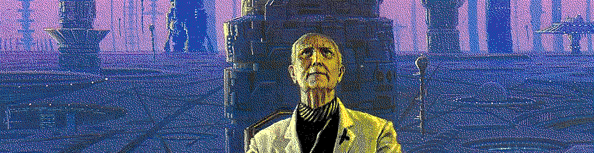

#   Urbit Foundation

##  Learning Objectives

-   Describe the current and prospective Urbit ecosystem.

##  The Urbit Developer and User Ecosystem

Urbit is currently primarily developed by the [Tlon Corporation](https://tlon.io), founded by Curtis Yarvin, Galen Wolfe-Pauly, and John Burnham in 2013.

At least one other company works full-time on Urbit projects, [urbit.live](https://urbit.live), which facilitates Urbit property transfers.

The plan was always to roll out a foundation to manage the Urbit community and development, much like the [Linux Foundation](https://en.wikipedia.org/wiki/Linux_Foundation).  A similar model crops up in several open-source projects, such as the [Apache Foundation]().  (There are also financial entities like [NumFocus](https://numfocus.org/) which provided clerical support but not administration for FOSS projects.)

Foundations are useful for providing a legal vehicle to manage operations, payments, taxes, and time.  Not all open-source projects end up with foundations:  many are too small to worry about it, and others are sponsored by corporations or university research groups.

The vision for the Urbit Foundation (colloquially; formally `urbit.org`) has evolved over time.  For a while it was going to be a classical software foundation, then the Urbit Education Foundation, and now it's considered `urbit.org` or the Urbit Foundation:

> Urbit is meant to be universal, ubiquitous infrastructure. Tlon exists to make that infrastructure useful and usable. We expect Urbit, as a platform, to be cared for by the community in collaboration with the emerging Urbit Foundation. We intend Tlon to become increasingly focussed on providing a great user experience for anyone interested in this new network, so the network can continue to grow and thrive.

The Urbit Foundation was actually launched in August 2020, so it's now a real, slowly mitosizing organization.

The Urbit Foundation is primarily concerned, at this point, with promoting the development of Urbit as a platform with the [grants and bounties program](https://grants.urbit.org/).

Ultimately there is intended to be a board for the Urbit Foundation which will administer the corresponding galaxies for network infrastructure and governance votes.

- Reading: [Josh Lehman `~wolref-podlex`, "First Steps Towards `urbit.org`"](https://urbit.org/blog/first-steps-towards-urbit-org/)
- Optional Reading: [Stephen Walli, "The Role of FOSS Foundations"](https://www.networkworld.com/article/2221186/the-role-of-foss-foundations.html)
- Optional Reading: [Erik Newton `~patnes-rigtyn`, "Governance of `urbit.org`"](https://urbit.org/blog/governance-of-urbit/)
