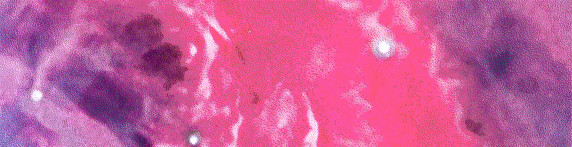
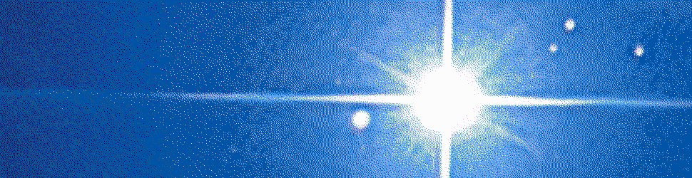

#   Gall II

{: width=100%}

##  Learning Objectives

- Manage internal Gall state.
- Explain scrying.
* Produce an intermediate Gall app.


##  Managing State

{: width=100%}

Basically everything we have done so far has relied on rebuilding the subject to produce a desired result.  Gall apps may have long-deferred calculations, however, and it is infeasible to run apps asynchronously the same way one does with a quick computation.

### State

{: width=100%}

Each Gall agent (“app”) maintains a current state.  One of the most common return types for Gall app arms is `(quip card _this)` or `(quip card _state)`.  A [`++quip`](https://urbit.org/docs/reference/library/1c/#quip) is a tuple of `list` and mold, where we have a list of cards and the mold of the current state.  This means that the arm intends to return cards (moves, events) and the changed state of the app.

It's worth noting that a common convention in modern Gall programs is to define a face `this` for the current agent:

```hoon
+*  this  .
    def   ~(. (default-agent this %|) bowl)
```

so you'll see `(quip card _this)` more frequently.

The program has two pieces of state.  One is of mold `bowl:gall` (in fact, the agent is a door `|_  =bowl:gall`).  A `bowl` is defined in `%zuse`:

```hoon
++  bowl              ::  standard app state
  $:  $:  our=ship    ::  host
          src=ship    ::  guest
          dap=term    ::  agent
      ==              ::
      $:  wex=boat    ::  outgoing subscriptions
          sup=bitt    ::  incoming subs
      ==              ::
      $:  act=@ud     ::  change number
          eny=@uvJ    ::  entropy
          now=@da     ::  current time
          byk=beak    ::  load source
  ==  ==
```

An app may also maintain internal state.  One idiom for updating this state is to use the [`%=` centis](https://urbit.org/docs/reference/hoon-expressions/rune/cen/#centis) rune's irregular form.  (We've been doing this all along with `$()`.)

```hoon
::  Delete a chat message
state(inbox (~(del by inbox) path.action))
```

Another option is to use a delayed monadic binding, as demonstrated below.

Many Gall apps are now intended to use [`graph-store`](https://github.com/urbit/urbit/pull/3110), a backend data storage format and database that both provides internally consistent data and external API communications endpoints.  (This is new as of summer 2020.)

`graph-store` handles data access perms at the hook level, not at the store level.

Ultimately, all the existing Tlon-supported apps will be migrated to `graph-store`.  Here is [an example](https://gist.github.com/matildepark/268c758c079d6cf83fd1541b2430ff7f) showing the difference between the old JSON format and the new JSON `graph-store` format.

- Reading: [Tlon Corporation, "Gall Tutorial"](https://urbit.org/docs/reference/vane-apis/gall/)
- Optional Reading: [Logan Allen `~tacryt-socryp`, "Graph Store Proposal"](https://docs.google.com/document/d/1-Gwfg442kV3cdfG7NnWPEf2TMa3uLUTAKkZD70ALZkE/edit)

### Monads

{: width=100%}

Functional programming languages and platforms prefer pure functions, meaning that these functions don't emit effects.  Hoon cheats a little bit with `~&` sigpam for output, but in general is quite functional-as-in-language.  Many functional languages introduce the [_monad_](https://en.wikipedia.org/wiki/Monad_%28functional_programming%29) as a way of tracking state (including input/output):

> A state monad allows a programmer to attach state information of any type to a calculation. Given any value type, the corresponding type in the state monad is a function which accepts a state, then outputs a new state along with a return value.

Hoon provides three monad/monad-adjacent runes for producing pipelines of computations:

- [`=^` tisket](https://urbit.org/docs/reference/hoon-expressions/rune/tis/#tisket) is used to chain state from a result back into the state machine
- [`;~` micsig](https://urbit.org/docs/reference/hoon-expressions/rune/mic/#micsig) is used to glue a pipeline together (that is, there is internal state of the functions and results which is retained by the structure)
- `;<` micgal similarly glues a pipeline together (as a monadic bind) (this rune is undocumented at the current time); in other words, run an asynchronous function or event

(These are not used in every Gall app, but they can be helpful when deferring parts of a computation based on external data.)

For instance, here is a `;<` pipeline:

```hoon
;<  =state  bind:m  (handle-poke %noun 'fetch')
```

A generic `;<` pipeline

```hoon
;<  a=@  bind:m  c  d
```

means to run `c` giving an output of type `a` and pass it to `d`.

Here, the `state` is an app-local structure (defined with `+$`); `m` is a `tapp-async` thread with a `++bind` arm to a `strand` (Arvo thread).

`grep` the Urbit source code for examples of these three runes in use.

- Reading: [`~timluc-miptev`, "The Complete Guide to Gall"](https://github.com/timlucmiptev/gall-guide/blob/master/overview.md) (this will be part of your exercises today)
- Optional Reading: [Logan Allen, Matt, Matilde Park `~haddef-sigwen`, "Userspace Architecture"](https://docs.google.com/document/d/1hS_UuResG1S4j49_H-aSshoTOROKBnGoJAaRgOipf54/edit)

### Scrying

{: width=100%}

One of the key operations in Gall (and Clay) is _scrying_ (`++on-peek` handler).  To scry is to request data from anywhere in the global immutable namespace.  A scry produces a `(unit (unit cage))` (recall that a `unit` lets us distinguish empty/missing data from zero data).

Scrying is accomplished with the [`.^` dotket](https://urbit.org/docs/reference/hoon-expressions/rune/dot/#dotket) rune.  This accepts a mold (to cast the response), a tag (like `%cx`, as you saw with Clay), and a noun (the path to query).  Basically, think of a `.^` scry as a way of finding out things that aren't in your subject.

Check the [reference agent Gall example](https://urbit.org/docs/reference/vane-apis/gall/) for a good example of how scrying works in the `++on-peek` arm.

```hoon
++  on-peek
  |=  =path
  ^-  (unit (unit cage))
  ?+  path  [~ ~]
      [%x %local ~]           :: local counter request
    ``[%atom !>(local)]       :: produce local counter
      [%x %remote who=@ta ~]  :: remote counter request
      =*  location  i.t.t.path
      =/  res  (~(got by remote) (slav %p location))
    ``[%atom !>(res)]         :: produce remote counter
      [%y %remote ~]          :: list of remote counters request
      =/  dir=(map @ta ~)
      %-  molt  %+  turn  ~(tap by remote)
      |=  [who=@p *]  [(scot %p who) ~]
    ``[%arch !>(`arch`[~ dir])] :: produce list of remote counters
  ==
```

([`?+` wutlus](https://urbit.org/docs/reference/hoon-expressions/rune/wut/#wutlus) is a `switch` statement.)

This would be used in the following ways:

```hoon
.^(@ %gx /=example-gall=/local/atom)        :: produce local counter
.^(@ %gx /=example-gall=/remote/~zod/atom)  :: produce counter for ~zod
.^(arch %gy /=example-gall=/remote)         :: produce current list
```

To access data on a remote ship, you can't just scry.  What you actually do is to subscribe to data, and when the remote agent updates, it will send the information to subscribers.

{: width=100%}
