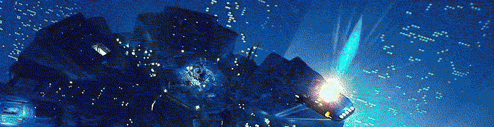
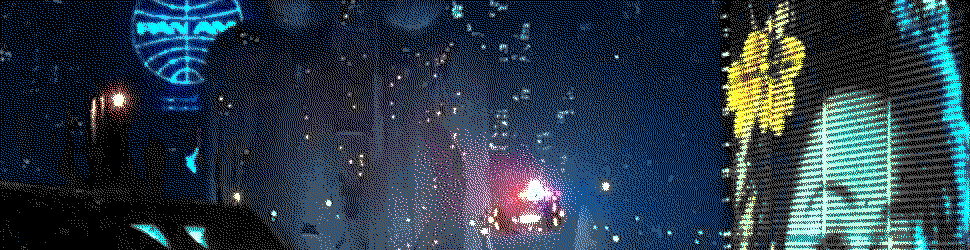
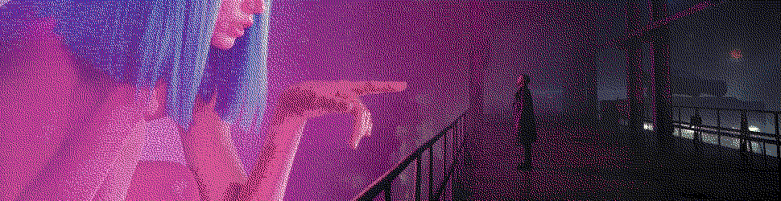
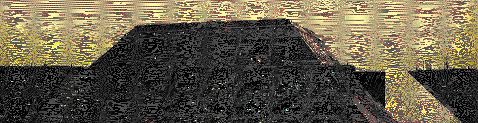

#   Eyre & Iris, HTTP Vanes

{: width=100%}

##  Learning Objectives

- Explain how `%eyre` acts as the Urbit server vane.
- Explain how `%iris` acts as the Urbit client vane.


Urbit has been variously described as a "personal server" or a "browser for the server side."  We've explored a lot of what these mean, but clearly HTTP and TCP/IP functionality must be baked in somewhere[.](https://en.wikipedia.org/wiki/Saccade)  <!-- egg -->

We illustrate some example calls to Eyre and Iris below.  Because your interaction with other vanes is mediate by Gall, you won't be able to run these directly in the Dojo.  We'll have you do more interactive work with Eyre and Iris in the exercises.


##  Eyre

{: width=100%}

The `%eyre` vane serves as an HTTP/HTTPS client:  "it interfaces via actions/events to HTTP client handlers in the Unix layer."  `%eyre` also "acts as a client for `%gall` apps, translating the `%gall` message flow into JSON over HTTP.  `%poke` requests become `POST` requests, `%peer` becomes a long-poll stream."

As with other vanes, Eyre receives `%task`s and `%give`s gifts.  Of course, these are mediated through the host operating system services, so Arvo supports `+$unix-task`s appropriate to `%eyre`.  Let's look at a schematic of the relevant code blocks to get a feel for how Eyre (and Urbit) thinks of a server:

```hoon
+$  unix-task
  $%
    ::  %eyre: learn ports of live http servers
    ::
    $>(%live task:able:eyre)
    ::  %eyre: starts handling an inbound http request
    ::
    $>(%request task:able:eyre)
    ::  %eyre: starts handling an backdoor http request
    ::
    $>(%request-local task:able:eyre)
```

An Eyre call looks like this:

```hoon
[%pass / %arvo %e %connect [~ /'~clock'] %clock]
```

Notice that it must have an endpoint to connect to, frequently a Gall app but sometimes a generator.  The token here represented by `%connect` can be one of the following:

1. `%live` lists the ports of the live HTTP servers
2. `%rule` updates the HTTP configuration (such as installing a TLS certificate or adding a domain name)
3. `%request` processes a server request
4. `%cancel-request` cancels an outstanding request
5. `%connect` attaches a server connection
6. `%serve` serves material, such as from a generator
7. `%disconnect` terminates an existing connection

From a code standpoint, `%eyre` is split a little across `zuse.hoon` and `eyre.hoon`.  Many data structures that `%eyre` uses heavily are defined in `%zuse` so that other vanes like `%gall` can use them as well (`en-json`, for instance).  We therefore need to consider both the content of `eyre.hoon` and the `++eyre` arm in `zuse.hoon`.

```hoon
++  eyre  ^?
  |%
  ++  able
    |%
    ++  gift
    ++  task
    --
  ::  +origin: request origin as specified in an Origin header
  +$  origin  @torigin
  ::  +cors-registry: origins categorized by approval status
  +$  cors-registry
  ::  +outstanding-connection: open http connections not fully complete:
  +$  outstanding-connection
  ::  +authentication-state: state used in the login system
  +$  authentication-state
  ::  +session: server side data about a session
  +$  session
    $:  expiry-time=@da
        channels=(set @t)
    ==
  ::  channel-state: state used in the channel system
  +$  channel-state
    $:  session=(map @t channel)
        duct-to-key=(map duct @t)
    ==
  ::  +timer: a reference to a timer so we can cancel or update it.
  +$  timer
  ::  channel: connection to the browser
  +$  channel
    $:  state=(each timer duct)
        next-id=@ud
        events=(qeu [id=@ud lines=wall])
        subscriptions=(map wire [ship=@p app=term =path duc=duct])
        heartbeat=(unit timer)
    ==
  ::  +binding: A rule to match a path.
  +$  binding
    $:  site=(unit @t)
        path=(list @t)
    ==
  ::  +action: the action to take when a binding matches an incoming request
  +$  action
    $%  ::  dispatch to a generator
        [%gen =generator]
        ::  dispatch to an application
        [%app app=term]
        ::  internal authentication page
        [%authentication ~]
        ::  internal logout page
        [%logout ~]
        ::  gall channel system
        [%channel ~]
        ::  gall scry endpoint
        [%scry ~]
        ::  respond with the default file not found page
        [%four-oh-four ~]
    ==
  ::  +generator: a generator on the local ship that handles requests
  +$  generator
    $:  =desk
        path=(list @t)
        args=*
    ==
  :: +http-config: full http-server configuration
  +$  http-config
    $:  :: secure: PEM-encoded RSA private key and cert or cert chain
        secure=(unit [key=wain cert=wain])
        :: proxy: reverse TCP proxy HTTP(s)
        proxy=_|
        :: log: keep HTTP(s) access logs
        log=?
        :: redirect: send 301 redirects to upgrade HTTP to HTTPS
        redirect=?
    ==
  :: +http-rule: update configuration
  +$  http-rule
    $%  :: %cert: set or clear certificate and keypair
        [%cert cert=(unit [key=wain cert=wain])]
        :: %turf: add or remove established dns binding
        [%turf action=?(%put %del) =turf]
    ==
  ::  +address: client IP address
  +$  address
    $%  [%ipv4 @if]
        [%ipv6 @is]
        ::  [%ames @p]
    ==
  ::  +inbound-request: +http-request and metadata
  +$  inbound-request
    $:  ::  authenticated: has a valid session cookie
        authenticated=?
        ::  secure: whether this request was encrypted (https)
        secure=?
        ::  address: the source address of this request
        =address
        ::  request: the http-request itself
        =request:http
    ==
  ++  hiss  {p/purl q/moth}                             ::  outbound request
  ++  host  (each turf @if)                             ::  http host
  ++  httq                                              ::  raw http request
  ++  httr  {p/@ud q/mess r/(unit octs)}                ::  raw http response
  ++  mess  (list {p/@t q/@t})                          ::  raw http headers
  ++  meth                                              ::  http methods
    $?  $conn                                           ::  CONNECT
        $delt                                           ::  DELETE
        $get                                            ::  GET
        $head                                           ::  HEAD
        $opts                                           ::  OPTIONS
        $post                                           ::  POST
        $put                                            ::  PUT
        $trac                                           ::  TRACE
    ==                                                  ::
  ++  mite  (list @ta)                                  ::  mime type
  ++  moth  {p/meth q/math r/(unit octs)}               ::  http operation
  ++  octs  {p/@ud q/@t}                                ::  octet-stream
  ++  pork  {p/(unit @ta) q/(list @t)}                  ::  fully parsed url
  ++  purl  {p/hart q/pork r/quay}                      ::  parsed url
  ++  quay  (list {p/@t q/@t})                          ::  parsed url query
  ::  +reserved: check if an ipv4 address is in a reserved range
  ++  reserved
  ::  +ipa: parse ip address
  ++  ipa
  ::  +ip4: parse ipv4 address
  ++  ip4
  ::  +ip6: parse ipv6 address
  ++  ip6
  ::
  ++  rout  {p/(list host) q/path r/oryx s/path}        ::  http route (new)
  ++  user  knot                                        ::  username
  --  ::eyre
```

`eyre.hoon`:

```hoon
::  structures
|%
+$  move
::  +note: private request from eyre to another vane
+$  note
::  +sign: private response from another vane to eyre
+$  sign
--
|%
::  +server-state: state relating to open inbound HTTP connections
+$  server-state
+$  channel-request
++  channel-timeout  ~h12
++  session-timeout  ~d7
--
::  utilities
|%
::  +prune-events: removes all items from the front of the queue up to :id
++  prune-events
::  +parse-channel-request: parses a list of channel-requests
++  parse-channel-request
::  +login-page: internal page to login to an Urbit
++  login-page
::  +render-tang-to-marl: renders a tang and adds <br/> tags between each line
++  render-tang-to-marl
::  +render-tang-to-wall: renders tang as text lines
++  render-tang-to-wall
::  +wall-to-octs: text to binary output
++  wall-to-octs
::  +internal-server-error: 500 page, with a tang
++  internal-server-error
::  +error-page: error page, with an error string if logged in
++  error-page
::  +format-ud-as-integer: prints a number for consumption outside urbit
++  format-ud-as-integer
::  +simplified-url-parser: returns [(each @if @t) (unit port=@ud)]
++  simplified-url-parser
::  +per-server-event: per-event server core
++  per-server-event
  |%
  ::  +request-local: bypass authentication for local lens connections
  ++  request-local
  ::  +request: starts handling an inbound http request
  ++  request
    ?-    -.action
        %gen
        %app
        %authentication
        %logout
        %channel
        %scry
        %four-oh-four
    ==
  ::  +handle-scry: respond with scry result, 404 or 500
  ++  handle-scry
  ::  +subscribe-to-app: subscribe to app and poke it with request data
  ++  subscribe-to-app
  ::  +cancel-request: handles a request being externally aborted
  ++  cancel-request
  ::  +return-static-data-on-duct: returns one piece of data all at once
  ++  return-static-data-on-duct
  ::  +authentication: per-event authentication as this Urbit's owner
  ++  authentication
    |%
    ::  +handle-request: handles an http request for the login page
    ++  handle-request
    ::  +handle-logout: handles an http request for logging out
    ++  handle-logout
    ::  +session-id-from-request: attempt to find a session cookie
    ++  session-id-from-request
    ::  +request-is-logged-in: checks to see if the request is authenticated
    ++  request-is-logged-in
    ::  +code: returns the same as |code
    ++  code
    ::  +session-cookie-string: compose session cookie
    ++  session-cookie-string
    --
  ::  +channel: per-event handling of requests to the channel system
  ++  by-channel
    |%
    ::  +handle-request: handles an http request for the subscription system
    ++  handle-request
    ::  +on-cancel-request: cancels an ongoing subscription
    ++  on-cancel-request
    ::  +set-timeout-timer-for: sets a timeout timer on a channel
    ++  update-timeout-timer-for
    ::  +on-get-request: handles a GET request
    ++  on-get-request
    ::  +acknowledge-events: removes events before :last-event-id on :channel-id
    ++  acknowledge-events
    ::  +on-put-request: handles a PUT request
    ++  on-put-request
    ::  +on-gall-response: turns a gall response into an event
    ++  on-gall-response
    ::  +emit-event: records an event occurred, possibly sending to client
    ++  emit-event
    ::  +discard-channel: remove a channel from state
    ++  discard-channel
    --
  ::  +handle-gall-error: a call to +poke-http-response resulted in a %coup
  ++  handle-gall-error
  ::  +handle-response: check a response for correctness and send to earth
  ++  handle-response
  ::  +add-binding: conditionally add a pairing between binding and action
  ++  add-binding
  ::  +remove-binding: removes a binding if it exists and is owned by this duct
  ++  remove-binding
  ::  +get-action-for-binding: finds an action for an incoming web request
  ++  get-action-for-binding
  --
++  parse-request-line
--
::  vane arms
|%
++  call
  |=  [=duct dud=(unit goof) type=* wrapped-task=(hobo task:able)]
  ^-  [(list move) _http-server-gate]
  ::  %crud: notifies us of an event failure
  ?:  ?=(%crud -.task)
  ::  %init: tells us what our ship name is
  ?:  ?=(%init -.task)
  ::  %trim: in response to memory pressure
  ?:  ?=(%trim -.task)
  ::  %vega: notifies us of a completed kernel upgrade
  ?:  ?=(%vega -.task)
  ::  %born: new unix process
  ?:  ?=(%born -.task)
  ?-    -.task
      %live
      %rule
      %request
      %request-local
      %cancel-request
      %connect
      %serve
      %disconnect
      %approve-origin
      %reject-origin
  ==
::
++  take
::
++  http-server-gate  ..$
::  +load: migrate old state to new state (called on vane reload)
++  load
::  +stay: produce current state
++  stay  `axle`ax
::  +scry: request a path in the urbit namespace
++  scry
--
```

(`++login-page` rewards a close reading for how to set up website structures in Hoon.)

Eyre frequently uses JSON structures for internal data communication and message passing (see, e.g, `++parse-channel-event` or `++on-put-request`).

- Reading: [`~timluc-miptev`, "HTTP & Static Files"](https://github.com/timlucmiptev/gall-guide/blob/master/http.md), section "Eyre"
- Optional Reading: [Tlon Corporation, "Eyre Tutorial"](https://urbit.org/docs/tutorials/arvo/eyre/) (outdated)
- Optional Reading: [Tlon Corporation, "Urbit Whitepaper (Draft 41K)"](https://web.archive.org/web/20150925170435/https://urbit.org/preview/~2015.9.25/materials/whitepaper#-e-eyre-web-server-client), section "`%eyre`: web server/client"


##  Iris

{: width=100%}

> Iris is the web-server vane that handles everything HTTP-related on the server side. It is the counterpart to Eyre, which is the client-facing HTTP vane.

What does this mean, in practice?  Iris is concerned with handling requests as if it were a client interface talking to other servers.

As with other vanes, Iris receives `%task`s and `%give`s gifts.  Arvo supports the following `+$unix-task`s for `%iris`:

```hoon
+$  unix-task
  $%
    ::  %behn/%eyre/%iris: new process
    ::
    $>(%born vane-task)
    ::  %iris: hear (partial) http response
    ::
    $>(%receive task:able:iris)
```

Iris can `++request` data from the external web, `++receive` a response to an HTTP request, `++record-and-send-progress` for a running process, and `++send-finished` when done.

A characteristic Iris call could look like this:

```hoon
[outbound-duct.state %give %request id request]~
```

Since `%iris` behaves as a client, it has a browser-like feel for requesting data:

```hoon
[%pass /['http://example.com'] %arvo %i %request [%'GET' 'http://example.com' ~ ~] *outbound-config:iris]
```

The data request is asynchronous, so one must check `client-response:iris` with the appropriate `wire` to see if the data are available yet.  This returns, on success, the following cell:

```hoon
[%finished =response=header:http full-file=(unit mime-data)]
```

Other possible values can be checked in the `+$client-response` type constructor arm.  Since these are asynchronous requests, they should be handled using the `=^` tisket or `;<` micgal monadic pipeline.  (You can see an example of this in [`mars.hoon`](https://github.com/timlucmiptev/gall-guide/blob/master/example-code/app/mars.hoon); search for `=^`.)

The Iris codebase, as with Eyre, is split between `iris.hoon` and `zuse.hoon`:

`zuse.hoon`:

```hoon
++  iris  ^?
  |%
  ++  able
    |%
    ::  +gift: effects the client can emit
    ++  gift
      $%  [%request id=@ud request=request:http]
          [%cancel-request id=@ud]
          [%http-response =client-response]
      ==
    ::
    ++  task
      $~  [%vega ~]
      $%  [%request =request:http =outbound-config]
          [%cancel-request ~]
          [%receive id=@ud =http-event:http]
      ==
    --
  ::  +client-response: one or more client responses given to the caller
  +$  client-response
    $%  [%progress =response-header:http bytes-read=@ud expected-size=(unit @ud) incremental=(unit octs)]
        [%finished =response-header:http full-file=(unit mime-data)]
        [%cancel ~]
    ==
  ::  mime-data: externally received but unvalidated mimed data
  +$  mime-data
  ::  +outbound-config: configuration for outbound http requests
  +$  outbound-config
    $:  redirects=_5
        retries=_3
    ==
  ::  +to-httr: adapts to old eyre interface
  ++  to-httr
  --
```

`iris.hoon`:

```hoon
|%
++  call
  |=  [=duct dud=(unit goof) type=* wrapped-task=(hobo task:able)]
  ^-  [(list move) _light-gate]
  ::  %crud: notifies us of an event failure
  ?:  ?=(%crud -.task)
  ::  %trim: in response to memory pressure
  ?:  ?=(%trim -.task)
  ::  %vega: notifies us of a completed kernel upgrade
  ?-    -.task
      %born
      %request
      %cancel-request
      %receive
  ==
::  http-client issues no requests to other vanes
++  take  !!
::
++  light-gate  ..$
::  +load: migrate old state to new state (called on vane reload)
++  load
::  +stay: produce current state
++  stay  `axle`ax
::  +scry: request a path in the urbit namespace
++  scry
--
```

- Reading: [`~timluc-miptev`, "HTTP & Static Files"](https://github.com/timlucmiptev/gall-guide/blob/master/http.md), section "Iris" (you will implement this as an exercise)
- Reading: [Tlon Corporation, "Iris API"](https://urbit.org/docs/reference/vane-apis/iris/)

{: width=100%}

_All images from *Blade Runner*._
