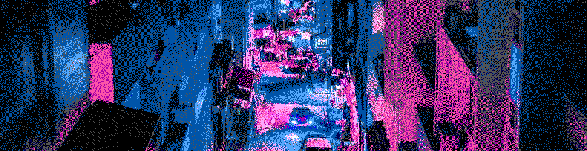
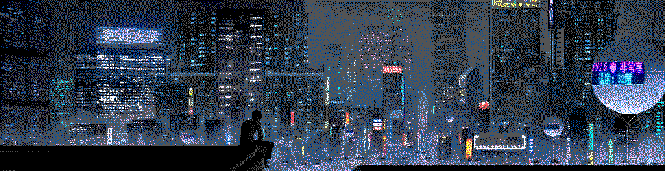

#   Gall IV

{: width=100%}

##  Learning Objectives

-   Understand how static Gall retrieves data.
-   Explain the role of imps as transient threads in Arvo.


##  “The Gall of It All”

{: width=100%}

Let's take one last wistful look into `%gall`.  As with other vanes, it lives split between [`gall.hoon`](https://github.com/urbit/urbit/blob/master/pkg/arvo/sys/vane/gall.hoon) and [`zuse.hoon`](https://github.com/urbit/urbit/blob/master/pkg/arvo/sys/zuse.hoon).

What I'd like to particularly examine at this point is how Gall communicates with webpages.  This primarily takes place today via Landscape, but there's nothing in Gall that ties it to Landscape specifically:  it's just one more agent.

A Gall agent and a webpage communicate via a `++channel`.  `PUT` requests along a path represent subscriptions and pokes, while `GET` requests represent event sources.

```hoon
+$  channel
  $:  ::  channel-state: the duct currently listening
      state=(each timer duct)
      ::  next-id: next sequence number to use
      next-id=@ud
      ::  events: unacknowledged events
      events=(qeu [id=@ud lines=wall])
      ::  subscriptions: gall subscriptions
      subscriptions=(map wire [ship=@p app=term =path duc=duct])
      ::  heartbeat: sse heartbeat timer
      heartbeat=(unit timer)
  ==
```

I've elided `%heartbeat` in our previous looks at Gall, but they're worth mentioning:  a `%heartbeat` is a periodic timer to check on a duct or channel.  `%eyre` and `%gall` are the primary consumers of `%heartbeat`s since they use them to check on webpage or agent state.  For instance, here is `%eyre`'s channel timeout arm:

```hoon
++  set-timeout-move
  |=  [channel-id=@t expiration-time=@da]
  ^-  move
  [duct %pass /channel/timeout/[channel-id] %b %wait expiration-time]
```

(This is uncharacteristically straightforward; it always makes me jumpy when the names make sense in Arvo!)


##  A Deep Dive into `weather.hoon`

{: width=100%}

Let's take an annotated look at the `weather.hoon` Landscape app.  This app needs to do three things:  retain state (location); pull weather data; and pass information to subscribers (the Javascript-based Landscape tile).

```hoon
/+  *server, default-agent, verb, dbug
=,  format
```

The app will use the following libraries:

- `server`, which provides helpful handlers for handling MIME data, authorization, URL parsing, and the like
- `default-agent`, which wraps your agent with crash information
- `verb`, which wraps your agent with logging
- `dbug`, which wraps your agent with debugging tools

The `format` namespace is exposed for the `%zuse` format parsers to be more readily available.

```hoon
|%
::
+$  card  card:agent:gall
+$  versioned-state
  $%  state-zero
  ==
+$  state-zero  [%0 data=json time=@da location=@t timer=(unit @da)]
--
=|  state-zero
=*  state  -
%+  verb  |
%-  agent:dbug
^-  agent:gall
```

The main core has standard boilerplate:  `+$card` is aliased, the versioned state is provisioned, and the wrappers imported earlier are set up.  This is followed by a `=<` tisgal which reverses the order of the following two daughter branches, so let's look at the auxiliary tools first:

```hoon
|_  bol=bowl:gall
++  poke-json
++  request-darksky
++  http-response
++  wake
--
```

- `++poke-json` requests weather information and initiates a heartbeat
- `++request-darksky` builds and issues a `GET` request to the DarkSky API for weather information; this will return a JSON
- `++http-response` parses the JSON weather information into state
- `++wake` is the heartbeat vane used to check on the current request status

It is worth your while to read each of these carefully.

The main agent core has the following arrangement:

```hoon
|_  bol=bowl:gall
+*  this  .
    weather-core  +>
    wc    ~(. weather-core bol)
    def   ~(. (default-agent this %|) bol)
++  on-init  [~ this]
++  on-save  !>(state)
++  on-load
++  on-poke
++  on-watch
++  on-arvo
++  on-leave  on-leave:def
++  on-peek   on-peek:def
++  on-agent  on-agent:def
++  on-fail   on-fail:def
--
```

As you can see, there are some aliases for commonly used but abstruse locations in the subject, followed by “sufficiently interesting” code in four arms.  Note especially how `weather-core` is defined and referred to subsequently; this is a very helpful style for complex agents, particularly if they shadow names.

- `++on-load` binds the `~weather` endpoint to the current agent via Eyre
- `++on-poke` triggers the JSON handler `++poke-json`
- `++on-watch` responds to subscription requests
- `++on-arvo` handles responses made to Eyre (to bind); to Iris (with information on the HTTP request); or to wake the agent.


##  Spiders and Imps

{: width=100%}

At the bottom of our conceptual map of Arvo and userspace sat the transient daemons that instrument certain agents, known as imps.

1. “Runtime (Nock interpreter, persistence engine, IO drivers, jets)
2. “Kernel vanes (managed by Arvo)
3. “Userspace agents (managed by Gall, permanent state)
4. “Userspace imps (managed by Spider, transient state)”

The `spider` structure can be shown briefly in full:

```hoon
/+  libstrand=strand
=,  strand=strand:libstrand
|%
+$  thread  $-(vase _*form:(strand ,vase))
+$  input   [=tid =cage]
+$  tid     tid:strand
+$  bowl    bowl:strand
+$  http-error
  $?  %bad-request   :: 400
      %forbidden     :: 403
      %nonexistent   :: 404
      %offline       :: 504
  ==
--
```

These are interfaces to track the evolution of particular strands.  A strand is an asynchronous transaction monad:

```hoon
++  strand
  |%
  ::  Output of strand computation
  ++  output  (strand-output-raw a)
  ::  Type of strand computation
  ++  form  (strand-form-raw a)
  ::  Monadic pure:  identity computation for bind
  ++  pure
  ::  Monadic bind.  Combines two computations, associatively.
  ++  bind
  ::  Take a new sign and evaluate the strand against it
  ++  eval
  --
```

Now we are closer to the heart of what our transient threads are doing:  they are async monads to let us progressively update the state of a computation based on periodically checking process status.

A common pattern in Arvo is to have a user-facing generator or Gall agent which spins up transient imps for each call.  Consider, for instance, `|hi`:

`gen/hi.hoon`:

```hoon
/?    310
:-  %say
|=({^ {who/ship mez/$@(~ {a/tape ~})} ~} helm-send-hi+[who ?~(mez ~ `a.mez)])
```

`gen/helm.hoon`:

```hoon
:: this token comes in
%helm-send-hi          =;(f (f !<(_+<.f vase)) poke-send-hi)
:: which passes through a number of arms to eventually land at
```

`ted/hi.hoon`:

```hoon
/-  spider
/+  strandio
=,  strand=strand:spider
^-  thread:spider
|=  arg=vase
=/  m  (strand ,vase)
^-  form:m
=+  !<([who=ship mez=$@(~ [=tape ~])] arg)
=/  message  ?~(mez '' (crip tape.mez))
;<  ~  bind:m  (poke:strandio [who %hood] %helm-hi !>(message))
(pure:m !>("hi {<who>} successful"))
```

You can see many more examples of the transient imp processes in `ted/`.

Any time you are dispatching multiple processes which have to wait on asynchronous calculations, it's worth considering setting up Spider.

- Optional Reading: [Tlon Corporation, "Move Traces"](https://urbit.org/docs/tutorials/arvo/move-trace/)

{: width=100%}
