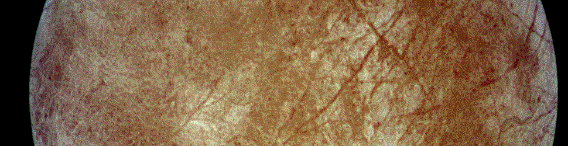

#   The Hoon Compiler

{: width=100%}

##  Learning Objectives

-   Examine how Hoon code is parsed.

We dealt with parsing text previously for generic token matching and handling.  The [Hoon parsing library](https://urbit.org/docs/reference/library/4f/) is quite substantial, however, and bootstraps the language itself on initial ship launch.


##  Building Code

{: width=100%}

For our purposes, we can consider compilers to have the following possible steps:

1. Preprocessing
2. Lexical analysis
3. Syntax analysis
4. Semantic analysis
5. Conversion to intermediate representation
6. Code optimization
7. Code generation

After this, linking is an eighth relevant step which involves turning discrete machine-code binaries into a single working program.

The structure of the Urbit virtual machine elides the necessity of some of these; for instance, linking is obviated by subject-oriented programming plus scrying.

Logically, Hoon parsing takes the following steps:

1. Preprocessing (desugaring)
2. Lexical analysis
3. Syntactico-semantic analysis (for a Lisp, there is no ambiguity)
4. Compilation to Nock

The Urbit parser first desugars expressions.

If the resulting code is lexically valid, it produces an AST; else, it raises an error such as `%generator-build-fail`.  For instance, one can produce an AST for a compile-time failure such as `nest-fail`:

```hoon
> !,  *hoon  (add:rs .1 "a")
[%cncl p=[%tsld p=[%wing p=~[%add]] q=[%wing p=~[%rs]]] q=~[[%sand p=%rs q=1.065.353.216] [%knit p=~[97]]]]
> (add:rs .1 "a")
-need.@rs
-have.[i=@tD t=""]
nest-fail
dojo: hoon expression failed
```

The AST is then compiled to Nock; at this point, compile-time failures like `mint` and `nest` occur.

`%clay`'s `++ford` arm caches the built Nock executable.

```hoon
=sole -build-file /===/lib/sole/hoon
```

- Optional Reading: [François-René Rideau (Faré), "Build Systems"](https://ngnghm.github.io/blog/2016/04/26/chapter-9-build-systems/)


##  The Parser

{: width=100%}

Parsing Hoon is related to parsing text.  The Hoon must be consumed into a data structure—in the case of Nock-based languages, everything becomes a binary tree.

In fact, you can see the AST for any Hoon expression in one step using [`!,` zapcom](https://urbit.org/docs/reference/cheat-sheet/).

```hoon
> !,  *hoon  (add 1 2)
[%cncl p=[%wing p=~[%add]] q=~[[%sand p=%ud q=1] [%sand p=%ud q=2]]]
```

Two equivalent operations that are syntactically different may produce different ASTs:

```hoon
> !,  *hoon  =/  h  5  (add h 1)
[ %tsnt
  p=term=%h
  q=[%sand p=%ud q=5]
  r=[%cncl p=[%wing p=~[%add]] q=~[[%wing p=~[%h]] [%sand p=%ud q=1]]]
]
> !,  *hoon  =/  h  5  +(h)
[%tsnt p=term=%h q=[%sand p=%ud q=5] r=[%dtls p=[%wing p=~[%h]]]]
```

Sugared expressions reveal their desugared form:

```hoon
> !,  *hoon  ?=(%.y 1)
[%tsls p=[%sand p=%ud q=1] q=[%wtts p=[%over p=~[[%.y p=3]] q=[%leaf p=%f q=0]] q=~[[%.y p=2]]]]
```

Sugared expressions will reduce to the same result as their desugared form:

```hoon
> !,  *hoon  =(%.y 1)
[%dtts p=[%rock p=%f q=0] q=[%sand p=%ud q=1]]
> !,  *hoon  .=(%.y 1)
[%dtts p=[%rock p=%f q=0] q=[%sand p=%ud q=1]]
```

Notice the `%dtls` in there for `.+`?  That maps into the Nock increment operator Rule Four:

```hoon
{$dtls *}  [(nice [%atom %$ ~]) [%4 q:$(gen p.gen, gol [%atom %$ ~])]]
```

Because Hoon rigorously defines all symbols and their interpretations (as does Lisp), there is a direct equivalence between the source code representation and the parsed abstract syntax tree (AST).  This allows for metaprogramming over common structures like cores and doors.  (Think about using dry cores with different variadicities, or wet cores.)

The Hoon parser is `++vast`, with the regular form in `++structure:norm:vast` and irregular form in `++scat:vast` and `++scad:vast`.

- Reading:  [Tlon Corporation, "Parsing in Hoon"](https://urbit.org/docs/hoon/guides/parsing)
- Reading:  `hoon.hoon`, `++vast` arm


### Rules

Any parser must tokenize an input string to yield sensible tokens for the handler.  You can use [`++scan`](https://urbit.org/docs/reference/library/4g/#scan) to parse a `tape` given a `rule`:

```hoon
> (scan "100 200 300 400 500" (more ace dem))
[100 [i=200 t=~[300 400 500]]]
```

A parsing rule in Hoon describes a way of unambiguously turning a `tape` into a binary tree of tokens.  Formally, [`++rule`](https://urbit.org/docs/reference/library/3g/#rule) is a door operating on a `nail` and an `edge`.

```hoon
++  rule  _|:($:nail $:edge)
```

A `++nail` is a parsing input, or location and remainder of parsed text,

```hoon
++  nail  {p/hair q/tape}
```

while an `++edge` is a parsing output, or location input and optional result and parsing continuation,

```hoon
++  edge  {p/hair q/(unit {p/* q/nail})}
```

There are examples of rules in the [parsing tutorial]() and in [4f Parsing (Rule Builders)](https://urbit.org/docs/reference/library/4f/).

For Hoon, everything is a noun, which means that in one sense we have a straightforward result (a binary tree of nouns) and in another sense a very complex result (a binary tree of tokens distinguishing runes, literals, and other values).

Dojo scans input for rule failure and will not allow you to type ill-formed input.  (You can get around this but it won't execute.)

#### Runes

`++expression:norm:vast` parses runes into tokens.  It produces unique tokens tagging each actual rune occurrence (which may be reduced further by desugaring).  For instance, for the `|` bar runes it proceeds thus:

```hoon
++  expression
  %-  stew
  ^.  stet  ^.  limo
  :~  :-  '|'
        ;~  pfix  bar
          %-  stew
          ^.  stet  ^.  limo
          :~  ['_' (rune cab %brcb exqr)]
              ['%' (runo cen %brcn ~ expe)]
              ['@' (runo vat %brvt ~ expe)]
              [':' (rune col %brcl expb)]
              ['.' (rune dot %brdt expa)]
              ['-' (rune hep %brhp expa)]
              ['^' (rune ket %brkt expx)]
              ['~' (rune sig %brsg exqc)]
              ['*' (rune tar %brtr exqc)]
              ['=' (rune tis %brts exqc)]
              ['?' (rune wut %brwt expa)]
              ['$' (rune bus %brbs exqe)]
          ==
        ==
  ==
```

- Reading:  `hoon.hoon`, `++expression:norm:vast` arm

#### Atoms

Each aura has a unique way of writing and printing in Hoon.  Since we are concerned with parsing, we defer the discussion of the prettyprinter to Hoon 2.

The `++so` arm parses atoms.  For instance, to parse an unsigned decimal value, the `++bisk:so` arm is utilized:

```hoon
++  so
  ~%  %so  +  ~
  |%
  ++  bisk
    ~+
    ;~  pose
      ;~  pfix  (just '0')
        ;~  pose
          (stag %ub ;~(pfix (just 'b') bay:ag))
          (stag %uc ;~(pfix (just 'c') fim:ag))
          (stag %ui ;~(pfix (just 'i') dim:ag))
          (stag %ux ;~(pfix (just 'x') hex:ag))
          (stag %uv ;~(pfix (just 'v') viz:ag))
          (stag %uw ;~(pfix (just 'w') wiz:ag))
        ==
      ==
      (stag %ud dem:ag)
    ==
  ==
```

[`++sane`](https://urbit.org/docs/reference/library/4b/#sane) can be used to determine if a value is compatible with an aura (as `@tas`).  It is unfortunately still inchoate at the time of writing (marked with `XX more and better sanity`.)

Other input formatting functions include

- [`++scow`](https://urbit.org/docs/reference/library/4m/#scow), which renders a pair of atom aura (a `@tas` token, `%ud` for instance) and value as a `tape`.  It is considered superior to interpolation and works very well for data of an expected type.
- [`++scot`](https://urbit.org/docs/reference/library/4m/#scot) does the same as a `cord`.
- [`++slaw`](https://urbit.org/docs/reference/library/4m/#slaw) parses an input `cord` as an atom of a specified aura.

    ```hoon
    > `(unit @q)`(slaw %q '.~winter-martyr')
    [~ .~winter-martyr]
    ```

- Reading:  `hoon.hoon`, `++so` arm

#### Cells and Other Types

Cells are marked with the `%cell` tag; cores with `%core`; jetting and binary hints with `%hint`; and so forth.  These are enumerated in the [5a Compiler Utilities](https://github.com/urbit/urbit/blob/master/pkg/arvo/sys/hoon.hoon#L7483) section of `hoon.hoon`.

### Runes

Runes are defined in the `+$hoon` arm of `hoon.hoon`, of which a representative sample follows:

```hoon
{$mcts p/marl:hoot}                         ::  ;=  list templating
{$mccl p/hoon q/(list hoon)}                ::  ;:  binary to nary
{$mcnt p/hoon}                              ::  ;/  [%$ [%$ p ~] ~]
{$mcgl p/spec q/hoon r/hoon s/hoon}         ::  ;<  bind
{$mcsg p/hoon q/(list hoon)}                ::  ;~  kleisli arrow
{$mcmc p/spec q/hoon}                       ::  ;;  normalize
```

The types of children that a rune may have are enumerated in [4o Molds](https://urbit.org/docs/reference/library/4o/); there are a handful of others for XML parsing and interpolation in `++hoot`:

```hoon
+$  abel  typo                                  ::  original sin: type
+$  alas  (list (pair term hoon))               ::  alias list
+$  atom  @                                     ::  just an atom
+$  aura  @ta                                   ::  atom format
+$  base                                        ::  base mold
+$  woof  $@(@ {~ p/hoon})                      ::  simple embed
+$  chum  $?  lef/term                          ::  jet name
+$  coil  $:  p/garb                            ::  name, wet/dry, vary
              q/type                            ::  context
              r/(pair seminoun (map term tome)) ::  chapters
          ==                                    ::
+$  garb  (trel (unit term) poly vair)          ::  core
+$  poly  ?(%wet %dry)                          ::  polarity
+$  foot  $%  {$dry p/hoon}                     ::  dry arm, geometric
              {$wet p/hoon}                     ::  wet arm, generic
          ==                                    ::
+$  link                                        ::  lexical segment
+$  crib  [summary=cord details=(list sect)]    ::
+$  help  [links=(list link) =crib]             ::  documentation
+$  limb  $@  term                              ::  wing element
+$  null  ~                                     ::  null, nil, etc
+$  onyx  (list (pair type foot))               ::  arm activation
+$  opal                                        ::  limb match
+$  pica  (pair ? cord)                         ::  & prose, | code
+$  palo  (pair vein opal)                      ::  wing trace, match
+$  plat                                        ::
+$  pock  (pair axis nock)                      ::  changes
+$  port  (each palo (pair type nock))          ::  successful match
+$  spec                                        ::  structure definition
+$  tent                                        ::  model builder
+$  tiki                                        ::  test case
+$  skin                                        ::  texture
+$  tome  (pair what (map term hoon))           ::  core chapter
+$  tope                                        ::  topographic type
```

Desugaring is defined in terms of the runic primitives.  For instance, [`?@` wutpat](https://urbit.org/docs/reference/hoon-expressions/rune/wut/#wutpat) reduces to `?:(?=(@ p) q r)`.  This is represented in the parser by:

```hoon
{$wtvt *}   [%wtcl [%wtts [%base %atom %$] p.gen] q.gen r.gen]
```

(There is a relic of an attempted renaming of `$` buc to bus in the `$bs` rune names.  You can find a few other legacy notations in the palimpsest of `hoon.hoon`, such as vat for `@` pat and net for `/` fas.)

- Reading:  `hoon.hoon`, `++vast` arm

### ASTs to Nock

Given an abstract syntax tree with tokens and atoms, how is it converted to Nock?

`++ride` is the end-to-end compiler, which uses `++mint:ut` and `++ream` to produce an executable `nock`.

```hoon
++  ream                                        ::  parse cord to hoon
  |=  txt/@
  ^-  hoon
  (rash txt vest)
::
++  ride                                        ::  end-to-end compiler
  |=  {typ/type txt/@}
  ^-  (pair type nock)
  ~>  %slog.[0 leaf/"ride: parsing"]
  =/  gen  (ream txt)
  ~>  %slog.[0 leaf/"ride: compiling"]
  ~<  %slog.[0 leaf/"ride: compiled"]
  (~(mint ut typ) %noun gen)
```

`++ream` (really `++rash`) is fairly straightforward in its product:

```hoon
> (ream '+(1)')
[%dtls p=[%sand p=%ud q=1]]
```

`++ar` is the "texture engine," which produces `$nock`s using arms like `++fish`.  But the real magic takes place in `++mint`, which maps rune tokens with type, and `++mull`, which deals with wet gate operations.  (There are quite a number of other arms in `++ar` such as `++fish` and `++bake` which are used in handling and expanding molds as well.)

`++mint` is much larger and more involved, to map rune tokens to Nock code.  It accepts a `type` and a `hoon`, returning a `type` and a `nock`.  It's mostly a switch on rune matches as the AST is compiled into Nock.

Here is `.?` dotwut (clearly mapped to Nock):

```hoon
{$dtwt *}  [(nice bool) [%3 q:$(gen p.gen, gol %noun)]]
```

Here is `|%` barcen, which uses `++grow` to build a core:

```hoon
{$brcn *}  (grow %gold p.gen %dry [%$ 1] q.gen)
```

- Reading:  `hoon.hoon`, `++ar` arms `++mint`, `++fish`, `++bake`, `++mull`

{: width=100%}
