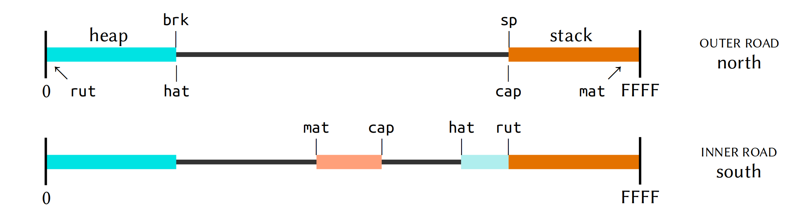

#   Vere II

{: width=100%}

##  Learning Objectives

- Explain the noun memory model of Vere, including the road.
- Identify the Application Binary Interface (ABI) of Arvo.

##  The Loom

{: width=100%}

One of the intriguing nuggets buried within Urbit is the _loom_, a unique memory management model.  The loom divides memory into stack and heap, as conventional, but then layers stack and heap inside of spawned processes in a surprising but convenient way.

> A road is a normal heap-stack system, except that the heap and stack can point in either direction. Therefore, inside a road, we can nest another road in the opposite direction.
>
> When the opposite road completes, its heap is left on top of the opposite heap's stack. It's no more than the normal behavior of a stack machine for all subcomputations to push their results on the stack.
>
> The performance tradeoff of "leaping" - reversing directions in the road - is that if the outer computation wants to preserve the results of the inner one, not just use them for temporary purposes, it has to copy them.
>
> This is a trivial cost in some cases, a prohibitive cost in others. The upside, of course, is that all garbage accrued in the inner computation is discarded at zero cost.

{: width=100%}

You lose context on which layered road a particular process is running on, and you have to use wrapped `malloc` methods, but the automatic garbage collection in C is very nice.

u3 in general needs you to count references, though, which is obnoxious even if good discipline.  So why the road model?

> The key is that we don't update refcounts in senior memory. A pointer from an inner road to an outer road is not counted. Also, the outmost, or surface road, is the only part of the image that gets checkpointed.

This means that inner road computations can be aborted without consequence to the outer road.  This is key to maintaining the atomicity of Arvo events.

> Any significant computation with nouns, certainly anything Turing complete, should be run (a) virtualized and (b) in an inner road.

- Reading: [Tlon Corporation, "u3:  Noun Processing in C"](https://github.com/urbit/urbit/blob/master/doc/spec/u3.md#u3-the-road-model), section "u3:  The Road Model"
- Optional Reading: [Tlon Corporation, "Vere Tutorial"](https://urbit.org/docs/tutorials/vere/)

##  The Application Binary Interface

{: width=100%}

As you will see in Arvo 2 (and saw briefly at the end of Arvo 1), the Arvo core is an event handler.  This is hard-coded into contact with the C code of the binary.  (In `tree.c`, for instance, you can find references such as `static u3j_hood _141_pen_ho[] = { {"ap", 86}, {"ut", 342}, { } };`, indicating the arms within Arvo.)

What sorts of things are directly managed by the binary?  That is, what kinds of operations are there?  Just looking at the function and service prefixes tells you a lot:

| Prefix | Purpose |
| ------ | ------- |
| `u3a`  | allocation |
| `u3e`  | persistence |
| `u3h`  | hashtables |
| `u3i`  | noun construction |
| `u3j`  | jet control |
| `u3m`  | system management |
| `u3n`  | nock computation |
| `u3r`  | noun access (error returns) |
| `u3t`  | profiling |
| `u3v`  | arvo |
| `u3x`  | noun access (error crashes) |
| `u3z`  | memoization |
| `u3k[a-g]` | jets (transfer, C args) |
| `u3q[a-g]` | jets (retain, C args) |
| `u3w[a-g]` | jets (retain, nock core) |

Many of these are too specific to concern us now, but let's particularly examine a couple of cases.

### `u3m` System Management

For Urbit, “virtualization” can mean either the binary itself running Nock or running Nock on Nock (`++mock`).  Here we are concerned with the process of running the binary virtual Nock machine.

`u3m` wraps the system so that Unix and Nock errors can be handled within a unified framework.  It also handles loading files, the road memory model, prettyprinting, and garbage collection.

- Reading: [Tlon Corporation, "Vere API Overview by Prefix"](https://urbit.org/docs/tutorials/vere/api/), section `u3m`

### `u3v` Arvo ABI

`u3v` instruments the Arvo event handler:

1. `u3v` interfaces directly with the `++wish` arm of the Arvo kernel
2. `u3v` processes ova (`ovum`s), which are typeless cards that are compatible with Unix events
3. `u3v` parses and produces messages (`tank`s, etc.)

It also manages compacting the Arvo kernel and caches to manage and reclaim memory.

- Reading: [Tlon Corporation, "Vere API Overview by Prefix"](https://urbit.org/docs/tutorials/vere/api/), section `u3v`

We defer a detailed discussion of jets until Nock 2.

Ultimately, the Vere C implementation of the Nock interpreter is intended to be replaced with [Jacque, a Java implementation](https://urbit.org/docs/glossary/jacque/).
