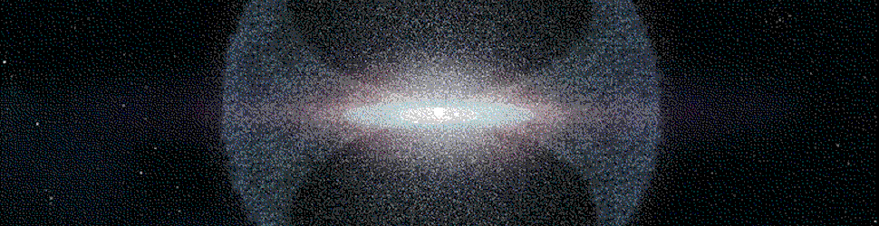
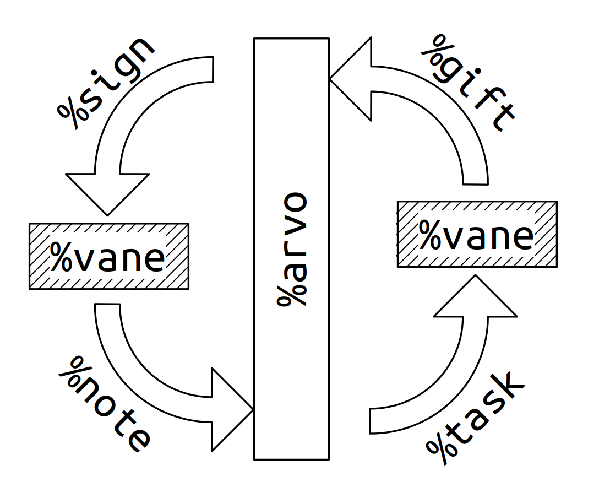
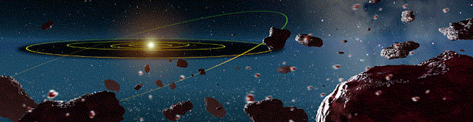

#   Arvo II

{: width=100%}

##  Learning Objectives

-   Describe the Arvo event handler, cards, and ducts.


##  The Core Arvo

### The Event Handler

```hoon
::  arvo: structural interface core
++  arvo
  |%
  ++  come  |=  [@ @ @ pram vise pone]
            (come:soul +<)
  ++  load  |=  [@ @ @ pram vase pane]
            (load:soul +<)
  ++  peek  |=  *
            =/  rob  (^peek ;;([@da path] +<))
            ?~  rob  ~
            ?~  u.rob  ~
            [~ u.u.rob]
  ++  poke  |=  *
            =>  .(+< ;;([now=@da ovo=ovum] +<))
            (poke:soul now ovo)
  ++  wish  |=(* (^wish ;;(@ta +<)))
  --
```

- `++poke` is the only arm which can transition Arvo from one state to another.  It is a typed transactional message.
- `++peek` provides a globally referential `scry` namespace
- `++wish` parses a core with `%zuse`
- `++load` upgrades the kernel
- `++come` is used with a new kernel

Altogether, Arvo is remarkably straightforward (as an event handler should be) and has the surprising ability to upgrade itself in-place.

- [Tlon Corporation, "Arvo Tutorial"](https://urbit.org/docs/tutorials/arvo/arvo/#the-state), section "The State"

### The State

The Arvo state is represented as a structure:

```hoon
=/  pit=vase  !>(..is)                          ::
=/  vil=vile  (viol p.pit)                      ::  cached reflexives
=|  $:  lac=_&                                  ::  laconic bit
        eny=@                                   ::  entropy
        our=ship                                ::  identity
        bud=vase                                ::  %zuse
        vanes=(list [label=@tas =vane])         ::  modules
    ==                                          ::
++  card  {p/@tas q/*}                          ::  typeless card
++  ovum  {p/wire q/card}                       ::  Arvo event
++  wire  path                                  ::  event cause
```

> Arvo is a core with these six arms. To use these arms, we hardcode the axis of the formula (11, 4, 86, etc) into the C code that calls Arvo, because otherwise we'd need type metadata - which we can get, by calling Arvo.

- `pit` represents the part of Arvo which only changes in an update
- `vil` is a cache of types which shouldn't be recompiled regularly due to frequency of use:  `type`, `duct`, `vase`
- `lac` is the verbosity of the kernel
- `eny` is system entropy
- `our` is the ship's identity
- `bud` is the standard library
- `vanes` is the list of vanes with internal state

One of the most salient system calls is to obtain entropy, or random generated numeric noice.  Ultimately, entropy must be drawn from the Unix system via an `ovum` (see below):

```hoon
  %wack
?>  ?=(@ q.q.ovo)
=.  eny  (shaz (cat 3 eny q.q.ovo))
```

The flip side of this call may be found in `urbit/vere/io/fore.c`,

```c
//  inject fresh entropy
//
c3_w    eny_w[16];
c3_rand(eny_w);

wir = u3nc(c3__arvo, u3_nul);
cad = u3nc(c3__wack, u3i_words(16, eny_w));

u3_auto_plan(car_u, u3_ovum_init(0, u3_blip, wir, cad));
```

where it is obtained from the system via `urbit/vere/pier.c`:

```c
/* c3_rand(): fill a 512-bit (16-word) buffer.
*/
void
c3_rand(c3_w* rad_w)
{
  ent_getentropy(rad_w, 64) )
}
```

> `libent` is a cross-platform wrapper around `getentropy(2)`.  It exports one symbol, `ent_getentropy`.  If `getentropy` is available, then it's just a shim around that.  Otherwise, it uses `getrandom(2)` (available since kernel 3.17) on Linux, or `/dev/urandom` on other \*nix.

- [Tlon Corporation, "Arvo Tutorial"](https://urbit.org/docs/tutorials/arvo/arvo/#the-state), section "The State"

##  Ducts

{: width=100%}

Arvo orchestrates vane activities using cards, but a card isn't sent naked.  It is accompanied by a `duct`, or list of causal events as a `(list wire)`.

Arvo mandates that each vane maintain a queue of causal events.  Vanes coordinate their duct/call stacks as queues (`++to` arm, common name `qeu`).

> The Arvo causal stack is called a `duct`. This is represented simply as a `list` of `path`s, where each `path` represents a step in the causal chain. The first element in the `path` is the first letter of whichever vane handled that step in the computation, or the empty span for Unix.
>
> This is a call stack, with a crucial feature: the stack is a first-class citizen. You can respond over a `duct` zero, one, or many times. You can save `duct`s for later use.

An incoming card is placed in a vane's queue, with the provenance indicated in case errors or `gift`s need to be sent back along the call path.

There are four kinds of cards:

> In other words, there are only four ways of seeing a move:
>
> 1. as a request seen by the caller, which is a `note`;
> 2. that same request as seen by the callee, a `task`;
> 3. the response to that first request as seen by the callee, a `gift`;
> 4. the response to the first request as seen by the caller, a `sign`.

{: width=50%}

The system also frequently deals in the `ovum` type,

```hoon
+$  ovum  (pair wire curd)
```

which is a "card with a cause," or a way of passing steps and actions into Arvo that is also compatible with `%unix` cards.

> For input events, this is the module that caused the event; for output actions, it's the module that performs the action.

- Reading: [Tlon Corporation, "Vere API Overview by Prefix"](https://urbit.org/docs/tutorials/vere/api/), section "u3v: the Arvo kernel"

{: width=100%}
